# Introduction  
Salt-affected soils are soils with high amounts of soluble salts and/or sodium ions. The salts hold water in the soil at high osmotic potential, which limit easy exchange of water and nutrients with the plant roots. Consequently, they retard growth and development of many plants. Their global distribution was first estimated in the late 1970s at about 1 billion hectares (Szabolcs, 1979; Abrol et al., 1988). Since then, there has been inconsistent updates of their distribution. Recent literature at the global scale mostly use data that was collected in the late 1970s and portray global distribution of affected areas at about 1 billion hectares (FAO/IIASA/ISRIC/ISS-CAS/JRC, 2008; Wicke et al., 2011; Ivushkin et al., 2019). A new update is necessary to improve knowledge of the status and actual distribution of salt-affected soils.
Salt-affected soils have significant impacts on the environment, water, and agriculture. They negatively influence agriculture productivity and quality of soil and surface water but also have significant economic potential if they are properly managed (Wicke et al., 2011). An improved knowledge of their distribution, characteristics, and trend is necessary for sustainable management and economic exploitation. The current lack of consistent information update of salt-affected soils is hampering policy developments to support management and alternative uses of these soils. In 2018, the Global Soil Partnership (GSP) Plenary Assembly deliberated on the global information gap for salt-affected soils and requested for global mobilization to update the information (GSP-FAO, 2018). Following the request, GSP conducted a survey among member countries as a first step to gain understanding of the status of salt problems and identify areas to focus on when mobilizing for information update. The survey revealed that more than 70% of the countries have varied aspects of salt problems and data for mapping salt-affected soils (Figure 1.1). However, most of the datasets are old and need updating.  


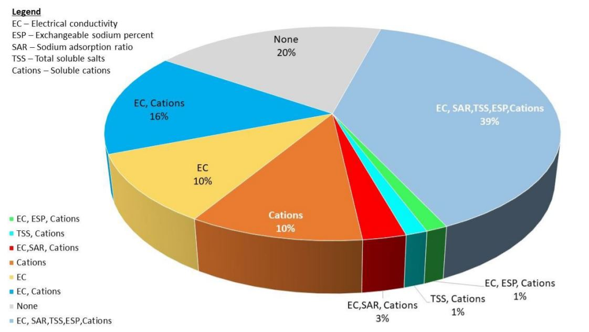

In this manual, the GSP global mobilization approach is used to develop information update of salt-affected soils. The approach is a country-driven process where countries (partners) develop and contribute global soil information but retain the copyright of the contributed soil data (Figure 1.2). The process is globally coordinated by GSP in collaboration with International Network of Soil Information Institutions (INSII) and
focal persons (FP) in each country. The whole process is supported with technical documents developed by the technical bodies within GSP such as Pillar four Working Group (P4WG) and Intergovernmental Technical Panel on Soils (ITPS) (FAO and ITPS, 2018). This manual is part of the technical documents for supporting the global mapping of salt-affected soils (Figure 1.2).
One of the challenges in updating global information using the approach in Figure 1.2, is the potential uncertainties due to differences in datasets and approaches by countries. There are many methods and indicators in the literature which countries can use in mapping and classifying salt-affected soils. Unless the country data and methods are harmonized, the contributions can be disorganized and result into uncertain global map of salt-affected soils. The focus of the present manual is to provide guidelines for harmonizing input data and approaches for mapping salt-affected soils. The book puts emphasis on popularly used soil indicators for diagnosing salt problems in the soils (Figure 1.1) and a harmonization protocol for all contributing countries.

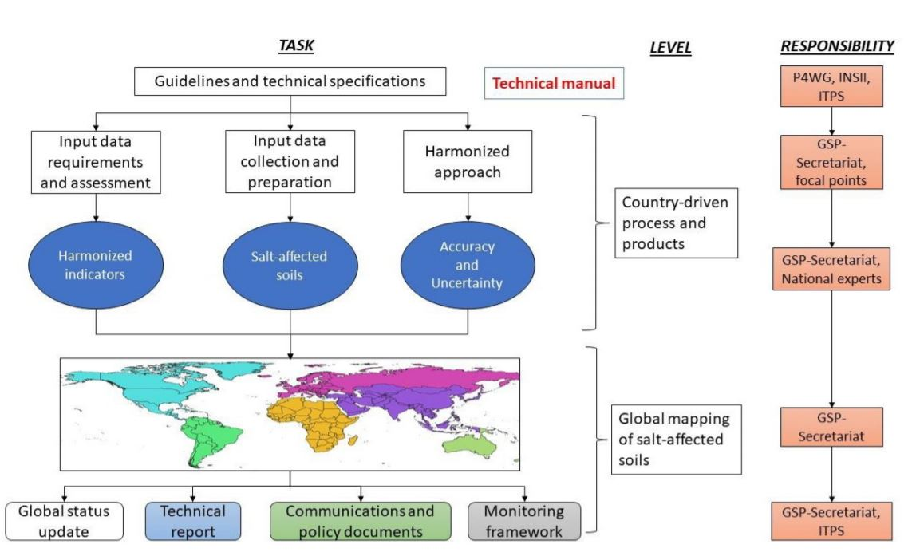

## Presentation
This book is organized into three sections covering seven chapters. The sections are sequentially arranged but independently designed to benefit focused readership who may want to go straight to any section. Section 1 gives the background information, Section 2 covers the methodological procedures for developing multiscale spatial maps of salt-affected soils, and section3 outlines the steps for information sharing and resources mobilization (Table 1.1). Section 1 has three chapters that gives brief literature review on the characteristics of salt-affected soils and methods for their mapping. The section is intended to provide readers with basic concepts linking the characteristics of salt-affected soils with data requirements for mapping and classifying these soils. It also discusses the mapping methods and existing information on the global distribution of salt-affected soils. Section 2 describes the procedural steps for developing maps of salt-affected soils (Table 1.1). Section 3 outlines the requirements and procedures for information sharing and resource mobilization for developing or monitoring salt-affected soils.

*Table 1.1: Book presentation*
```{r, echo = FALSE}
dt <- read.csv("figures/tables/Table_1.1.csv", sep = ";")
kable(dt, col.names = gsub("[.]", " ", names(dt))) %>%
kable_styling("striped", full_width = F)
```

# Characteristics of salt-affected soils  
## Genesis of salt-affected soils  
The minerals responsible for salt problems in the soil originate from diverse sources and gradually accumulate to contribute to the formation of salt-affected soils. Many models exist in the literature for describing the salt accumulation and evolution of these soils. They can be grouped into two broad categories (Figure 2.1): one involving climatic interactions with soil and water (Miller and Brierley, 2011) and the other describing direct deposit of the salt particles into the soil (Abou-Baker and El-Dardiry, 2015; Daliakopoulos et al., 2016).    

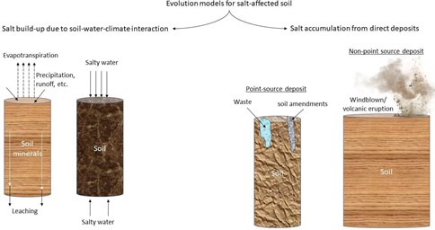  
### Soils-water-climate interaction mode  
This model was first proposed by Gedroiz (Kelly and Brown, 1934) and described the evolution of salt- affected soils along the trajectory of gradual changes of the characteristics of soluble salts. It postulated that salt-affected soils develop when dissolved minerals in water accumulate and change status as water is moved from the soil. Soluble salts are deposited in the soil when water evaporates and gradually accumulate with time to form saline soils. Sodic soils then develop when the soluble salts are leached and/or when divalent cations are precipitated out of the exchange complex followed by the corresponding increase in sodium ions. If leaching is insufficient, the salt-affected soils remain predominantly saline (FAO, 1984). Further types of sodic soils (e.g. solodized sodic soils) are formed when sodium ions move out of the exchange complex and are replaced by hydrogen ions (Miller and Pawluk, 1994). This genetic evolution is common in arid and semiarid areas where evaporative demand is high during certain times of the year.
Salt-affected soils also develop when salts accumulate due to repeated direct contact of soil with salty water. In this case, the type of salt-affected soils is particularly influenced by the dominant soluble salts in the salty water (Munn and Boehm, 1983). The model describing this genetic pathway is common in the coastal areas and in areas with salty and high groundwater table. The model also explains the development of certain types of salt-affected soils or ion-specific salinity in areas subjected to wastewater irrigation (Jalali et al., 2008).  

### Direct deposit model  
In this model, salt accumulation in the soil is facilitated by the repeated deposition of salt particles or solutions in the soil. There are two types of this model: point-source and non-point source deposits (Figure 2.1). Point-source depositions introduce localized salt accumulation, which gradually spread to other areas or down the soil profile by action of runoff, leaching, tillage, etc. Non-point deposits occur when windblown salt particles or volcanic eruptions settle on the soil. Alternate layers of the deposits may be buried and contribute to accumulation of salts in the soil profile. This model also explains the development of salt-affected soils due to geologic marine incursions (Schofield et al., 2001).

## Characteristics
The dominant cations in salt-affected soils are Sodium (Na+), Calcium (Ca2+), Magnesium (Mg2+), Potassium (K+) and dominant anions are Chloride (Cl-), Sulphate (S0 -2), Carbonate (C0 -2), Bicarbonate (HC0 -) and Nitrates (N0 -) (Richards, 1954). Salt-affected soils with high amounts of sodium ions are known as sodic soils. High content of sodium ions in these soils cause dispersion of clay and organic matter, which settle on the surfaces of soil particles to give them a brownish black appearance. This black appearance is the reason for the name "black alkali soils" in reference to sodic soils (Richards, 1954). When the dispersed clay settles in between soil particles, they plug the matric spaces and block water infiltration. Consequently, sodic soils tend to remain waterlogged for extended period after rainfall or irrigation. In some instances, dispersed humus and clay may be leached down the soil profile and portray clay accumulation and decrease in texture down the profile (Sparks, 2003; Krasilnikov et al., 2013).
High content of sodium ions has been used as an indicator for identifying sodic soils. According to Richards (1954), sodium occupies more than 15% of the soil's cation exchange capacity (CEC) in sodic soils. This observation has led to the use of Exchangeable Sodium Percent (ESP) ??? 15 as a diagnostic indicator for sodic soils. In addition, since sodic soils are low in total salt but high in exchangeable sodium, the ratio of sodium ions to the sum of major anions has been shown to be more than 1 in sodic soils (Chhabra, 2005). Figure 2.2 gives an illustration of the characteristics of sodic soils.

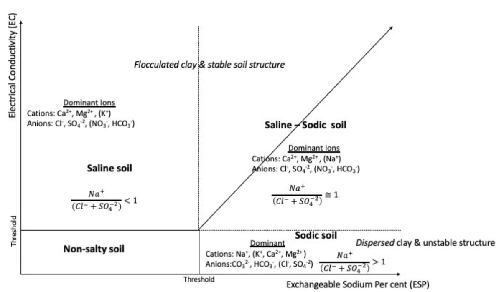


Salt-affected soils with high contents of soluble salts and low sodium ions in the exchange complex are often identified as saline soils. Due to their low content of exchangeable sodium ions, saline soils have low ESP and the ratio between sodium ions and sum of major anions is less than 1 (Figure 2.2). Preponderance of chloride and sulphate ions give saline soils a brownish white appearance. Hence, they are sometimes referred to as white alkali soils.  

Saline soils with significant proportions of calcium ions have good soil structure. Calcium ions have high flocculation power in the soil (Sumner and Naidu, 1998; Rangesamy and Marchuk, 2011). Therefore, their presence in soil tends to promote clay flocculation and particle aggregation. Some saline soils have gypsum (calcium sulphate) and lime (calcium and magnesium carbonate) (Skarie et al., 1987).  

Salt-affected soils with high content of soluble ions and appreciable amount of sodium ions are known as saline-sodic soils. When sodium salts in these soils hydrolyse, the pH of the soil increases and the soil changes to sodic soils. In this regard, saline-sodic soils are sometimes referred to as saline-soils capable of alkaline hydrolysis (Chhabra, 2005). When the soluble salts remain high in the saline-sodic soils, the characteristics of the soils are like those of the saline soils. When the concentration of the soluble salts is lowered and the sodium salts hydrolyse, then the characteristics of the soils change to those of sodic soils.  

Richard (1954) used measurable soil properties to further quantify characteristics of salt-affected soils (Table 2.1). These characteristics have been widely applied for general classification of salt-affected soils (Chhabra, 2005; Zaman et al., 2018).  

*Table 2.1: Characteristics of salt-affected soils*  

```{r, echo = FALSE}
dt <- read.csv("figures/tables/Table_2.1.csv", sep = ";")
kable(dt, col.names = gsub("[.]", " ", names(dt))) %>%
kable_styling("striped", full_width = F)
```

## Indicators for assessing salt-affected soils  
Indicators of salt-affected soils are features that identify the status or occurrence of the soils. In this book, they have been divided into three categories: quantitative soil properties, qualitative soil surface/profile properties, and vegetation characteristics.
Quantitative soil indicators are measurable soil properties related to salt problems in the soil such as concentration of soluble ions or exchangeable sodium ions, soil pH, etc. Integral soil indicators representing overall concentration of soil salts are also often used. These indicators include electrical conductivity (EC), total soluble salts (TSS), total dissolved solids (TDS), total soluble cations (TSC), resistivity etc. (Abrol et al., 1988; Zaman et al., 2018). Various levels of these indicators have been proposed in the literature for identification of the three types of salt-affected soils. A seminal work in this regard was proposed by Richard (1954) (Table 2.1). Other adjustments to the thresholds given in Table 2.1 have since been given, for example using different levels of soil pH and introduction of the ratio of soluble ions (Table 2.2). Soil spectral reflectance indices are also new indicators under development and are expected to provide diagnostic threshold for different types of salt-affected soils (Kalra and Joshi, 1994; Farifteh et al., 2008).

*Table 2.2: Summary of soil properties for diagnosing salt-affected soil*

```{r, echo = FALSE}
dt <- read.csv("figures/tables/Table_2.2.csv", sep = ";")
kable(dt, col.names = gsub("[.]", " ", names(dt))) %>%
kable_styling("striped", full_width = F)
```
*<sup>1</sup> Richards (1954);  <sup>1</sup> Abrol et al. (1988); <sup>2</sup>Choudhary and Kharche (2018); <sup>3</sup>Chhabra (2005); <sup>4</sup>Horneck et al. (2007)*

Qualitative soil properties are observable features associated with certain characteristics of salt-affected
soils. They include presence of crusts, qualitative diagnostic properties of natric/salic soil horizons, columnar/prismatic soil structure under dry conditions with peds covered by brownish black films (WRB,
2014; Pankova, 2015). These soil properties are mostly used to identify salt-affected soils in the field. 

Their aggregate evidence can be found in most soil maps with delineations of salt-affected soils (Abuelgasim and Ammad, 2019). Salt-tolerant vegetation are dominant in salt-affected areas. Their presence is sometimes used as indicator of salt-affected soil (Bouchhima et al., 2018). An advance application of this concept is found in remote sensing of the earth surface. Many tests have revealed correlation between remote sensing indices with salt-affected soils (Gorji et al., 2019).

## Drivers of salt problems in the soil  
Drivers of salt problems in the soils can be grouped into two: primary and secondary drivers. Primary drivers are the natural sources of mineral elements contributing to the salt problems or the natural conditions that favor development of salt-affected soils. Secondary drivers are factors that exacerbate salt problems in the soils. They are largely associated with human intervention on the natural environment. Table 2.3 gives a summary of these drivers of salt problems in the soil.  

*Table 2.3: Drivers of salt problems in soil*

```{r, echo = FALSE}
dt <- read.csv("figures/tables/Table_2.3.csv", sep = ";")
kable(dt, col.names = gsub("[.]", " ", names(dt))) %>%
kable_styling("striped", full_width = F)
```


### Primary drivers 
Salty parent material is a primary source of salt problems in the soil. They gradually release the mineral constituents of soil during chemical weathering, which react with air and water to produce soluble salts responsible for salt problems. These salts are laterally carried away by moving water to other sites or
vertically by capillarity up the soil profile (Fanning and Fanning, 1989). Further processes such as leaching can convert the salt conditions to produce other types of salt-affected soils.
Climate is another driver of formation of salt-affected soils. In arid and semi-arid climate, the evaporative demand dries up water on the soil which leave the salt crystals on the soil surface. In addition, low rainfall in these climatic zones does not fully facilitate leaching of salts down the soil profile. The combined effects of evaporative demand and insufficient leaching cause accumulation of salts in the soil and contribute to the development of salt-affected soils (Schaetzl and Anderson, 2005).
Groundwater is another driver influencing the development of salt-affected soils. Salty groundwater rising through the soil profile by capillarity contributes the salts, which remain in the soil when the water evaporates (Rengasamy, 2006). In certain areas where salty groundwater table meets the land surface, groundwater is discharged on to the soil surface as springs and geysers. The discharged salty water gradually builds salts in the soil and contribute to the development of salt problems in the soil. Groundwater also contributes to the salt problems when its salty water is used for irrigation.
Other primary causes of salt problems in the soils are sea/tidal water interaction, windblown salt deposits, and salty runoff water. Sea/tidal water contains salt that remain on the soil after interaction with soil at the seacoast. They can also influence soil salt problems when the water is used for irrigation or if used elsewhere (such as in wastewater or sewage) but later discharged onto the soil. Interaction of windblown salt particles also introduces salts into soils. Repeated deposits of windblown salt particles can accumulate the salts and lead to the development of salt-affected soils (Yang et al., 2018). Recurrent runoff or flood water from salt-affected areas can also bring in salt, which can accumulate with time and contribute to the development of salt-affected soils (Krasilnikov et al., 2013).  

### Secondary drivers  
Irrigation is the most cited secondary driver of salt problems in the soil. Irrigation water can either induce salt problems when salty water is used for irrigation or when irrigation water causes inadequate leaching of soil salts. Irrigation water can also recharge groundwater and cause it to rise and gradually introduce groundwater salts into the soil (Rietz and Haynes, 2003; Pulido-Bosch et al., 2018). Fertilized irrigation water can also introduce salts into the soil, which gradually build up with repeated application and contribute to the development of salt-affected soils.
Besides irrigation, waste and wastewater are also significant secondary drivers of salt problems in the soil. Improper management of wastewater and solid waste can contribute to the development of salt-affected soils (Piotr, 2008). Repeated disposal of waste material either directly mix with soil or contribute salty leachates into the soil, which gradually accumulate with time and lead to the formation of salt-affected soils. Use of wastewater in irrigation is also another way of inducing salt problem in the soil. Wastewaters contain mineral elements which can cause ion-specific toxicity and salinity in the soil (Muyen et al., 2011; Abd-Elwahed, 2018).
Land use/cover change is also an important secondary driver of salt-accumulation in the soil. Altering the vegetation type in certain ecosystems potentially change the plant water-use and evapotranspiration characteristics with consequences such as drying up of soil and salt build-up. Changing the vegetation types can also alter the equilibrium of groundwater table and eventually contribute to groundwater-induced salt-affected soils (Rengasamy, 2006). In the arid and semi-arid environments, declining vegetation cover has also been linked to increased exposure of soils to the risk of salinization (Perri et al., 2018).
Other secondary sources of salt problems in the soil include inappropriate fertilizer application, inadequate drainage, and misuse of soil amendments.

##	Classification of salt-affected soils
Salt-affected soils are classified according to the types of salt and intensity of the salt problems. Classification of the types of salt-affected soils was first proposed by Richard (1954) based on electrical conductivity (EC), pH and exchangeable sodium percent (ESP) or sodium adsorption ratio (SAR). According to this scheme, there are three types of salt-affected soils (Table 2.2):  

*   Saline: soils with excess soluble salts in which EC > 4 dS/m, pH < 8.5, and ESP < 15 (or SAR < 13)
*   Sodic: soils with excess exchangeable sodium ions in which EC<4 dS/m, pH>8.5, and ESP>15 (SAR>13)
*   Saline-sodic soils: soils with high content of soluble salts and appreciable quantity of sodium ions capable of alkaline hydrolysis. The soils have EC>4 dS/m, pH < 8.5 and ESP >15 (or SAR > 13)

Many proposals have been proposed in the literature on the limits given by Richards (1954). Abrol et al. (1988) proposed pH limit of 8.2 instead of 8.5 for the three classes of salt-affected soils. This pH value was also found satisfactory in Indian soils (Choudhary and Kharche, 2018). Szabolcs (1987) also gave a further classification of saline soils as: Gypsiferous soils, saline soils due to calcium chloride, saline soils due to soluble magnesium salts, acid sulphate soils with iron and aluminium sulphates, and potentially saline soils.
Classification of the intensity of salt problems in the soil is commonly expressed using levels of electrical conductivity and exchangeable sodium ions and on weight basis (Richard, 1954; Abrol et al., 1988; FAO, 2006; Chinese Academy of Sciences, 2001). Examples of these levels are given in Table 2.4

*Table 2.4: Identifying intensity of salt problems in soil*

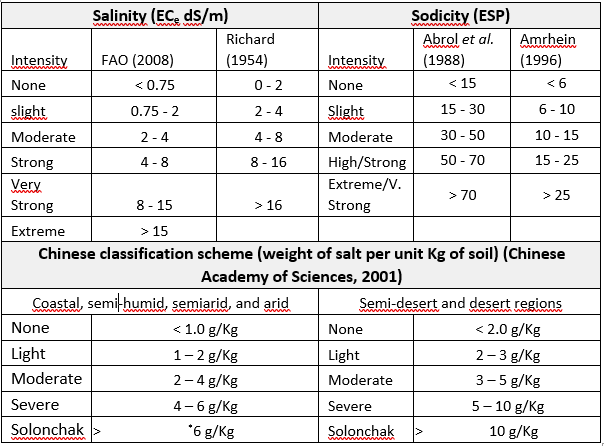

Besides the classification in Table 2.4, there are some other lumped parameters that are used to assess the salinity problems. The parameters include total dissolved solids (TDS in mg/L), total soluble cations (TSC) and total soluble anions (TSA) in mol(c)/L. There are approximations in the literature for converting these gravimetric measures into EC. For example, TDS may be approximated by multiplying EC (dS/m) by 800 for hypersaline soils and 640 for other saline soils. These are approximate guidelines since there are no exact relationships. Classification of salt intensity using gravimetric measurements has been given by Vargas et al. (2018) (Table 2.5).
The classification schemes in Table 2.4 and Table 2.5 show that there are many alternatives for identifying different levels of salt problems. They can be used at the national scale in the countries where they are popularly used.

*Table 2.5: Classification of salt intensity using gravimetric measurements*

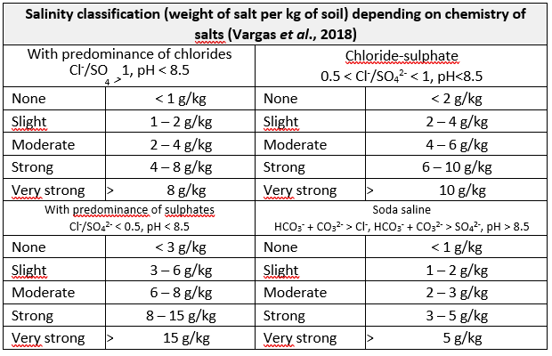  

##	Global distribution of salt-affected soil   
Salt-affected soils are found in all continents in varying spatial proportions. The literature is replete with attempts to quantify the global distribution of these soils. Massoud (1976) and Szabolcs (1979) developed the first world map of salt-affected soils using FAO/UNESCO Soil Map of the World. They estimated salt- affected areas at about 0.9 billion hectares (Table 2.6). In 2004, Squires and Glenn (2004) published new estimates of the global distribution and placed the coverage of affected areas at 1.029 billion hectares. This estimate portrayed 40% of the global affected areas as saline and 60% as sodic soils.  


*Table 2.6: Global estimates of salt-affected areas*

```{r, echo = FALSE}
dt <- read.csv("figures/tables/Table_2.6.csv", sep = ";")
kable(dt, col.names = gsub("[.]", " ", names(dt))) %>%
kable_styling("striped", full_width = F)
```

In 2011, Wicke et al. (2011) estimated the global distribution of types and intensity of salt-affected soils based on the Harmonized World Soil Database (FAO et al., 2008). Their estimate portrayed salt-affected areas as covering 1.1 billion hectares in which 60% of the areas were saline, 26% sodic, and 14% saline- sodic (Figure 2.3). It is important to note the proportions of affected areas by types as given by Wicke et al. (2011) was the opposite (flipped) proportions given by Squires and Glenn (2004). In 2018, Joint Research Centre (JRC) developed a global map of salinization, which showed the affected areas covering 1 billion hectares (Cherlet et al., 2018).
Recently, Ivushkin et al. (2019) published another global estimate of salt-affected soils. This study used a combination of remote sensing, soil data from World Soil Information System (WoSIS, https://www.isric.org/explore/wosis) and modelling. Their estimate also put the global distribution of salt- affected soils at about 1 billion hectares (Figure 2.3).

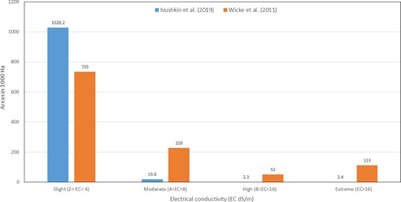  

Interestingly, all these global estimates have remained nearly the same at around 1 billion hectares. Possible explanations are that: 1) the overall salt-affected soil areas have not changed over the years, or
2) the input data for estimating the areas has not changed, or 3) the estimation methods have been inconsistent. There is a need for new updates to improve the global information of the status of salt- affected soils.
Although all continents have salt-affected soils, arid and semi-arid Land (ASAL) areas seem to have a higher proportion. This is attributed to the prevalently low and irregular rainfall and high evaporative demand in ASAL areas, which all together combine to accumulate salts in/on the soil (Sheng et al., 2010; Pankova and Konyushkova, 2013).
Apart from ASALs, coastline salt problems are also of significant importance. Coastline salt problems are largely due to seawater intrusion. Li et al. (2014) gave a global picture of salt-affected coastlines of the world using secondary information from the literature (Figure 2.4). Other than this preliminary work, there is no clear data or representation of the extent and severity of salt-affected coastlines of the world.

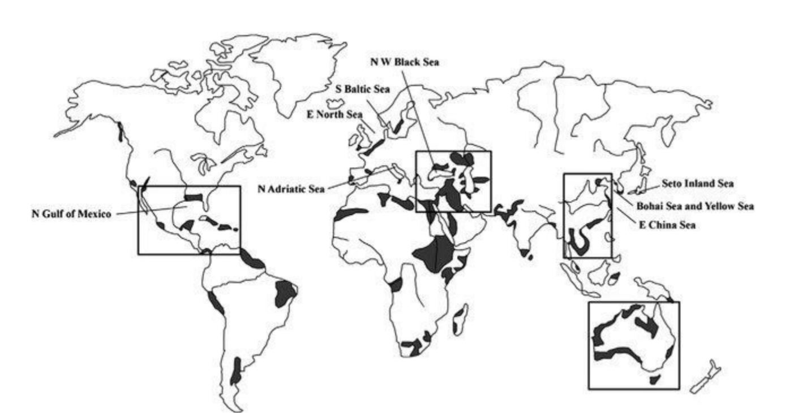 

# Methods for mapping salt-affected soils    
Maps of salt-affected soils contain spatial information of the distribution of types and intensity of salt problems in the soils. They are developed by considering the drivers, indicators, prevalence of salt-affected soils in the landscape and mapping tools and resources (Figure 3.1). Input data on the drivers and indicators provide the evidence of occurrence of salt problems in the soil. They influence the type of mapping tools for information mining and representation of the final maps. Some of the commonly used mapping tools include Geographic Information Systems (GIS), statistical modelling, stereoscopes, etc. Besides the input data and mapping tools, mapping methods are also influenced by resource requirements such as expertise, computing facility, and funding.

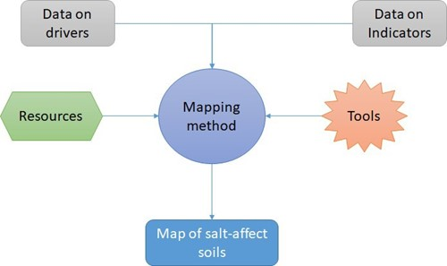  

The main categories of the methods for mapping salt-affected soils are:

i.    Methods based on soil maps and expert opinion;
ii.   Remote sensing applications;
iii.    Modelling of soil indicators of salt problems.

This chapter elaborates on the potential and limitations of these categories of mapping methods with regards to their: 1) contribution to building integral global information of salt-affected soils, 2) ability to quantify mapping accuracy and uncertainty, and 3) flexibility for periodic information update.

## Methods based on soil maps and expert opinion  
Soil maps have been traditionally used to identify salt-affected soils in many territories of the world. Their application relies on identification and verification of the areas in the soil maps with designations related to salt-affected soils. A seminal work in global assessment of salt-affected soils using this approach was published by Szabolcs (1979). The publication used FAO-UNESCO soil map of the world in which the polygons with salt-affected soils were classified saline soils (solonchak and saline phases), alkali soils (solonetz and alkaline phases), and potentially salt-affected soils. Potentially salt-affected soils were soils in areas that were not salt-affected at the time (or salt-affected to a very low degree) but could be easily become affected due to human activities. The approach given by Szabolcs (1979) also used expert opinion to identify the areas that were not very well represented in the FAO-UNESCO soil map of the world. Figure
3.2	is example output from this mapping approach.

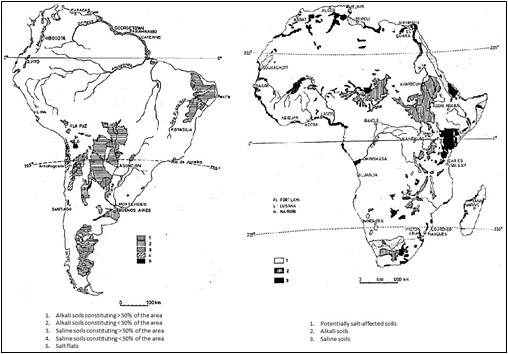  

Application of soil maps to quantify areas of salt-affected soils has since been applied in various parts of the world. Examples include mapping of saline and sodic soils in the European Union (Toth et al., 2008), salt-affected soils in the European part of Russia (Khitrov et al., 2009), digital assessment of salt-affected soils in India (Mandal et al., 2011), among others.
Most applications of soil maps use the sequence of identification, verification, and quantification processes to produce the spatial information of salt-affected soils. The identification process aims at locating the soil

typological/mapping units in the soil map with classified designations of salt-affected soils. The identified units are then verified with either through expert opinion or confirmatory field-sampling and testing. The confirmed areas are finally delineated and their aerial extent quantified. This sequence may be preceded with the development of a new soil map or digitalization of old maps where necessary (Khitrov et al., 2009; Mandal et al., 2011).
Although the application of soil maps to identify salt-affected soils is popular in some countries, it suffers from the lack of accuracy and uncertainty quantification of the final maps. The approach also produces maps of salt-affected soils with hard boundaries, which are arguably infrequent in most landscapes. Other soil information associated with salt-affected soils such as the distribution of electrical conductivity, pH, soluble ions, etc. may be imprecisely given or missing.

##	Using remote sensing application  
Remote sensing application has been used in agriculture and environment for many years. The technology provides spatial and temporal information about the land cover, soil cover characteristics, climate, and atmospheric conditions, which are of importance in soil and agriculture resources management. It relies on the interaction of the electromagnetic radiations with soil and vegetation to produce characteristic signatures in the reflected radiations. The reflected signatures are then modelled to extract soil and vegetation features. Two broad categories of radiations are discernible with this technology: radiations from the sun (also called passive radiations) or radiations from the sensor (active radiation). They are further classified according to the type of sensors detecting the radiations: 1) proximal sensors, which are put on the soil surface or a few meters from the soil surface; 2) sub-atmosphere cameras, which are carried by low lying aircrafts or aerial vehicles; and 3) satellites (Figure 3.3).


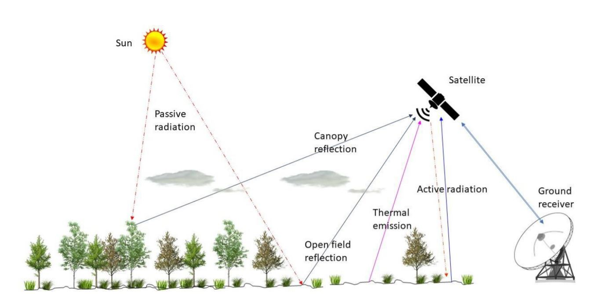 

Remote sensing applications in mapping salt-affected soils target land surface evidence of salt problems in the soil. Examples of proximal sensors often used are electromagnetic induction (EMI), geophysical sounding, and reflectometers. These sensors are mostly used to determine bulk soil electrical conductivity (Lesch et al., 1992). Low-altitude sensors such as Unmanned Arial Vehicles (UAV) are also gaining traction in mapping salt-affected soils (Hu et al., 2019; Ivusking et al., 2019). Hu et al. (2019) tested hyperspectral camera mounted on UAV and EMI in mapping salinity and found UAV as the most promising method for high-resolution identification of soil surface salinity characteristics.  

Satellite remote sensing are the most popularly used. They cover wide areas in a single scene, which is economical for large-area mapping. Moreover, most satellite images are increasingly becoming freely downloadable and gaining wide applications because of globally tested models and free processing algorithms. Their applications range from interpretation of composite images to modelling the relationships between indices of image reflectance and indicators of salt problems in the soil (Matternicht and Zinc, 2003; Gorji et al., 2019). Widely used remote sensing images for mapping soil resources are Landsat, sentinel and (Moderate Resolution Imaging Spectroradiometer (MODIS) (Table 3.1). These images are globally available for free download.  


*Table 3.1: Commonly used remote sensing image characteristics for mapping salt-affected soils*  

```{r, echo = FALSE}
dt <- read.csv("figures/tables/Table_3.1.csv", sep = ";")
kable(dt, col.names = gsub("[.]", " ", names(dt))) %>%
kable_styling("striped", full_width = F)
```

*B is notation for satellite image band  
Examples of popularly used image indices in mapping salt-affected soils are normalized salinity index (NSI), salinity index (SI), soil adjusted vegetation index (SAVI), vegetation soil salinity index (VSSI), normalized difference salinity index (NDSI), normalized difference vegetation index (NDVI), salinity ratio (SR), canopy response salinity index (CRSI), and brightness index (BI) (Gorji et al., 2019). They are summarized in Table
3.2. These indices have been variously used either alone or in combination to model soil surface salinity characteristics.

*Table 3.2: Examples of popular image band combinations for soil salinity mapping*
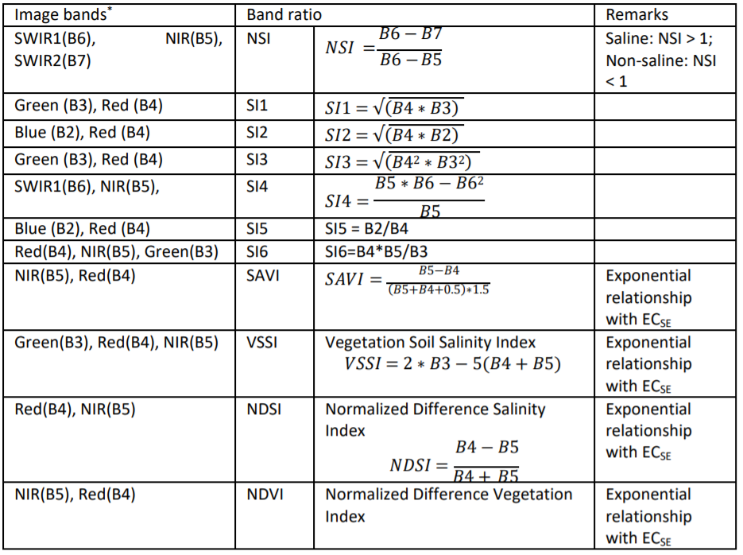

Remote sensing application for mapping salt-affected soils is expedited by the availability of images and processing software. Consequently, the approach is the fastest of all the methods for mapping salt- affected soils. Its application in large areas often produce consistent maps between boundaries of countries, which minimizes the need for harmonization. Furthermore, its time-series application is potentially useful in monitoring changes in status of salt-affected soils. A recent application at the global level was demonstrated by Ivushkin et al. (2019) (Figure 3.4).

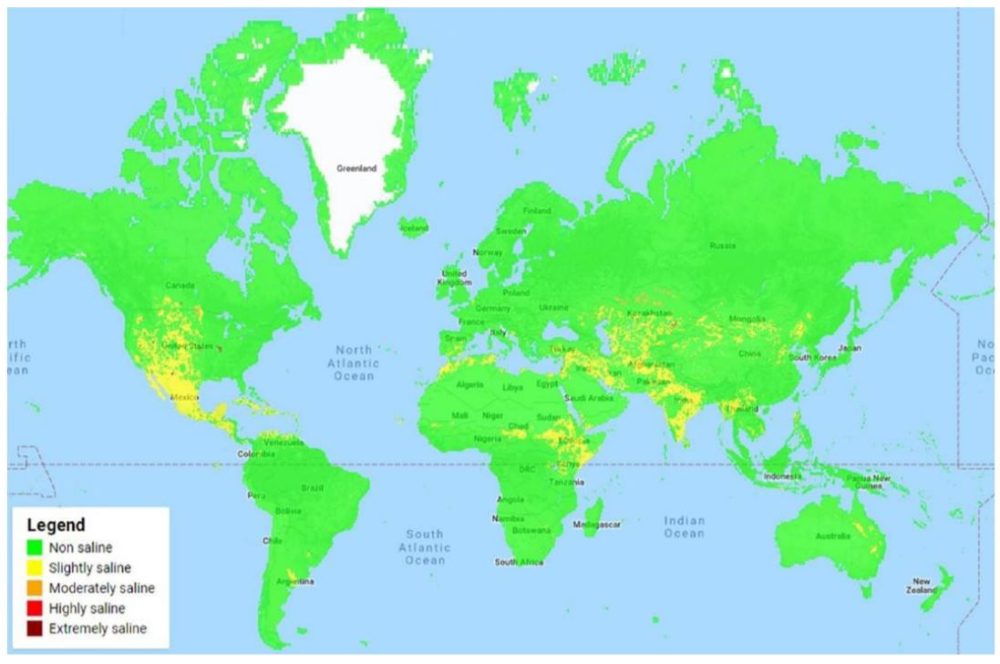

Despite the potential of remote sensing application, the approach is limited in detecting salt problems down the soil profile. Most remote sensing images for large-area mapping do not penetrate more than a few inches of the topsoil and only rely on the calibration models to estimate salt problems down the soil profile. These calibration models can result into spurious relationships without significance in salt dynamics in the soil (Matternicht and Zinc, 2003; Gorji et al., 2019). Some attempts have been made to overcome these limitations. Combined modelling with other spatial datasets such as climate, soil maps and vegetation cover are examples focused on performance improvements of the approach (Scudiero et al., 2019).  

##	Methods based on soil indicators of salts  
Soil indicators provide evidence of the presence of salts in the soil and occurrence of salt-affected soils. They are traditionally used in most soil classification schemes to identify the soil profiles and soil types belonging to the group of salt-affected soil (Soil Survey Staff, 1999; IUSS Working Group WRB, 2015; Craig and Hempel, 2017). Soil indicators of salt-affected soils are also used to quantify the intensity of salt problems in the soil (Table 2.4). They are also used to calibrate other methods for mapping salt-affected soils. Hence, they play a central role in assessing salt-affected soils and should therefore be the foundation for developing soil information of salt-affected soils.
Three types of applications exist in the literature for mapping salt-affected soils using soil indicators: 1) mapping the soil attributes and classifying the output maps, 2) mapping classes derived from the soil attributes, and 3) classifying calibrated maps of electromagnetic induction outputs or remote sensing images (Figure 3.5) (Triantafilis et al., 2001; Taghizadeh-Mehrjardi et al., 2019).

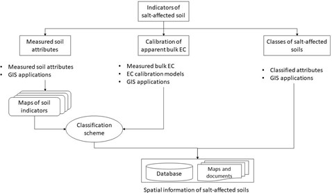
Applications using calibrated models with EMI are popularly used in mapping soil salinity. In this case, EMI data are calibrated with measured EC on a select sample set and the results used to map soil salinity (Lesch et al., 1992). Farzamian et al. (2019) recently tested the efficacy of local and regional models of this approach to improve its wide adoption. Mapping approaches involving extrapolation of pre-classified classes of salt-affected soils are also available in the literature. These approaches resemble the soil-map based method except that the input data are georeferenced soil attributes. They are not very popular owing to the challenges with extrapolation of categorical attributes (Jafari et al., 2012). Classifying spatially interpolated soil attributes is also another way of mapping salt-affected soils. In this case, the georeferenced soil indicators are first interpolated then the resulting maps are classified into maps of salt- affected soils (Zurqani et al., 2018). This approach was tested by Wicke et al. (2011) to produce a global map of salt-affected soils (Figure 3.6).

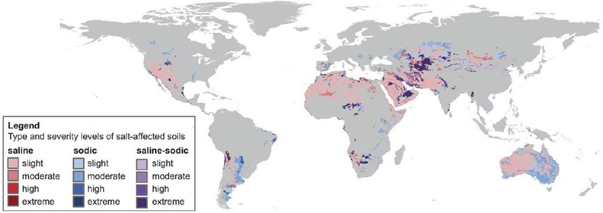

## Data requirements for mapping soil salinity    
Input data for mapping salt-affected soils depends on the mapping methods. A summary of data requirements by the main categories of mapping methods is given in Table 3.3. The soil indicator-based methods are the most data demanding. At least, they require soil data on electrical conductivity (EC), pH, and exchangeable sodium percent (ESP) or sodium adsorption ratio (SAR) as recommended by FAO or USDA classification schemes for salt-affected soils.  

*Table 3.3: Summary data requirements for mapping salt-affected soils*
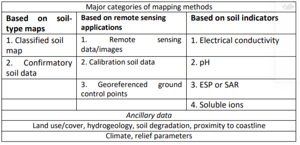

### Measured soil properties  
Measured soil properties for classifying salt problems in the soil are given in Table 3.4. Soluble ions in this category include Sodium (Na^+^), Calcium (Ca^2+^), Magnesium (Mg^2+^), Potassium (K+), Chloride (Cl^-^), Sulphate (SO^-2^), Carbonate (CO^-2^), Bicarbonate (HCO^-^) and Nitrates (NO^-^). They are useful in identification of the dominant salts and types of salt-affected soils. Electrical conductivity (EC), total soluble salts (TSS), total soluble cations (TSC), and total dissolved solids (TDS) are integral measures of salt concentration in the soil. This book recommends a minimum data set for classifying salt-affected soils as EC, pH and either ESP or SAR because of the recommendations given by the popular salt classification schemes (Table 2.1).
Table 3.4: Summary soil properties for mapping salinity  

*Table 3.4: Summary soil properties for mapping salinity*
```{r, echo = FALSE}
dt <- read.csv("figures/tables/Table_3.4.csv", sep = ";")
kable(dt, col.names = gsub("[.]", " ", names(dt))) %>%
kable_styling("striped", full_width = F)
```

###	Bulk-soil properties and soil maps
Bulk soil properties are properties measured in the field using proximal soil sensors. They are mostly used for estimation of pH and electrical conductivity. The sensors for measuring electrical conductivity are: 1) electrical resistivity, 2) electromagnetic induction, and 3) time domain/amplitude domain/frequency domain reflectometry (TDR, ADR, FDR). They measure electrical conductivity of the bulk soil, which is also known as apparent electrical conductivity (ECa) (Dalton and van Genuchten, 1986; Corwin and Lesch, 2005).

Field measurement of soil pH is often done using pH meters (and sometimes pH sensors). pH meters are used with samples prepared in the field. Hence, they are not really pH of the bulk soil. The sensors for bulk soil pH include field-efficient transistor (ion-selective field efficient transistor - ISFET) and conductimetric sensors, electrode sensors (Schirrmann et al., 2011).
Soil maps are ensemble of spatial information of groups (units) of soil with certain characteristics. Typical examples of soil maps are polygon maps showing dominant soil types in each polygon and thematic choropleth maps of indicators/classes of salt-affected soil types.

###	Information on soil forming factors
Soil forming factors are the parent material, land use/cover, climate, and relief. Information on the parent material is obtained from the geology map. The map should contain data on the age and type of lithology of the dominant rocks from which the soil was formed (Figure 3.7). Most geology maps are available as polygon GIS vector files.
Land cover/use information represent the biotic and anthropogenic activities influencing soil formation and secondary drivers of salt problems in the soil. Land cover/cover maps and remote sensing images are suitable sources of information of land cover/use. Examples of climate data are mean annual precipitation (rainfall, snowfall, etc.), annual minimum and maximum temperature, mean annual evapotranspiration rate, and wind speed. Freely downloadable climate data at low-resolution global scale are available at https://www.worldclim.org/ (Accessed on 31 January 2020). Digital elevation model (DEM) is the primary input data for deriving relief information. DEM can be downloadable at https://earthexplorer.usgs.gov/ accessed on 14 January 2020).


###	Other ancillary data
Other ancillary data for mapping salt-affected soils are administrative boundaries and spatial data of other drivers of salt problems in the soil (Figure 3.7). Spatial data of other drivers of salt problems are maps of hydrogeology (groundwater quality and depth to groundwater level), soil degradation, proximity to coastline, and flood-prone areas.

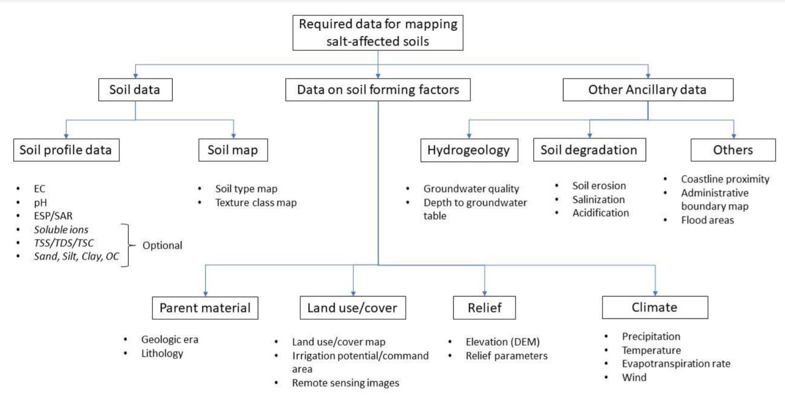  
###	Conversion models  
Electrical conductivity determined on saturated soil paste extract (ECSE in dS/m) is the preferred EC for classifying salt-affected soils. However, many soil laboratories don't analyse ECSE due to the cumbersome laboratory procedures involved with its determination and long turn-around time for analysing many samples. Instead they use other extracts, such as from 1:5 soil:water mix (1 part of soil in 5 parts of water), 1:2.5 solutions, etc (Landon, 1984). Proposals have been made in the literature to calibrate EC determined from other soil extracts to the ECSE equivalent (Hogg and Henry, 1984, Ozcan et al., 2006; Sonmez et al., 2008; Kargas et al., 2018). These proposals depend on the soil texture, organic matter content, temperature, and measured ECS. A generic framework in these proposals for converting EC to ECSE is as follows:

\begin{equation}
\tag{3.1}
EC_{SE} = f(EC_{s,texture,carbon,temperature}+ \varepsilon )
\end{equation}

*Table 3.5: Existing EC conversion models*  
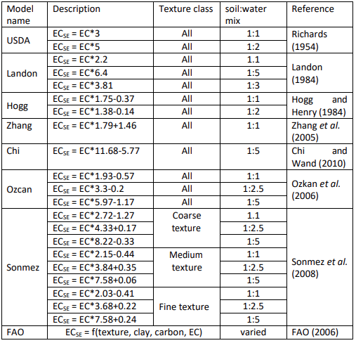  


