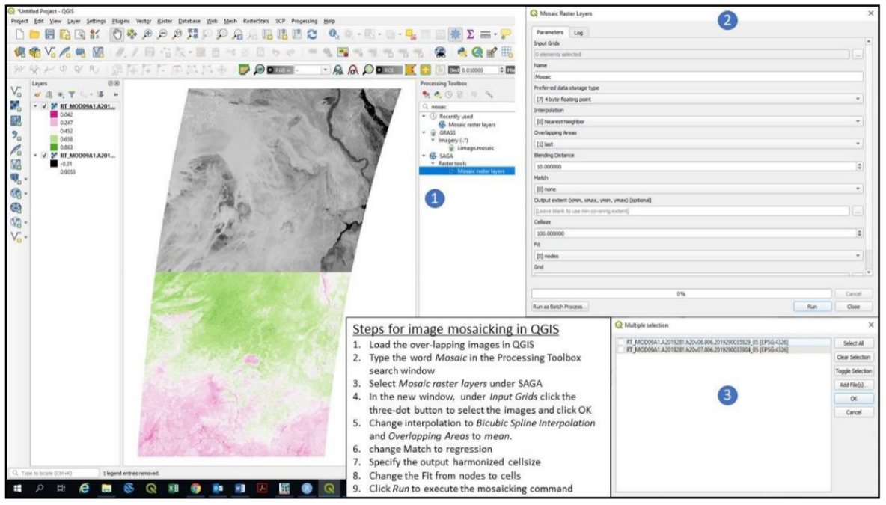
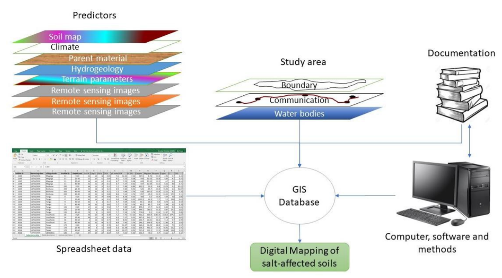
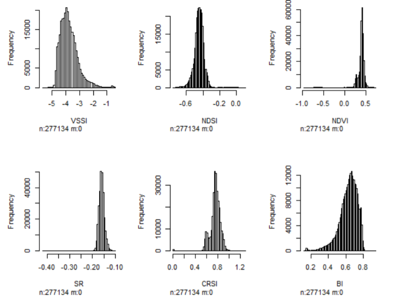
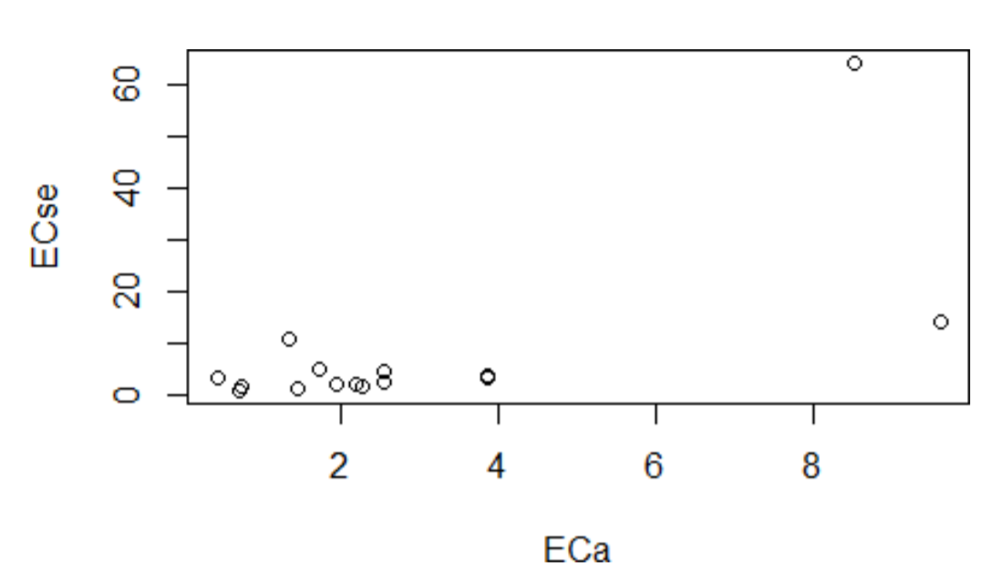
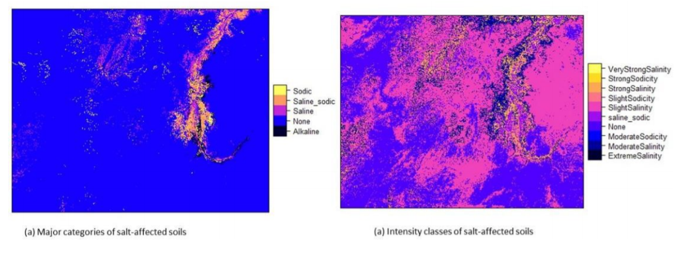
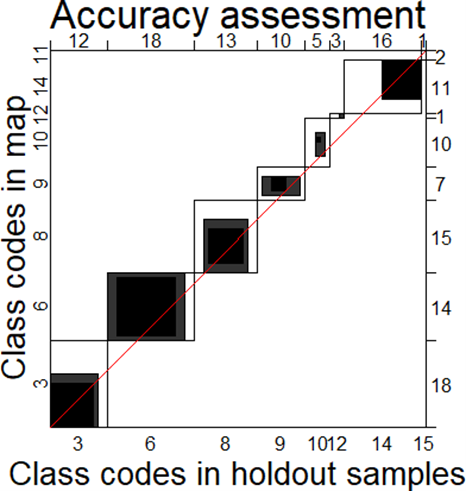
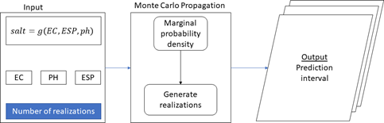
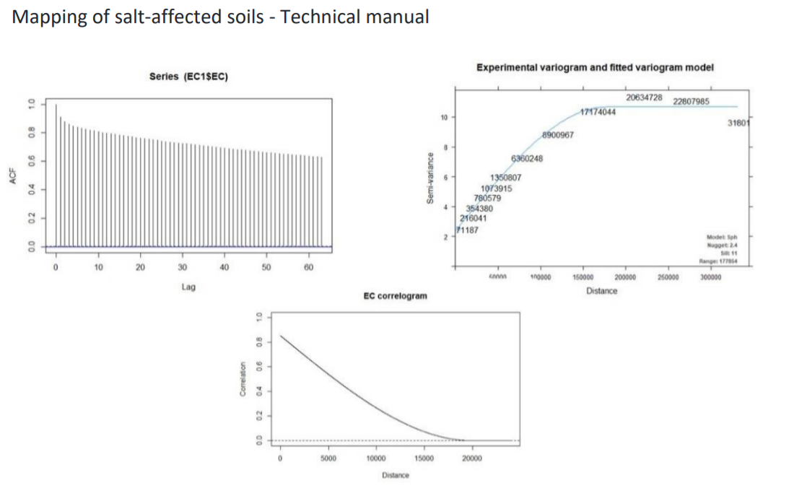

# SECTION TWO - DEVELOPMENT OF INFORMATION ON SALT-AFFECTED SOILS{-}

This section describes the procedural steps for developing multiscale spatial information of salt-affected soils. It demonstrates how to integrate the resources (computer and software, data, and expertise) with methods to develop spatial information of salt-affected soils.

  

# Preparation for multiscale mapping of salt-affected soils  

## Requirements   
Multiscale mapping of salt-affected soils requires adequate coordination and mobilization of input data, computer and software for implementing the mapping methods, and a harmonized approach that allows comparison of information in space and time. Input data requirements have been elaborated in Section 1, which gives the relationship between input data and characteristics of salt-affected soils. Mobilization of capital resources and coordination of activities are outlined in Section 3. The interaction between different aspects on input requirements for mapping salt-affected soils are illustrated in Figure 4.1.

  


###	Input data  
Input data provide evidence of occurrence of salt-affected soils. Their characteristics influence and are also influenced by the specifications of the final outputs of the mapping exercise such as suitable soil depths, spatial resolution of the final maps, incorporation of uncertainty and accuracy assessment , and classification of the intensity of salt problems in the soil. Table 4.1 is an example summary of input data requirements for national, regional and global mapping of salt-affected soils.

*Table 4.1: Minimum input data requirements for large-area mapping of salt-affected soils*
  
[^1] [^2] [^3] [^4] [^5]  
[^1]: WOSIS: https://www.isric.org/explore/wosis
[^2]: HWSD:http://www.fao.org/soils-portal/soil-survey/soil-maps-and-databases/harmonized-world-soil-database-
v12/en/
[^3]: WorldClim: https://www.worldclim.org/
[^4]: ESA: https://www.esa-landcover-cci.org/
[^5]: USGS: https://earthexplorer.usgs.gov/


###	Computer and software
Computer and software are required to process the input data, implement the assessment methods, and to store and share the final spatial information. They include processing, storage, and networking facilities for developing the spatial information of salt-affected soils. Processing facility is the core component responsible for implementing the assessment methods and consist of the computer processor and software. Consideration for specification of the processing facility is important since processing complexities tend to increase with increase in spatial extent and resolution of the final outputs. Storage of the input and processed data is handled by the computer storage (hardware) facility. Like the processing facility, the demand for storage facility also increases with increase in spatial extent of the target areas. The sizes of the input images and processed maps may increase from the national to global level assessment. All these considerations influence the minimum computer and software requirements for implementing multiscale mapping of salt-affected soils. The following computer specifications are suggested for national mapping of salt-affected soils:  

*   Enough processing memory (at least 8GB RAM);  
*   Fast processing capacity (at least Core i5 or equivalent);   
*   Enough storage capacity (at least 100 GB).  

Internet connectivity is also an important aspect of the computer and software requirements. It enables access to online data repositories during data acquisition as well as during information sharing.   


### Example input data for demonstrating spatial mapping of salt-affected soils  
The case study for demonstration indicator-based spatial mapping of salt-affected soil was obtained is northern Sudan. The area stretches from the Latitude 22$^\circ$ 13' 30.3" to 16$^\circ$ 30' 28.59" North and from the Longitude 32$^\circ$ 41' 3.55" to 25$^\circ$ 0' 0" East (Figure 4.2). Input soil data from this area consist of 379 profile locations which were surveyed in 2018 at various soil depths between 0 and 200 cm. The data includes
ECSE (dS/m), pH, ESP, soluble ions (Soluble Na^+^, SO~4~^2-^, CO~3~^2-^, HCO~3~^-^, and Cl^-^) in cmol/kg and were determined using the saturated soil paste extract approach. This data is available at https://doi.org/10.1594/PANGAEA.920201

 
Data on soil forming factors include multispectral remote images, remote sensing image of digital elevation model (DEM), and maps of land cover types, geology, and mean annual rainfall amount (Table 4.2). The input data also include shapefiles of the case-study boundary and major towns and raster map of aquifer types.  

*Table 4.2: Case-study input data from northern Sudan (source: Government of Sudan, http://susis.sd/)*  

 

## Software requirements for multiscale mapping salt-affected soils    

###	GIS application requirements    
GIS applications are useful in spatial data preparation and presentation of the final products to enrich the information content. Commonly used GIS applications for data preparation are:  

a)    Reprojection: This application is needed to align the coordinate system of GIS data into one uniform projection. Projections that give spatial dimensions in meters are preferred while WGS84 geographic (decimal degrees) projection is preferred for data sharing.  
b)    Layer clipping: This application helps with reducing data bulk by trimming the extent within the boundary of the area of interest.  
c)    Format conversion: This application is used to enable data exchange between different software and for data sharing. Format conversion is done to change GIS vector to raster (and vice versa) or to change between raster file types (such as from geoTiff to ASCII).
d)    Resampling: Resampling application is needed to harmonize resolution of input layers for spatial modelling of indicators and classified map of salt-affected soils.  
e)    Image correction: Image correction is mainly applied to remote sensing images. There are two types of image correction: radiometric and geometric correction. Radiometric correction aims at converting image digital numbers (DN) to reflectance. The algorithms for radiometric corrections are usually given for each type of remote sensing mission. Geometric correction application reprojects the images to a preferred coordinate reference system (CRS) to the images.  
f)    GIS database development: This facility is required to put together a harmonized complete dataset to minimize spatial modelling errors and to ensure compatible storage for future reference or applications.  
g)    Map layout: This is the final value-addition to GIS layers to enhance communication with users of the final products of spatial information for salt-affected soils.  

Most GIS software can implement the above applications. The following guidelines can be used to select a suitable GIS software to use:

*   Software which accommodates a wide range of GIS file formats;  
*   Software with many alternatives for colour pellets and symbology for map layouts;  
*   Software with easily accessible layer view and graphical user interface functionalities;  
*   Software which is strict with on-screen overlay of truly pixel-harmonized and georeferenced layers;  
*   Software with versatile but easy-to-implement vector-to-raster conversion algorithms;  
*   Software with robust modules for remote sensing applications and direct image download;  
 
Mapping of salt-affected soils - Technical manual

*   Software with vibrant and freely accessible online support;  
*   Easily accessible software (preferably low cost or open source).  
Some of the GIS software meeting the above criteria are QGIS (https://download.qgis.org/), ILWIS (https://52north.org/software/software-projects/ilwis/), gvSIG (http://www.gvsig.com/en), and SAGA (http://www.saga-gis.org/en/index.html). Other commercial GIS software such as ArcGIS, ERDAS, IDRISI, ENVI, etc. are also suitable alternatives.


### 	Data harmonization requirements  
Data for multiscale mapping of salt-affected soils may have variations and standards because of their sources and methods of data generation, spatial and temporal resolution, file format, and measurement units. Input data harmonization is necessary to produce compatible dataset to reduce errors in data handling and spatial modelling uncertainties. Data harmonization applications include:  

a)    Standardizing measurement units;  
b)    Converting soil property values to the equivalent of a preferred measurement method;  
c)    Harmonizing soil property values at uniform soil depth intervals;  
d)    Transforming statistical distribution to a preferred probability distribution function;  
e)    Harmonizing spatial resolution, projection and extent of input GIS layers for spatial modelling.


In multiscale mapping of salt-affected soils, input data harmonization focuses on soil indicators and GIS spatial layers (Figure 4.3). Software requirement for data harmonization include requirements for implementing data conversion models, image correction and indices development, and harmonizing GIS layers. Statistical harmonization needs are implemented using statistical software while GIS harmonization needs are implemented using GIS software. A suitable software such as R and its contributed packages (R (https://cran.r-project.org/bin/windows/base/) may be suitable for combining statistical and GIS harmonization needs. R contributed packages include soilassessment (Omuto, 2020), raster (Hijmans, 2020), rgdal (Bivand et al., 2019), and GSIF (Hengl, 2019).


### Spatial modelling requirements  
Multiscale mapping of salt-affected soils requires spatial input data, which are combined through certain procedures to produce spatial information of the status of soil salt problems. Spatial modelling targets the development of spatial layers of input data (indicators) of salt problems and for developing classified map of salt-affected soils. The software requirements for spatial modelling are:

*   Functionality for spatial prediction of numerical and categorical variables;  
*   Functionality to estimate mapping accuracy and uncertainties;  
*   Functionality to classify salt-affected soils.   

Freely downloadable R computing software adequately meets these requirements. Some of its packages are especially useful in implementing some of the above requirements. For example, the soilassessment package has functions for classifying salt-affected soils and estimating mapping accuracy and uncertainties while the caret package has functions for spatial prediction of numerical and categorical variables (Kuhn, 2020; Omuto, 2020).  

## Input data preparation for mapping salt-affected soils  
Input data preparation is a necessary step in mapping salt-affected soils. It involves creation of a complete and fully harmonized database of soil profile data, GIS layers, and reference documentation.

i.    Soil profile database is the database containing spreadsheet of georeferenced soil profile. The database contains information on soil depth and measured soil properties for each sampled depth, measurement units, methods used in measurements, reference laboratory, date of data acquisition, reference publication (if any), contact person, and summary metafile (text-file).
ii.   GIS database is the database containing spatial GIS layers, which are layers of soil forming factors and ancillary drivers of salt problems in the soils.
iii.    Document database is the database containing literature of existing information about salt- affected areas, problems, legislation, and previous attempts on solving the problem, etc.  

It is important to consider standard GIS practices when preparing and GIS data handling. The practices include:


I.    Rule on file path: A short pathname is preferred
Pathname contains file locations separated by forward or backward slash "/". The number of items in a pathname, which are separated by the slash "/" should be as few as possible and containing no spaces. For example, "C:/Salinity/Input" has two slash symbols implying two folders in the pathname while "C:/Salinity/Sudan/Input" has three slash symbols for three folders in the pathname. The 3-folder pathname is longer than the 2-folder pathname.  


II.   Rule on file name    
DO NOT create filenames or folder-names with spaces (e.g. "salt affected.shp" is not recommended). Instead use underscore or without space (e.g. "salt_affected.shp" or "saltaffected.shp" are recommended). DO NOT start filenames with numbers, symbols, mathematical operators, full-stop and comma (e.g. ".ECtp.xls" or "+ESP.tif" or "0_30topESP.mpr" are not recommended). It is better not to use mathematical operators in filenames.
DO NOT create filenames with long names (e.g. "salt_affected_soluble_ions_sodium.csv" is not recommended).Use informative naming style incorporating file type or projection for GIS layers (e.g. "soildata_dg.shp" or "ECtop0_30cm.tif" or "DEM90_UTM37N").


III.    Rule on data archive  
Separate and protect input data by placing them in input folder and write-protecting it from inadvertent overwrite. The steps shown in Figure 4.4 are useful in creating working and archiving folders and protecting archive folders. Write-protect feature for input folder may need to be remove when a new original data is to be added to the archive and the protection reinstated afterwards.


###	Organizing spreadsheet data  
A three-step approach is described for organizing and documenting spreadsheet data.  

<ins>Step 1: Aligning spreadsheet data</ins> 

In this step, the spreadsheet data is orderly arranged so that the data rows represent samples and columns represent variables. The samples are distinguished by sequential serial numbers. A good practice is to use the first column as the variable indexing the serial order of the samples. The other variables in the database are consecutively aligned in the columns beginning with profile ID, location description (if any), Latitude and Longitude, and sampling depth-range (Figure 4.5). The depth-range is further split into two variables: Upper and Lower. Upper denotes the first part of the depth-range while Lower denotes the last part of the depth-range. The value for Upper in one sample should be the same as the value for Lower in the preceding sample for the same profile ID (Figure 4.5). Other variables such as Depth Code (or Horizon number), soil texture components, organic carbon, pH, EC, ESP, and additional soil properties (e.g. soluble ions, exchangeable sodium ions and CEC) are also included in that order (Figure 4.5). The Depth Code (or Horizon) should have consecutive numbers beginning with 1 for the first depth to the last sampled depth/horizon in each profile. This arrangement creates repeated numbers/codes for the profile ID and Longitude and Latitude values (Figure 4.5).  


It is important to ensure that:

*   Upper, Lower, and Horizon for each profile ID should be increasing down the soil profile;  
*   Latitude, Longitude and Profile ID should remain constant for each Profile ID;  
*   Upper is equivalent to the first part of the Depth range and Lower is the second part of Depth.  


<ins>Step 2: Saving and exporting spreadsheet data</ins>  

After data organization, the spreadsheet data should be saved (preferably as comma separated values, CSV) for further alignment with other datasets (Figure 4.6).


Sometimes, it may be necessary to ascertain that the computer system separator is comma or semi-colon since this will influence access to the saved CSV file. The following procedure may be useful to establish the type of system separator.  

1.    Click on the Start menu.
2.    Type control panel.
3.    Click on Control Panel (Desktop app).
4.    Select Clock, Language, and Region.
5.    Click Region.
6.    Select Additional settings in the pop-up window.
7.    Check the separator in front of List separator.


Where necessary, change the system separator to comma (by following the above steps and changing to comma at step 7 and saving the change). If the system separator is changed after completing the steps in Figure 4.6, then the steps should be repeated.


<ins>Step 3: Documenting spreadsheet data</ins>  


This last step is concerned with documenting the data. The items to document are:  

*   Title (short description data type - point or spatial GIS layer);
*   Data type, date of data generation, number of profiles/augers;
*   Salinity/sodicity indicator;
*   Type of measurement (field or laboratory) and units of measurement;
*   Type of soil-water solution (soil solution extract used);
*   GPS coordinate reference system (CRS);
*   Reference publication/contact address.


The following is an example of a two-column textfile/notepad for the documentation. It should be saved as data metafile alongside the CSV file in Figure 4.6.


### Organizing GIS layers  
Organizing GIS layers starts from layer acquisition. Online repositories are available for free download of some GIS datasets such as remote sensing images, elevation, land cover/use types, soil, and climate. The link to some of these datasets is given in Table 4.1. An example of steps for GIS data download is given in Appendix A1. Downloaded data is harmonized and archived in input GIS database


###	Harmonizing input GIS layers  

#### Harmonizing coordinate reference system  

Coordinate reference system (CRS) defines the projection of a GIS layer. CRS models the Earth's surface into a 2D representation. Since the earth is not a perfect sphere, its surfaces require unique conversion models to transform the 3D landscape into 2D representation. Consequently, there are different CRS models between sets of Latitudes and Longitudes. GIS data organization endeavours to identify layers' CRS and harmonize them into one uniform projection model. Harmonized CRS is a basic core of GIS database because it allows spatial layering of different datasets either for visualization (on the screen) or for subsequent spatial modelling of salt-affected soils. Reprojection is the terminology often used in GIS for transforming one CRS to another. The following steps are used for reprojecting GIS layers:  

*Step 1:*   Identifying the final CRS to use for all GIS layers (here known as harmonized CRS).
It is important to use WGS 84 (decimal degrees) as the harmonized CRS for all layers because it has uniform parameters throughout the world. During reprojection, this CRS is known as target CRS.  
*Step 2:*   Note the CRS for each GIS layer and the individual need for reprojection. This CRS is known as source CRS during reprojection.  
*Step 3:*   Reproject the layers as shown in Figure 4.7.  


#### Harmonizing layer format

Not all GIS layers are available in the preferred file format. Most soil forming factors such as soil map, geology, and land cover types are often available as polygon vector files. They need file format conversion to raster since spatial modelling is normally done on raster file formats. The process of harmonizing GIS layer formats attempts to convert vector files to raster formats. It also seeks to convert all file in the database to uniform filetypes. Vector-to-raster conversion is the GIS function for harmonizing vector polygons into raster data types.
Vector-to-raster conversion in QGIS can be implemented using modules in GRASS, SAGA, GDAL, or QGIS Raster tools. Except for SAGA, all the other modules require an attribute of unique integers designating the polygon items for vector-to-raster conversion. Nonetheless, they all produce comparable results for mapping salt-affected soils. Creating an attribute of unique integers may require additional steps that are accessible at https://docs.qgis.org/testing/en/docs/user_manual/index.html.
Some of the pre-requisite operations before vector-to-raster harmonization include projection harmonization, identification of the target polygon attribute to use in the conversion, decision on the target pixel resolution of the final raster map, and cleaning of missing entries, topology errors, and associated errors in the data entry. Figure 4.8 illustrates the steps for vector-to-raster conversion in QGIS.  


#### Harmonizing remote sensing images  

(1)   Image correction  

Input remote sensing images for spatial modelling of salt-affected soils come from diverse sources with different characteristics such as spatial extent, image digital numbers, CRS, and file format. They need harmonization before integration in the modelling process. Image correction is the harmonization process for aligning the characteristics of downloaded images to correspond with those of the established GIS database for mapping salt-affected soils.

Step 1:   Unzip the downloaded images.
Most downloaded images are wrapped in compressed files such as .zip, .rar or .gz. They should be unpacked into commonly used GIS file formats such as geoTIFF, ASCII, HDF, etc. Software such as WinZip or WinRar or 7-Zip unpacks the compressed files into a preferred destination folder (such as C:/Salinity/Output). Sometimes the unpacked file may still contain compressed files and another unpacking step should be used in this regard to extract the GIS files. Different zipped files should be unzipped into different folders to avoid over-writing metafiles and for processing each file independently.  

Step 2:   Image correction
Semi-Automatic Classification Plugin (SCP) in QGIS provides a quick way for simultaneous geometric and radiometric correction of remote sensing images. The plugin has many functions for handling different types of remote sensing images such as Landsat, Sentinel-2, Sentinel-3, ASTER, MODIS, etc. Figure 4.9 illustrates how these types of images are corrected using SAC plugin in QGIS.


Step 3:   Combine and size Images
Downloaded images sometimes cover regions that extend outside the study area. In such cases, the images need to be clipped using the boundary layer of the study area. Besides image clipping, there are also cases where two or more remote sensing image-scenes are needed to cover the study area completely. Image mosaicking is used to join adjacent images to produce a composite image that covers the whole study area. The harmonization process endeavours to merge overlapping data and/or trim data to fit the study area.  

(2)	Mosaicking images  

Although there are algorithms for mosaicking several bands in one-step, band-by-band mosaicking is preferred as it gives room to assess the quality of the output product. Starting with Band1, vertically overlapping images covering the country are selected and mosaicked (Figure 4.10). The process is repeated for all the bands of the selected image type. It is important to:
1)    note of the image CRS and harmonized pixel size for the resultant mosaicked image
2)    select a suitable choice of name for each mosaicked image band (say Mosaic1 for band 1)
3)    identify the need for further clipping of the final mosaicked bands to trim them to the study area.


  

(3)	Image trimming  

Image trimming/clipping/masking produces reduced data size and customizes products to the area of interest. The steps for image clipping are illustrated in Figure 4.11.  

  

####	Harmonizing relief data  
Relief data is processed to produce a set of terrain parameters influencing the distribution of salt-affected soils. The literature categorizes terrain parameters as either primary or secondary attributes (Wilson and Gallant, 2000). Primary attributes are derived from the altitude and directional location of the topographic surface. They include slope, aspect, curvature, flow accumulation and up-slope flow contributing area. Secondary attributes are obtained from the altitude and derivatives of the primary attributes. They depict surface characteristics regarding water distribution and light reflection and include indices such as topographic wetness index, compound topographic index, stream power index, etc. (Li et al., 2005).  
Elevation map is the primary input for extracting terrain parameters. Where necessary, depressionless elevation is first developed to improve the quality of the derived parameters (Weibel and Heller, 1991). SAGA software has a module for simultaneous derivation of 14 terrain parameters from DEM input. Its implementation steps are given in Figure 4.12.  


 

At least two primary and two secondary terrain parameters are adequate for modelling salt-affected soils. This book proposes slope, longitudinal curvature, LS-factor, Channel Network Base Level, and Valley Depth as the terrain parameters for mapping salt-affected soils. 


###	Input GIS database  
Properly established and complete GIS database has many advantages in data management, spatial modelling and as organized baseline for future monitoring activities. GIS database for multiscale mapping of salt-affected soils comprise harmonized input data, documentation (metadata) of the input data, and methods and software for data access and preparation (Figure 4.13). The database is the backbone for spatial information of salt-affected soils and should therefore be properly established and standardized to improve efficiency in information update, access, and data sharing.

 

Some of the desired GIS database characteristics for mapping salt-affected soils are:

*   The database should have representative data (raster layers) of soil forming factors, ancillary information on other drivers of salt problems in the soil (such as groundwater and irrigation command areas), and soil indicators of salt-affected soils
*   All methods for data transformation and metadata should be documented
*   All input (un-processed) data should be archived in secured input folder and protected from inadvertent data modification. The processed data should be saved in the Output folder, which should also be the working directory.
*   All GIS raster files should be harmonized to a common CRS and pixel resolution  


ILWIS map-list is a suitable facility for ensuring that all harmonized raster layers have uniform CRS and pixel resolution. Unlike other GIS software which can allow (force) on-screen overlay even for different layer characteristics, ILWIS never overlay non-harmonized layers. In addition, it can also facilitate multivariate statistics and harmonization of statistical distribution of the layers. Figure 4.14 gives the steps for creating a map-list of harmonized raster layers.


 

The final GIS database should have:  

1.    Spreadsheet soil data. It should contain at least the following variables: Sample, Pits, Longitude, Latitude, Depth, Upper, Lower, Horizon, EC, pH, ESP.
2.    GIS layers. This data should have the following minimum layers
*   Relief parameters: Elevation (denoted as dem), slope (slope), slope-length factor (ls), channel network to basin level (cnbl), longitudinal curvature (loncurve), and valley depth (valley);
*   Remote sensing image bands: Blue band (BBlue), Green band (BGreen), Red band (BRed), Infrared band (BIRed), shortwave band 1(swir1), and shortwave band 2 (swir2);
*   Land cover (lcover);
*   Climate: rainfall (rain), maximum temperature (maxtempr), and minimum temperature (mintempr);
*   Geology (geology);
*   Hydrogeology (pgeology);
*   Soil map (soilmap);
*   Erosion (erosion);

#	Country-driven global mapping approach  
##	Background  
The country-driven approach for mapping salt-affected soils is based on indicator mapping backed by drivers of salt-affected soils and models for classification of the salt problems. The approach integrates and borrows from the potential of other mapping methods. It also offers quantification of mapping accuracy and uncertainty, which are increasingly accepted by the soil science community as a standard practice. It also facilitates building of spatial information on indicators and drivers besides information on the status of salt-affected soils at multiple scales. However, these advantages come at the price of data demand. Some of the required input data such as soil indicators (ESP and Soluble ions) may not be readily available in many territories.
The country-driven global mapping is a three-step approach anchored on input data harmonization, spatial modelling of input soil indicators using spatial predictors, and classification of salt-affected soils (Figure 5.1).

 


The approach puts emphasis on measured soil data (EC, pH, and ESP) as the primary soil indicators for classifying salt-affected soils. These input soil data are spatially modelled to produce maps of soil indicators of salt-affected soils. Appropriate classification schemes are selected to classify the indicator maps into maps of salt-affected soils (Figure 5.1).
R software and its contributed packages are the principal software for implementing the country-driven global mapping protocol. A summary of the key packages for implementing various steps of the protocol is given in Table 5.1. RStudio software (https://rstudio.com/products/rstudio/download/) is used as an integrated development environment to support implementation of the packages in R. 

*Table 5.1: R packages and their application in multiscale mapping of salt-affected soils*

These packages and their dependencies are installed using the following commands in R

```{r,eval=FALSE}
install.packages(c("raster", "sp", "rgdal", "car", "carData", "dplyr", "spacetime", "gstat", "automap", "randomForest", "fitdistrplus", "e1071", "caret", "soilassessment", "soiltexture", "GSIF", "aqp", "plyr", "Hmisc", "corrplot", "factoextra", "spup", "purrr", "lattice", "ncf", "npsurv", "lsei", "qrnn", "nnet", "mda", "RColorBrewer", "vcd", "readxls","maptools","neuralnet","psych"))

library(sp); library(foreign); library(rgdal); library(car);library(carData); library(maptools) library(spacetime); library(gstat); library(automap);library(randomForest);library(fitdistrplus); library(e1071); library(caret); library(raster); library(soilassessment); library(soiltexture); library(GSIF); library(aqp); library(plyr); library(Hmisc); library(corrplot); library(factoextra) library(spup); library(purrr); library(lattice);library(ncf);library(npsurv); library(lsei); library(nnet); library(class); library(mda); library(RColorBrewer); library(vcd); library(grid); library(neuralnet);library(readxl); library(psych);library(qrnn); library(dplyr)

```

It is important to note the following points when implementing the mapping protocol in Figure 5.1 in R.

*   R is a case-sensitive scripting software. More than 90% of its commands are scripted in a text- editor and executed by running the line/script.
*   Hash (#) denotes the beginning of a comment and is not executed by the software. Consequently, it can be used to insert comments in a line. All comments after hash (#) are colored green (like green traffic light) implying "pass" without execution.
*   Errors and warnings are given in red, while functions and number are given in blue and commands and variables are given in black.
*   When using RStudio text-editor, four panes are available in which the top left pane is the text editing window, top right pane is for data environment, bottom right pane is for display and help, and the bottom left is the console for executing the scripts.
*   Implemented scripts and reports (warning or errors) are shown in the console pane.
*   Some commands may run for some time and patience is recommended to enable the software to progress to completion. During such time, a red icon will be shown at the top left corner of the console pane.  


## Step 1: Input data harmonization
Input data harmonization at this point is carried out to: 1) harmonize soil indicators to those of saturated soil paste extract, 2) harmonize statistical distribution to normal distribution, and 3) harmonize soil depths at the interval of 0-30 cm, 30-100 cm, and 100-200 cm (and more depending on soil depths). These harmonization steps compliment those that were done during input data preparation.  

###	Harmonizing GIS layers

Begin by setting the working directory. This is a recommendation building on the previous database development in which the input processed data were saved in the output folder (c:/salinity/output) in Section 4.3.4.
```{r,eval=FALSE}
# Step 1-1: Import the data
setwd("C:/Salinity/Output") # Setting the working directory
soil=readOGR(".","soildata") # Importing soildata.shp as shapefile
```


Spreadsheet data can also be imported directly as excel data or CSV using appropriate commands such as
```{r,eval=FALSE}
soil = read_xlsx("soildata.xlsx") 
```
 for importing MS Excel or 

```{r,eval=FALSE}
soil=read.csv("soildata.csv",header=T) 
```

for importing CSV filetype. GIS rater files are imported using either readGDAL or raster functions. Both functions accept many GIS raster file format such as geoTIF, ILWIS, ASCII, etc. When using the readGDAL function, the first instance is used to create a stack space for subsequent layers. Hence, it does not have "\$" sign at the end of predictors and does not have "\$band1" at the end of the import line. The function is unique since (1) it does not accept import and stack of layers of different dimensions in terms of spatial extent and pixel sizes and (2) it automatically creates a stack (here known as predictors) for input GIS layers. Subsequently, it is a preferred function for ensuring input data conformity. If the raster function is used, it may be necessary to resample the layers in case of possible differences in dimensions that may later introduce modelling errors. All imported input GIS layers should be named accordingly (dem, slope, ls, loncurve, cnbl, valley, rain, lcover, geology, pgeology, BBlue, BGreen, BRed, BIRed, swir1, swir2, etc.)


```{r,eval=FALSE}
predictors=readGDAL("dem.tif")
predictors$slope=readGDAL("SLOPE.mpr")$band1
predictors$ls=readGDAL("ls.asc")$band1
predictors$valley=readGDAL("valley.mpr")$band1
predictors$geology=readGDAL("geology.mpr")$band1


predictors$BBlue=readGDAL("BBlue.mpr")$band1
predictors$swir1=readGDAL("swir1.asc")$band1
predictors$swir2=readGDAL("swir2.tif")$band1


predictors$dem=predictors$band1 # for replacing the first layer
predictors$band1=NULL # for removing replaced layer
# Step 1-2: Check the data for unique values and remove where possible
summary(predictors)
# Object of class SpatialGridDataFrame # Coordinates:
#		min		max # x	-75674.99	417325
#	y 1883692.11 2443692
# Is projected: TRUE # proj4string :
# [+proj=utm +zone=36 +datum=WGS84 +units=m +no_defs +ellps=WGS84 +towgs84=0,0,0] # Grid attributes:
#	cellcentre.offset cellsize cells.dim # x		-75176 997.9757	494
# y	1884191 998.2175	561
# Data attributes:
#	dem	loncurve	ls	cnbl
# Min.	: 176.0		Min.	:-1.000e-07		Min.	:0.000002		Min.	:178.6 # 1st Qu.: 292.5	1st Qu.:-1.000e-07	1st Qu.:0.011727	1st Qu.:279.4
# Median : 342.9  Median :-1.000e-07   Median :0.033486   Median :326.9 # Mean  : 349.7   Mean   : 1.170e-06   Mean   :0.053562   Mean   :332.3 # 3rd Qu.: 399.1  3rd Qu.: 1.149e-06   3rd Qu.:0.062155   3rd Qu.:380.0 # Max.   :1064.6   Max.   : 3.295e-04   Max.   :7.043770   Max.  :571.0
# .....
#    swir1	swir2	BBlue	BGreen

# Min.	:0.008162	Min.	:0.002062	Min.	:0.009072	Min.	:0.01625
# 1st Qu.:0.554471	1st Qu.:0.533823	1st Qu.:0.426480	1st Qu.:0.11551
# Median :0.625109	Median :0.603396	Median :0.476060	Median :0.13294
# Mean	:0.604679	Mean	:0.582251	Mean	:0.462953	Mean	:0.13189
# 3rd Qu.:0.676205	3rd Qu.:0.650973	3rd Qu.:0.516825	3rd Qu.:0.15002
# Max.	:0.868268	Max.	:0.838160	Max.	:0.679898	Max.	:0.22036

# Remove NAs in case they occur due to data clipping
predictors$slope=ifelse(is.na(predictors$slope),mean(!is.na(predictors$slope)),predi ctors$slope)

```

Statistical distribution of the GIS layers may also need to be checked if it requires harmonization. The histogram function (hist) is used to facilitate visual assessment for skew and need for normalization. In the case-study sample dataset, slope and rainfall layers showed skewed distribution and are normalized with square root and log-transformation, respectively. Other transformation models can be tested for other datasets.

```{r,eval=FALSE}
# Check for frequency distribution of the GIS layers
hist(predictors@data[,c("dem","slope","loncurve","cnbl","valley","lcover","rain", "geology","pgeology")])


# Step 1-3: Derive the remote sensing indices
```


Remote sensing image indices in Table 3.1 related to surface features/evidence of salt problems are determine using imageIndices function in the soilassessment package. It uses seven bands of the input remote sensing data, which should now be in the predictors stack of layers. They are specified in the script using the "\$" symbol with the predictors. 

```{r,eval=FALSE}
predictors$SI1=imageIndices(predictors$BBlue,predictors$BGreen,predictors$BRed,predi ctors$BIRed,predictors$swir1,predictors$swir2,"SI1")

#	Min. 1st Qu.	Median	Mean 3rd Qu.	Max. # 0.03426 0.16152 0.18227 0.17972 0.20203 0.28645


predictors$SI2=imageIndices(predictors$BBlue,predictors$BGreen,predictors$BRed,predi ctors$BIRed,predictors$swir1,predictors$swir2,"SI2");summary(predictors$SI2)
#	Min. 1st Qu.	Median	Mean 3rd Qu.	Max. # 0.02974 0.31104 0.34469 0.33663 0.37158 0.50973


# Continue to complete all 13 image indices (see appendix A and Table 3.1)
predictors$BI=imageIndices(predictors$BBlue,predictors$BGreen,predictors$BRed,predic tors$BIRed,predictors$swir1,predictors$swir2,"BI");summary(predictors$BI)
#	Min. 1st Qu.	Median		Mean 3rd Qu.		Max. # 0.1113	0.5757	0.6454	0.6302	0.7039	0.9405
```

Any NAs produced during the calculation of the image indices can also be removed using the command in Step 1-2. Altogether, there are at least 13 layers of image indices produced. This number can be reduced using multivariate principal component analysis (PCA). The next step assesses statistical distribution of the image indices and harmonizes them to normal distribution, which is a prerequisite for PCA data reduction. 
```{r,eval=FALSE}
# Step 1-4: assess statistical distribution and harmonize where necessary
hist(predictors@data[,24:29]) # Figure 5.2
summary(predictors$SI6)
#	Min.	1st Qu.	Median	Mean	3rd Qu.	Max. # 0.003647 0.940943 1.129692 1.068303 1.232106 1.663694

predictors$BI=sqrt(predictors$BI)

hist(predictors$BI)
```



VSSI and BI image indices showed slight skew. Test with square-root transformation was found to adequately normalize the data. Although the transformation model is arbitrarily tested at this stage, it is better to use robust models such as the Box-Cox transformation (Box and Cox, 1964). 

```{r,eval=FALSE}
# Step 1-5: Perform PCA and select the first PCs accounting for over 95% of the image indices' variation

# Extract the image layers
predicters=predictors@data[,c("SI1","SI2","SI3","SI4","SI5","SI6","SAVI","VSSI","NDS I","NDVI","SR","CRSI", "BI")]
soil.cor=cor(predicters)
corrplot(soil.cor,method="number",number.cex = 0.8) # Figure 5.3a
pca<-prcomp(predicters[], scale=TRUE)
fviz_eig(pca) # Figure 5.3b

```

After normalizing the image indices, they are selected and converted into data-frame to enable determination of correlation and principal component analysis. Afterwards, the selected PCs are converted back to the raster stack.
The correlation plot (Figure 5.3b) shows the correlation between image indices. For example, SI1 and SI2 have a Pearson correlation index equal to 86%. PCA examines these correlations and determines the principal axes where data are highly correlated. These axes are also known as principal component (or dimensions in Figure 5.3b). Figure 5.3 is important in guiding the choice of PCs to represent the entire (13) layers of image indices.  

  

In Figure 5.3b, cumulative sum of the first 4 PCs (Dimensions) add up to more than 95% explained variation in the overall 13 layers of the image indices. Hence, the first 4 PCs can adequately represent the 13 image indices. This approach can be used on any set of image indices to select the appropriate number of PCs to reduce the data bulk.  

```{r,eval=FALSE}
# Return the selected PCs to the raster stack to complete the harmonization process
Pred.pcs<-predict(pca,predicters[])
predictors@data$PCA1=Pred.pcs[,1]
predictors@data$PCA2=Pred.pcs[,2]
predictors@data$PCA3=Pred.pcs[,3]
predictors@data$PCA4=Pred.pcs[,4]

```

### Harmonization of input soil data

Many methods can be used to determine EC. They include (1) use of saturated soil paste extract, (2) using other soil extracts, (3) using pedoTransfer models from other soil properties, or (4) electromagnetic induction. Harmonization seeks to standardize methods 2 to 4 to the equivalent values in method 1, since popular classification schemes use values obtained by method 1.
(1)	Example harmonization using known models in Table 3.5 (in Chapter3)


NB: This part is for the purposes of illustrating the steps for harmonizing EC. The case-study data indeed contains EC as obtained by the method of saturated soil paste extract and do not need harmonization. A quick look at the data structure is necessary to establish availability and format for target variables (EC, texture components, and organic carbon). The str function extracts the data structure.  

```{r,eval=FALSE}
# Step 1-6a: Harmonize input indicator measurements to those for saturated soil paste extract
#Step 1-6b: Load the library and import the soil data
str(soil)

# 'data.frame': 192 obs. of	14 variables:
# $ Sample	: int	1 2 3 4 5 6 7 8 9 10 ...
# $ Pits	: int	1 1 2 3 4 5 6 6 7 8 ...
# $ Longitude: num	62.2 62.2 62.2 62.2 62.2 ...
# $ Latitude : num	30.2 30.2 30.2 30.2 30.2 ...
# $ Upper	: int	0 20 0 0 0 0 0 40 0 0 ...
# $ Lower	: int	20 100 30 30 30 30 40 100 30 40 ...
# $ Horizon	: Factor w/ 2 levels "A","B": 1 2 1 1 1 1 1 2 1 1 ...
# $ EC	: num	1.16 1.63 0.499 0.295 0.161 0.8 1.85 0.938 0.167 0.141 ...
# $ PH	: num	8.3 8.71 8.64 8.72 9.14 8.6 8.86	8.95	8.83	9.45	...
# $ ESP	: num	3.61 7.16 2.76 2.26 1.56 ...				
# $ Sand	: num	51 45.2 45.2 55.2 67.2 43.2 45.2	49.2	49.2	85.2	...
# $ Silt	: num	38 44 39 32 20 44 39 36 31 2 ...				
# $ Clay	: num	11 10.8 15.8 12.8 12.8 12.8 15.8	14.8	19.8	12.8	...
# $ OC	: num	0.21 0.32 0.24 0.66 0.23 0.36 0.17 0.05 1.37 0.12 ...
```

The data seems to have the required variables for harmonizing EC values. The first step in the harmonization is to derive the soil textural classes. The functions for deriving the soil textural classes do not accept NAs in the data. Hence, they must be clearly checked and removed from the list of variables containing the textural components. This is done by first creating a dummy column to sum the texture components and using this dummy to choose only data-entries without missing entries (i.e. NA). In the case-study dataset, the texture components appear in variables number 11 (Sand), 12 (Silt) and 13 (Clay) (Note that there are 14 variables all together).


```{r,eval=FALSE}
#Step 1-6c: Check for missing data and select only complete dataset
variable.names(soil[11]); variable.names(soil[12]); variable.names(soil[13]);
soil$dummy= rowSums(soil[, 11:13])
soil1=subset(soil,!is.na(soil$dummy))
soil1$dummy=NULL # remove the dummy
soil0=data.frame(soil1)
#Step 1-6c: Create and code the texture classes
SSCP=soil0[,c("Clay","Silt","Sand")]
names(SSCP) = c('CLAY', 'SILT', 'SAND')
SSCP = round(SSCP, 2)
SSCP_norm = TT.normalise.sum(tri.data = SSCP[,1:3], residuals = T)
colnames(SSCP_norm)[1:3] = paste0(colnames(SSCP_norm)[1:3],"_nm")
SSCP = cbind(SSCP, round(SSCP_norm, 2))
SSCP$CLAY=SSCP$CLAY_nm;SSCP$SILT=SSCP$SILT_nm;SSCP$SAND=SSCP$SAND_nm
rm(SSCP_norm)
soil0=cbind(soil0,"TEXCLASS" =TT.points.in.classes(tri.data =SSCP[, c('CLAY', 'SILT', 'SAND')],class.sys = "USDA.TT",	PiC.type	= "t",collapse	= ', '))
soil0$TEXCLASS=as.factor(soil0$TEXCLASS)
soil0$TEXCLASS1=as.numeric(soil0$TEXCLASS)
summary(soil0$TEXCLASS)
rm(SSCP)
soil0$TEXCLASS=car::recode(soil0$TEXCLASS,"'Lo, SiLo'='SiLo'") # Here, the double classes are changed one at a time

summary(soil0$TEXCLASS)
#Cl	Lo Lo, SiLo	LoSa	SaClLo	SaLo	SiLo
#2	51	2	9	1	104	22

soil0$TEXCLASS1=dplyr::recode(soil0$TEXCLASS,Cl=1, ClLo =7, Lo=11, LoSa=10, Sa=12, SaCl=8, SaClLo=9,SaLo=5, SiCl=2,SiClLo=3,SiLo=4,Si=6,CS=13,MS=14,HCL=16,FS=15)

summary(soil0$TEXCLASS1)
#Min.	1st Qu.	Median	Mean	3rd Qu.	Max.  1.000	5.000	5.000		6.691	11.000		11.000

soil1=soil0
```

It is important to note again that the sample case-study variables were determined on saturated soil paste extract. Hence, the examples for harmonization given here are for the purpose of demonstrating script implementation. Suppose the EC was determined from 1:1 soil extract, then the following script is used to harmonize the EC values.

```{r,eval=FALSE}
#Step 1-6d: EC harmonization
soil1$ECse1=ECconversion1(soil1$EC,soil1$OC,soil1$Clay,soil1$texture1,"1:1","FAO")
summary(soil1$ECse1)

#Min.	1st Qu.	Median	Mean	3rd Qu.	Max.	NA's
#0.4912	2.0461	4.0769	10.5302	9.8501	108.8235	1
```

(2)	Example harmonization using pedo Transfer function


Pedo-transfer function (PTF) is a function for estimating soil property by utilizing functional relationship between this property (known as a target variable, such as ECSE) and other easy-to-measure soil variables such as texture, carbon, etc. Suppose a few samples have ECSE measurements, then a PTF is built between ECSE and the other soil properties. The PTF function is stored and later used to estimate ECSE for all (or future) samples in the study area. The soilassessment package has pedoTransfer function for building PTF. This function provides for alternative models such as linear, random forest, support vector machine, neural networks, etc. for modelling the relationship between the target soil variable and its predictors. The first term in the pedoTransfer function specifies the preferred model such as randomforest, svm, neuralnetwork, linear, etc. The second term specifies the dataframe containing the calibration dataset. This dataframe should not have NAs in any of the variables for developing the pedoTransfer model. The last terms are unlimited list of predictor variables, which are separated by comma. Their names should be like the variable names in the dataframe.

```{r,eval=FALSE}
#Step 1-6e: EC harmonization
soil2 =soil1[sample(nrow(soil1)), ][1:(floor((nrow(soil1)/4)*1)), ]
soil2=subset(soil2,!is.na(soil2$ECse))
EC.ptf= pedoTrasnfer("randomforest",soil2,ECse,Sand,OC,Clay)
soil1$ECpf=predict(EC.ptf, newdata=soil1) #to attach the harmonized ECSE equivalent
plot(soil1$ECse,soil1$ ECpf)
abline(a=0,b=1,lty=20, col="black")
```

(3)	Example harmonization of apparent electrical conductivity of bulk soil


Apparent electrical conductivity of bulk soil (ECa) is measured in the field using proximal sensors such as EMI. It's possible to obtain many sampled data points with this EC measurement approach owing to its rapid nature. However, the measured ECa values need calibration with measured ECSE to harmonize them. The harmonization is a two-step process in which the calibration model is first build between selected samples with ECa and ECSE and then the model applied to the remaining ECa to estimate the equivalent ECSE. In the soilassessment package, the function ECconversion3 facilitates this kind of harmonization. The following scripts demonstrate how to use ECconversion3 to harmonize ECa with ECSE. A scatterplot of ECa with ECSE is important in guiding the choice for the link model. In the given example, a power relationship is assumed as the link model between ECa and ECSE (Figure 5.4). Other link options such as linear, exponential, logarithmic, etc. are also provided in the ECconversion3 (Omuto, 2020).

```{r,eval=FALSE}
#Step 1-6f: EC Harmonization
plot(ECse~ECa,soil2) # To choose a suitable predictive model #(Figure 5.4)
EC3.ml=nls(EC~ECconversion3(ECa,A,B,"power"), start=c(A=0.1, B=0.8), data=soil2)
soil$ECse3=ECconversion3(soil$EC, coef(EC3.ml)[1], coef(EC3.ml)[2],"power")
```

 

Soil depth harmonization aims at developing soil information for uniform depth throughout the soil data. Uniform depth facilitates comparison of salt problems down the profile and horizontally across the landscape. This harmonization is achieved with the depth-integrating spline approach (Bishop et al., 1999). The tool for implementing the approach is contained in the GSIF package (Hengl, 2019).

```{r,eval=FALSE}
#Step 1-7: Harmonizing soil depths

lon=soil1$Longitude
lat=soil1$Latitude
id=soil1$Pits
top=soil1$Upper
bottom=soil1$Lower
horizon=soil1$Horizon
ECdp=soil1$EC
prof1=join(data.frame(id,top,bottom, ECdp, horizon),data.frame(id,lon,lat),type="inn er")


depths(prof1)=id~top+bottom Warning message:
converting IDs from factor to character
site(prof1)=~lon+lat
coordinates(prof1) = ~lon+lat
proj4string(prof1)=CRS("+proj=longlat +datum=WGS84 +no_defs")
depth.s = mpspline(prof1, var.name= "ECdp", lam=0.8,d = t(c(0,30,100,150))) 

plot(prof1, color= "ECdp", name="horizon",color.palette = rev(brewer.pal(8, 'Accent'
)),par=c(cex.lab=2.0)) #Figure 5.5


lon=soil1$Longitude
lat=soil1$Latitude
id=soil1$Pits
top=soil1$Upper
bottom=soil1$Lower
horizon=soil1$Horizon
ECdp=soil1$EC
prof1=join(data.frame(id,top,bottom, ECdp, horizon),data.frame(id,lon,lat),type="inn er")


depths(prof1)=id~top+bottom Warning message:
converting IDs from factor to character
site(prof1)=~lon+lat
coordinates(prof1) = ~lon+lat
proj4string(prof1)=CRS("+proj=longlat +datum=WGS84 +no_defs")
depth.s = mpspline(prof1, var.name= "ECdp", lam=0.8,d = t(c(0,30,100,150)))

plot(prof1, color= "ECdp", name="horizon",color.palette = rev(brewer.pal(8, 'Accent'
)),par=c(cex.lab=2.0)) #Figure 5.5


lon=soil1$Longitude
lat=soil1$Latitude
id=soil1$Pits
top=soil1$Upper
bottom=soil1$Lower
horizon=soil1$Horizon
ECdp=soil1$EC
prof1=join(data.frame(id,top,bottom, ECdp, horizon),data.frame(id,lon,lat),type="inn er")


depths(prof1)=id~top+bottom Warning message:
converting IDs from factor to character
site(prof1)=~lon+lat
coordinates(prof1) = ~lon+lat
proj4string(prof1)=CRS("+proj=longlat +datum=WGS84 +no_defs")
depth.s = mpspline(prof1, var.name= "ECdp", lam=0.8,d = t(c(0,30,100,150))) 

plot(prof1, color= "ECdp", name="horizon",color.palette = rev(brewer.pal(8, 'Accent'
)),par=c(cex.lab=2.0)) #Figure 5.5
```


```{r,eval=FALSE}
#Step 1-8: Extract the depth-harmonized soil data and re-project
soilhrmdepths=data.frame(depth.s$idcol, depth.s$var.std, check.names = TRUE)
soil2=merge(soil1,soilhrmdepths,by=intersect(names(soil1),names(soilhrmdepths)),by.x
="Pits",by.y="depth.s.idcol",all=TRUE)
coordinates(soil2)=~Longitude+Latitude
proj4string(soil2)=CRS("+proj=longlat +datum=WGS84")#Attach CRS to the data
#Harmonize CRS and ensure use of the correct +proj and +zone for the study area
soil1=spTransform(soil2,CRS("+proj=utm +zone=36 +ellps=WGS84 +units=m +no_defs"))
soil1=soil2
hist(soil1$EC)
soil1=subset(soil1,!is.na(soil1$EC))
bubble(soil1,"X0.30.cm", main="Harmonized EC (0-30 cm)") #Figure 5.6
```


This harmonization is done to transform the frequency distribution to normal distribution. Frequency transformation to normal distribution is optional for spatial modelling algorithms. If it's chosen, then the empirical distribution is first established through histogram analysis and transformation implemented if the distribution is found to be skewed. hist function is used to extract and plot the histogram. Box-Cox (1964) transformation is preferred. The following scripts illustrate the steps for transforming statistical distribution. Summary distribution is first obtained to establish if there are zeros, NAs, or negative values. It is desirable to remove them before implementing Box-Cox transformation.

```{r,eval=FALSE}
#Step 1-9: Harmonization of statistical distribution

summary(soil1$X0.30.cm)
Min.	1st Qu.	Median		Mean	3rd Qu.	Max. 0.0000		0.6291	1.8709	6.6812		5.3121 154.2463

soil1$dummy=(soil1$EC)+0.001 # add "+0.001" if minimum X0.30.cm is zero
hist(soil1$dummy, main="Frequency distribution (before transformation)", xlab="Harmo nized EC (dS/m)")
soil1$Tran=(soil1$dummy^(as.numeric(car::powerTransform(soil1$dummy, family ="bcPowe r")["lambda"]))-1)/(as.numeric(car::powerTransform(soil1$dummy, family ="bcPower")["la mbda"]))
hist(soil1$Tran, main="Frequency distribution (after transformation)",xlab="Harmoniz ed EC (dS/m)")
```

Histogram plot of the empirical distributions before and after transformation are given in Figure 5.7.

  


## Step 2: Spatial modelling of indicators
Spatial modelling of indicators of salt-affected soils is based on the digital soil mapping (DSM) concept. In this concept, a relationship is built between the soil indicators of salt problems and spatial predictors (GIS layers of drivers and indicators of salt problems and soil forming factors). This approach enables quantification of: 

1.    Spatial information of indicators of salt-affected soils (EC, pH, ESP) and different soil depths;
2.    Mapping uncertainties and accuracy;
3.    Spatial information of classes and intensity of salt problems.  

###	Choosing suitable model  
DSM approach proposes a mathematical relationship between the target soil variable and its predictors (or representation of soil forming factors). This relationship is popularly known as the SCORPAN model (McBratney et al., 2003):  


\begin{equation}
\tag{5.1}
Target\ soil\ variable = f(S,C,O,R,P,A,N) + error
\end{equation}

where S isthe soil component (such as soil map), C is climate, O is organism, R isrelief, P is parent material,
A is the Age(time), N is the spatial coordinates, error is the error term, and f is the link function of the
relationship between the predictors and the target soil variable. Popular models often used to represent f
are linear, random-forest, support-vector machine, mixed-effects, regression kriging, etc. The
soilassessment package provides regmodelSuit function for guiding the choice of the appropriate model
for mapping soil variables. It tests different models and returns the top nine models using RMSE, ME, NSE
and r^2^. Lowest root mean-square error (RMSE), highest r^2^, lowest mean error (ME), highest Nash-Sutcliff
coefficient of efficiency (NSE) are then used as the guiding criteria for choosing the suitable model (Holst
and Thyregod, 1999; Gupta and Kling, 2011). 


\begin{equation}
\tag{5.2}
RMSD =  \sqrt{\sum_{i=1}^N \frac{(x_i -\bar{x_i})^2}N}
\end{equation}


\begin{equation}
\tag{5.3}
ME = \frac{y_0 - y_m}n
\end{equation}

\begin{equation}
\tag{5.4}
NSE = 1 - \frac{(y_0-y_m)^2}{(y_0 -\bar{y})^2}
\end{equation}


where harmonized value is $y_o$, $y_m$ is the modelled value, and the mean value is $\bar{y}$.
An initial step for spatial modelling is to build the model in a calibration dataset and then testing the model using an independent dataset. This calls for the establishment of calibration and validation datasets. These datasets should have well aligned soil properties (indicators) and spatial predictors at each georeferenced sampling point. Pixel value extraction of GIS layers (predictors) using point data (soil1) is a suitable method for developing either the calibration or validation datasets.

```{r,eval=FALSE}
#Step 2-1: Extract pixel values of predictors and attach to the soil sampling points
# First check for similarity in coordinate reference system - crs and then extract the predictors
crs(predictors); crs(soil1) 
#+proj=utm +zone=36 +datum=WGS84 +units=m +no_defs +ellps=WGS84 +towgs84=0,0,0 CRS arguments:
#+proj=utm +zone=36 +datum=WGS84 +units=m +no_defs +ellps=WGS84 +towgs84=0,0,0
```

It's important to ensure that the CRS for predictors and soil database are the same before starting pixel extraction
```{r,eval=FALSE}
#Then extract the pixel values for all predictors into the soildata dataframe
{predictors.ov=over(soil1, predictors)
	soil1$dem=predictors.ov$dem
soil1$slope=predictors.ov$slope
	soil1$cnbl=predictors.ov$cnbl
	soil1$ls=predictors.ov$ls
	soil1$valley=predictors.ov$valley
soil1$loncurve=predictors.ov$loncurve
soil1$lcover=predictors.ov$lcover
soil1$rain=predictors.ov$rain
soil1$pgeology=predictors.ov$pgeology
soil1$geology=predictors.ov$geology
soil1$PCA1=predictors.ov$PCA1
soil1$PCA2=predictors.ov$PCA2
soil1$PCA3=predictors.ov$PCA3
soil1$PCA4=predictors.ov$PCA4
}

#Step 2-2: Establish suitable DSM model
summary(soil1)
# Object of class SpatialPointsDataFrame Coordinates:
# min		max Longitude -261790.8	497928
# Latitude	1841020.7 2430061
# Is projected: TRUE proj4string :
# [+proj=utm +zone=36 +datum=WGS84 +units=m +no_defs +ellps=WGS84
# +towgs84=0,0,0]
# Number of points: 1498 Data attributes:
# Pits		Sample	Upper	Lower	Horizon
# 292	:	8	1	:	1	Min.	:	0.00	Min.	:	2.00	Min.	:1.000
# 280	:	7	10	:	1	1st Qu.:	0.00	1st Qu.: 30.00	1st Qu.:1.000
# 293	:	7	100	:	1	Median : 30.00	Median : 64.00	Median :2.500
# 327	:	7	1000	:	1	Mean	: 42.56	Mean	: 75.37	Mean	:2.692
# 372	:	7	1001	:	1	3rd Qu.: 70.00	3rd Qu.:110.00	3rd Qu.:4.000
# 378	:	7	1002	:	1	Max.	:210.00	Max.	:300.00	Max.	:8.000
# ....
# ls	valley	loncurve	lcover
# Min.	:0.00051	Min.	:	0.7306	Min.	:0e+00	Min.	:	2.0
# 1st Qu.:0.00129	1st Qu.: 30.1037	1st Qu.:0e+00	1st Qu.:178.0
# Median :0.00219	Median : 43.0999	Median :0e+00	Median :178.0
# Mean	:0.02028	Mean	: 44.6613	Mean	:0e+00	Mean	:155.5
# 3rd Qu.:0.02821	3rd Qu.: 62.2221	3rd Qu.:0e+00	3rd Qu.:178.0
# Max.	:0.44952	Max.	:105.7522	Max.	:1e-05	Max.	:188.0
# NA's	4	NA's	4	NA's	4	NA's	4
```

The NAs appearing in the data need to be removed (or investigated).
```{r,eval=FALSE}

soil1=subset(soil1,!is.na(soil1$dem))
soil11a=soil1@data[,c("Tran","dem","slope","ls","cnbl","loncurve","valley","rain","l
cover","pgeology","geology","PCA1","PCA2","PCA3","PCA4")]
regmodelSuit(soil11a,Tran,dem,geology,pgeology,slope,rain,loncurve,cnbl,valley,lcove r,ls,PCA1,PCA2,PCA3, PCA4)
# |========================================================================| 100%
# 	ME	RMSE	R2	NSE
# Linear	1.37034834	1.8129133	0.1320264	-4.45424486
# RandomForest	0.24614749	0.4291176	0.9623631	0.99707891
# SVM	1.34745209	1.8212570	0.1357457	-4.44014767
# BayesianGLM	1.36669809	1.8051662	0.1399516	-4.55079779
# BaggedCART	0.88676091	1.1705841	0.7018074	0.44302759
# Cubist	0.07851255	0.2744213	0.9753726	1.00000000
# CART	1.40147986	1.8274332	0.1320797	-4.56273851
# Ranger	0.26852953	0.4205875	0.9655103	0.99702690
# QuantRandForest	0.04923343	0.2855093	0.9761419	1.00000000
# QuantNeuralNT	1.16162791	1.7075411	0.2582558	0.07778314


```


The above results depict quantum regression random forest and cubist models as suitable for modelling the 0-30cm ECse using the given spatial predictors in the case-study test data.

### Model building and testing  
Statistical model building and testing strategies recommend independent datasets for model building and for model testing. These datasets should ideally be sampled with focus for model building and testing. In the absence of independently sampled dataset for either model building (calibration) or testing (validation), data-splitting strategy is often used. Data-splitting strategy randomly (or stratified randomly) splits the data into two parts. One part is held as calibration and the other as validation. The validation dataset is used for accuracy assessment. The indices for reporting modelling accuracy include RMSE, ME, r2, NSE, and a graphical plot of the modelled versus harmonized values. Data-splitting may be arbitrarily chosen according to or depending on the data-size. 


```{r,eval=FALSE}
#Step 2-3: Model building and testing
{soil4=as.data.frame(soil1)
bound <- floor((nrow(soil4)/4)*3)
soil3 <- soil4[sample(nrow(soil4)), ]
df.traina <- soil3[1:bound, ]
df.testa <- soil3[(bound+1):nrow(soil3), ]}

rf.ec=train(Tran~(slope+rain+loncurve+ls+cnbl+valley+lcover+dem+PCA1+PCA2+PCA3+PCA4+ PCA5), data = df.traina, method = "qrf", trControl=trainControl( method = "cv",numbe r=5,returnResamp = "all",savePredictions = TRUE, search = "random",verboseIter = FALSE
))

# Show the prediction interval
df.testa$Strain=predict(rf.ec,newdata=df.testa)
hist(df.testa$Strain,xlab="Box-Cox Transformed ECse (0-30cm)", main=NULL)
abline(v = quantile(df.testa$Strain, probs = c(0.05, 0.95)),lty = 5, col = "red")

```


Prediction limits on the Box-Cox transformed values at 95% confidence interval are given in Figure 5.8. It shows the interval around the mean of 0.77 as [-2, 4.1].

```{r,eval=FALSE}
#Step 2-4: Accuracy assessment
cor(df.testa$Strain,df.testa$dummy)^2 [1] 0.9950319
{plot(df.testa$Strain~df.testa$dummy, xlab="Measured ECse",ylab="Modelled ECse", mai n="Accuracy assessment on hold-out samples")
+	abline(a=0,b=1,lty=20, col="blue")} # Figure 5.9

```


```{r,eval=FALSE}
Bias=mean(df.testa$Strain-df.testa$dummy,na.rm=TRUE)
RMSE=sqrt(sum(df.testa$Strain-df.testa$dummy,na.rm=TRUE)^2/length((df.testa$Strain-d f.testa$dummy)))
Rsquared=cor(df.testa$Strain,df.testa$dummy)^2
NSE=1-sum(df.testa$Strain-df.testa$dummy,na.rm=TRUE)^2/sum((df.testa$Strain-mean(df. testa$dummy,na.rm=TRUE))^2,na.rm=TRUE)
statia=data.frame(Bias,RMSE,Rsquared,NSE);View(statia)
write.csv(statia,file = "EC0_30_validmodel_stats.csv")

```
###	Spatial prediction and uncertainty assessment

The model can now be used to produce spatial prediction of the target variable (EC in this case) in the whole study area. A summary of the predicted and validation data can also be compared to give indication of the prediction ranges.

```{r,eval=FALSE}
#Step 2-3: Use the developed model to predict the map of EC
lmbda1=(as.numeric(powerTransform(soil1$dummy, family ="bcPower")["lambda"]))
predictors$ECte=predicta(rf.ec,predictors)
coordinates(df.testa)=~Longitude+Latitude
proj4string(df.testa)=CRS("+proj=utm +zone=36 +datum=WGS84 +units=m +no_defs +ellps= WGS84 +towgs84=0,0,0") # Make sure to use correct CRS
predicters.ov1=over(df.testa, predictors)
df.testa$Predre=predicters.ov1$ECse
cor(df.testa$dummy,df.testa$Predre)^2 [1] 0.9978655

#Compare the spatial prediction and validation dataset
featureRep(predictors["ECse"],df.testa) #Figure 5.10
summary(predictors$ECse);summary(df.testa$dummy)
# Min.	1st Qu.	Median	Mean	3rd Qu.	Max.
# 0.00007	0.48810	1.17487	1.51685	1.61781	112.74435
# Min.	1st Qu.	Median	Mean	3rd Qu.	Max.
# 0.00048	0.59755	1.71126	6.60388	5.05220	113.50941

```


The feature representation in Figure 5.10 shows how well the range of measured EC (validation EC) are contained in the prediction map. In the case-study sample, high EC (>40 dS/m) seem to have been poorly captured in the prediction map. The x-axis shows the frequency (probability density) of occurrence of data (EC) values in y-axis. Poor representation of the high (EC > 40) implies model uncertainty for high EC values. This will be further investigated when uncertainties are produced. 

```{r, eval = FALSE}

#Step 2-4: Export the output

writeGDAL(predictors["ECse"], drivername = "GTiff", "Top0_30ECse.tif")


```

*Uncertainty assessment*  
The general spatial model for digital soil mapping is generally given as 

\begin{equation}
\tag{5.5}
y = f(X) + \varepsilon
\end{equation}

where $y$ is the target soil variable to be mapped, $X$ is a vector of spatial predictors (controlling factors of causes or drives for salt problems), $\varepsilon$ is the error term, and $f$ is the link function between the target soil variable and its drivers/forming factors. The nature of $f$ is unknown and is approximated by mathematical models. These model approximations, denoted as $\bar{f}$, give estimates of $y$ which are also denoted as $\bar{y}$. The difference between $y$ and $\bar{y}$ is the uncertain quantity. 

\begin{equation}
\tag{5.6}
\bar{y} = \bar{f}(X)
\end{equation}

\begin{equation}
\tag{5.7}
y - \bar{y} = [f(X) + \varepsilon] - \bar{f}(X)\\
= [f(x) -\]+ \varepsilon
\end{equation}


In this Book, the uncertain quantity is estimated using prediction width at 95% confidence interval. predUncertain function in soilassessment package is used to extract the uncertainty by bootstrap approach (Efron, 1992). The inputs for the function are a list of predictors, input soil indicator, and the chosen link model (which is taken from the suitable model for map development in Section 5.3.1).

```{r, eval =FALSE}
#Step 2-6: Uncertainty assessment
soil6a=soil1[,c("Tran")]
predictors6a=predictors[c("dem","slope","cnbl","lcover","loncurve","rain","pgeology"
,"geology","ls","valley","PCA1","PCA2","PCA3","PCA4","PCA5")]

pred_uncerta=predUncertain(soil6a,predictors6a,3,95,"qrandomforest")


spplot(pred_uncerta, "pred_width", scales = list(draw = TRUE),col.regions=heat.color s(20,rev = TRUE)) + spplot(df.testa,"dummy",pch=3,cex=0.4) #Figure 6.11


#Step 2-7: Exporting the uncertainty maps
EC0_30_uncertain=(pred_uncerta$pred_width*lmbda1+1)^(1/lmbda1)
writeRaster(EC0_30_uncertain, filename="EC0_30_uncertain.tif",format="GTiff")

```


The steps for spatial modelling of EC should be repeated for pH, ESP and soluble ions for 30-100 cm soil depths. Altogether, the final products form the spatial information of indicators of salt-affected soils at 0- 30 cm and 30-100 cm soil depths.

## Part 3: Spatial modelling of salt-affected soils
###	Spatial modelling of salt-affected soils

This section describes the approach for spatial modelling of salt-affected soils based on input maps of soil indicators of salt problems. It is the final step of the multiscale approach in Figure 5.1. Spatial modelling approach for salt-affected soils is focused on:

1)    Classification of salt-affected areas;
2)    Identification of intensity of the salt problems;
3)    Assessment of uncertainty in developing maps of salt-affected soils. The mathematical model for classifying salt-affected soils is given here as


\begin{equation}
\tag{5.8}
salt = g(EC,pH,ESP) + error
\end{equation}

where *salt* is the class of type or intensity of the salt problems and error is the difference between the actual and modelled values classes. Proposed estimations for the model $g$ in the literature are given in Table 2.4 and Table 2.5. The soilassessment package contains the functions saltClass, saltSeverity and saltRating for implementing these models. The input data for saltClass and saltSeverity functions are the three soil indicators, EC, pH, and ESP. saltRating functions give the major classes of salt-affected soils using EC and pH only. It's an approximation for indicative classes which need improvement with data from sodium salts. The input data for classifying salt-affected soils can be point-data in a spreadsheet dataframe or raster maps.


```{r, eval = FALSE}
#Step 3-1: Classifying types of salt-affected soils
predictors$salty=saltClass(predictors$ECse,predictors$PH,predictors$ESP,"FAO")
summary(predictors$salty)

#Min. 1st Qu.	Median	Mean 3rd Qu.	Max.
#1.000	1.000	1.000	1.151	1.000	5.000

predictors$saltiness=classCode(predictors$salty,"saltclass")
spplot(predictors["salty"])
spplot(predictors["saltiness"]) # Figure 5.12a
predictors$Salt_affected=saltSeverity(predictors$ECse,predictors$PH,predictors$ESP," FAO")	predictors$saltaffectedness=classCode(predictors$Salt_affected,"saltseverity")
spplot(predictors["saltaffectedness"]) # Figure 5.12b

```



The final maps in Figure 5.12 are exported as a GIS file format for use with other GIS software (such as QGIS) or for data sharing. Since the export function does not work with factors /character values, the salt classes in the maps are first converted into numeric map-values and then exported. A look-up table (LUT) is necessary to help identify the classes and the unique numeric codes generated for each map-value. The LUT is exported as a text-file.

```{r, eval = FALSE}
#Step 3-2: Exporting the maps
predictors$Saltclass=as.numeric(predictors$saltaffectedness)
salinity_LUT30=classLUT(predictors["saltaffectedness"],"saltseverity")

writeGDAL(predictors["Saltclass"], drivername = "GTiff", "Top0_30saltaffected.tif")
write.table(salinity_LUT30,file = "saltaffected_LUT30.txt",row.names = FALSE)

```
###	Accuracy assessment
Accuracy of classified salt-affected map is assessed using confusion matrix. In this strategy holdout samples are independently classified in terms of types and severity of salt problems in the soil. Classification of the holdout samples should follow the same procedure of harmonization as other input data (that is, harmonization of input indicators and depths 0-30 and 30-100 cm). These classes are then compared to the pixel-extracted classes from the classified maps. The Kappa index is a suitable indicator for reporting the accuracy.

```{r, eval = FALSE}
#Step 3-2: Import and classify validation dataset
soilv=readOGR(".","validation_harmonized")
soilv=subset(soilv,soilv$Horizon==1)
soilv$salt_affected1=saltSeverity(soilv$EC,soilv$pH,soilv$ESP,"FAO")
summary(soilv$salt_affected1)
# Min. 1st Qu.	Median	Mean 3rd Qu.	Max. 3.0	6.0		8.0		8.5	#11.5	15.0

soilv$saltaffectedness1=classCode(soilv$salt_affected1,"saltseverity")
summary(soilv$saltaffectedness1)


```

After classifying the validation dataset, the dataset is used to extract pixel values of the classified map and compared with the classified validation.

```{r, eval=FALSE}

#Step 3-3: Extract the salt classes from the map using the validation samples
soilv=subset(soilv,!is.na(soilv$saltaffectedness1))
predictors.ovv=over(soilv, predictors)
soilv$salt_affected=predictors.ovv$Salt_affected
soilv$saltaffectedness=predictors.ovv$saltaffectedness
# Check the summary of extracted classified pixels
summary(soilv$salt_affected)

summary(soilv$saltaffectedness)


```

A visual comparison shows that the validation datasets had points classified as extremely saline soil, but the map reported only one pixel. Similarly, three points in the validation datasets had strong salinity class while the map had 10 pixels with strong salinity classes. A graphical plot of the comparison (confusion matrix) gives a clear picture of the accuracy (Figure 5.13).

```{r, eval =FALSE}
# Plot the confusion matrix and determine the Kappa index
agreementplot(confusion(soilv$salt_affected, soilv$salt_affected1),main = "Accuracy assessment",xlab = "Class codes in holdout samples", ylab = "Class codes in map")
Kappa(confusion(soilv$salt_affected, soilv$salt_affected1)) 
```



###	Uncertainty assessment
Uncertainty assessment in salt-affected modelling is conceived as estimating uncertainties contributed by input data modelling and uncertainties from the salt-classification model. The Monte Carlo uncertainty propagation approach is used to model both input data uncertainty and classification model uncertainty (Sawicka et al., 2018). This is a three-step approach involving input parameter specification, development of marginal and joint distributions, and simulations for uncertainty propagation (Figure 5.14). Input parameter specifications comprise definition of the salt-classification model (Equation 5.8) and spatial distribution of mean and variance of the input variables. Spatial distribution of mean and variance are used to train the MC simulations at a set number of simulations/realizations. Usually, MC simulations are more accurate with a higher number of realizations. However, this may cost the analysis computing time for large datasets. A trade-off is necessary to safeguard suitable accuracy while at the same time incurring moderate computing time. A value of 100 is suggested for modelling salt-affected soils.



Development of marginal density functions uses statistical distribution parameters and correlation models (crm). Examples of statistical distribution parameters, which depend on the type of distribution, are the mean(??????????)  and  standard  variation  (????????)  for  normal  distribution  or  the  scale  (???)  and  rate  (??)  for  gamma distribution.
The following steps describes the process for preparing the input indicator maps into raster file format, since the modules for uncertainty assessment were developed for the raster file format. The input maps are further converted into spatialPixelsDataFrame to facilitate mathematical operations on dataframes. It is important to check the probability distributions of the input data using the histogram function. Although MC simulations in Figure 5.14 are not strict on the type of the distribution, normal distribution is easy to sample. It's therefore recommended that normalized distributions be established from the input maps.  

```{r, eval = FALSE}
#Step 3-4: Convert the input layers into raster files
EC=raster(predictors["ECse"]);names(EC)=c("EC"); EC1=as(EC,"SpatialPixelsDataFrame")
PH=raster(predictors["PH"]); names(PH)=c("PH"); PH1=as(PH,"SpatialPixelsDataFrame")
ESP=raster(predictors["ESP"]);names(EC)=c("ESP");ESP1=as(ESP,"SpatialPixelsDataFrame ")

ECte=raster(predictors["ECte"]);ECsd=pred_uncerta$pred_sd; names(ECsd)=c("ECsd")
PHde=raster(predictors["PHt"]);PHsd=pred_uncertb$pred_sd; names(PHsd)=c("PHsd")
ESPt=raster(predictors["ESPt"]);ESPsd=pred_uncertc$pred_sd; names(ESPsd)=c("ESPsd")

# Obtain sample spatial autocorrelation (Figure 5.15)
b=nrow(EC1)
c=trunc(0.01*b)
jj=EC1[sample(b,c),]
vrm=autofitVariogram(EC~1,jj)

plot(vrm)#Note the spatial correlation model and the value of Range parameter
acf((EC1$EC)) ##Also not the acf0 (at lag 0)
EC_crm <- makeCRM(acf0 = 0.85, range = 20000, model = "Sph")
plot(EC_crm, main = "EC correlogram")

```

The above correlation functions are repeated for all input soil indicators for 0-30 cm and 30-100 cm.



```{r, eval = FALSE}

#Step 3-5: Develop input marginal and joint multivariate uncertainty models for defining MC models
EC_UM=defineUM(distribution="norm",distr_param = c(ECte,ECsd),crm =EC_crm,id = "EC")
PH_UM=defineUM(distribution ="norm",distr_param =c(PHde,PHsd),crm =PH_crm,id = "PH")
ESP_UM=defineUM(distribution="norm",distr_param=c(ESPt,ESPsd),crm=ESP_crm,id= "ESP")
class(EC_UM);class(PH_UM);class(ESP_UM)
# [1] "MarginalNumericSpatial"
# [1] "MarginalNumericSpatial"
# [1] "MarginalNumericSpatial"


#Get the correlation values and use them in defining the Monte Carlo Uncertainty Mode (MUM)
cor(values(ECte),values(PHde)); cor(values(ECte),values(ESPt)); cor(values(PHde),val ues(ESPt))
# [1] 0.5511048
# [1] 0.3204495
# [1] 0.2859129

		salinityMUM = defineMUM(UMlist = list(EC_UM, PH_UM, ESP_UM), cormatrix = matrix(c(1, cor(values(ECte),values(PHde)), cor(values(ECte),values(ESPt)), cor(values(ECte), values(PHde)), 1, cor(values(PHde), values(ESPt)), cor(values(ECte), values(ESPt)), cor(values(PHde), values(ESPt)),1), nrow = 3, ncol = 3))

	class(salinityMUM)
#[1] "JointNumericSpatial"

```


Possible realizations are now developed after setting the Monte Carlo Uncertainty models (MUM). 100 level is set for simulating the MC simulations.

```{r, eval = FALSE}
#Step 3-6: Create MC realizations from the distributions
	MC <- 100
	input_sample = genSample(UMobject = salinityMUM, n = MC, samplemethod = "ugs",	nmax
= 20, asList = FALSE)
Linear Model of Coregionalization found. Good. [using unconditional Gaussian cosimulation]

# Compute input sample statistics
EC_sample = input_sample[[1:MC]]
PH_sample = input_sample[[(MC+1):(2*MC)]]
ESP_sample = input_sample[[(2*MC+1):(3*MC)]]
EC_sample_mean <- mean(EC_sample)


PH_sample_mean <- mean(PH_sample)
ESP_sample_mean <- mean(ESP_sample)

EC_sample_sd <- calc(EC_sample, fun = sd)
PH_sample_sd <- calc(PH_sample, fun = sd)
ESP_sample_sd <- calc(ESP_sample, fun = sd)

#Plot the realizations
par(mfrow=c(2,2),mar = c(1, 1, 2, 2), mgp = c(1.7, 0.5, 0), oma = c(0, 0, 0, 1),
las = 1, cex.main = 1, tcl = -0.2, cex.axis = 0.8, cex.lab = 0.8)
plot(EC_sample_mean, main = "Mean of ECt realizations", xaxt = "n", yaxt = "n")
plot(PH_sample_mean, main = "Mean of PHt realizations", xaxt = "n", yaxt = "n")
plot(ESP_sample_mean, main = "Mean of ESPt realizations", xaxt = "n", yaxt = "n")

```

Note that the MC simulations were done on the normalized input soil indicators. It's possible to sample
from non-normalized data. However, a harmonized statistical distribution is use in this book.
The uncertainty propagation model is used to determine how uncertainties in input soil indicators
propagate through the classification model into the final classified map.
```{r, eval = FALSE}
#Step 3-7: Uncertainty propagation through the classification model
	Salinity_model_raster <- function (EC1,PH1,ESP1){
+	ww=EC1
+	ww=raster(ww)
+	ww$salt=saltSeverity(values(EC1),values(PH1),values(ESP1),"FAO")
+	ww=ww$salt; names(ww)=c("salt")
+	ww
+ }

	v <- list()
	v[[1]] = map(1:100, function(x){input_sample[[x]]})
	v[[2]] = map(101:200, function(x){input_sample[[x]]})
	v[[3]] = map(201:300, function(x){input_sample[[x]]})
	input_sample=v
	salinity_sample=propagate(realizations=input_sample,model=Salinity_model_raster,n=MC
)

#Determine the uncertainty in final classified map
	samplelist <- list()
	samplelist [[1]] = map(1:100, function(x){input_sample[[x]]})
	samplelist [[2]] = map(101:200, function(x){input_sample[[x]]})
	samplelist [[3]] = map(201:300, function(x){input_sample[[x]]})
	input_sample= samplelist
	salinity_sample = propagate(realizations = input_sample, model = Salinity_model_raster, n = MC)

	salinity_sample <- raster::stack(salinity_sample)
	names(salinity_sample) <- paste("salt.", c(1:nlayers(salinity_sample)), sep = "")
	salinity_freq = modal(salinity_sample, freq=TRUE)
	salinity_prop = salinity_fre/100
	salinity_SErr = sqrt(salinity_prop*(1-salinity_prop)/100)
	CL=0.95
	z_star=round(qnorm((1-CL)/2,lower.tail=F),digits = 2)
	salinity_MErr=z_star*salinity_SErr
	writeRaster(salinity_MErr,filename="Salinity_ME.tif",format="GTiff")
```

The final output is exported to a GIS file format for map layout development (Figure 5.17).

Overall classification accuracy of salt-affected topsoils (0-30 cm) was 65%. These soils covered more than 82% of the topsoils in the case-study area (Figure 5.17). Northwest of the area had slight to moderately saline topsoil with pockets of overlying saline-sodic and slightly sodic topsoils. Topsoil salinity seems to be predominant in the eastern side towards the Red Sea. Topsoil sodicity seems to be concentrated along the River Nile (Figure 5.17).
The above steps for developing maps of salt-affected soils and associated uncertainty maps should be repeated for 30-100 cm soil depths.


##	Map update  
###	Update needs assessment  
Salt problem in the soil is a dynamic phenomenon owing to the changing characteristics of its drivers. It is therefore expected that maps of salt-affected soils will also change with time. Furthermore, the spatial coverage of measured soil indicators is not always exhaustive owing to sampling limitations. Altogether, these factors emphasize the need for planning for updates. The following factors need consideration when planning update for salt-affected soil maps:

a)    Need to update the age of input data used in developing the current map;
b)    Need for additional data collection to cover areas with high uncertainties in the current map;
c)    Need for field surveys to monitor hot-spot areas in terms of salt problems;
d)    Budget to cover the update cost;
e)    Update focus (e.g. for prevention or control of salt problems, database management, etc.).


###	Sampling for monitoring and gap filling
One of the points to consider when planning information update is the number of locations to visit and the geographic areas to prioritize. The number of locations is determined using a simple expression such as


\begin{equation}
\tag{5.9}
samples = Area \times (\frac{1}{4\times w \times pixel})^2
\end{equation}

where pixel is the pixel size of the map, Area is the area of target site to be sampled in m^2^, and $w$ is the number of soil forming factors data for mapping, which is obtained from the Jenny's soil forming factors model (Cl,O,R,P). The maximum possible number of soil-forming factors (w) is 5 (Jenny's factors and Soil) irrespective of number of layers in each factor while the minimum number is 1. Equation (5.9) is based on the minimum legible distance (MLD) concept in soil mapping (USDA-NRCS, 1999).
The number of samples from Equation (5.9) can be allocated to the target area using available sampling protocols such as Latin hypercube sampling, random sampling, stratified random sampling (Sheikholeslami and Razavi, 2017). The function surveyPoints in the soilassessment package, which uses stratified random sampling is used to implement the sample allocation. The inputs for this function are:

*   the map to sample;
*   number of CLORP layers used in developing the map;
*   the class in the map to sample, and the proportion of all statistically possible sample-size to target.

```{r, eval = FALSE}


#Step 4-1: Identifying areas to target with update # Get the summary of classes to target
predictors$saltaffectedness=classCode(predictors$Salt_affected,"saltseverity")
hist(predictors$Salt_affected, main = "Topsoil salt-affected classes ", xlab="Codes for salt-affected classes")

#Convert the summary into a dataframe for determining the proportions of each class

	salts=predictors["saltaffectedness"]; salts=as(salts,"SpatialPixelsDataFrame")
	salts=predictors["saltaffectedness"]; salts=as(salts,"SpatialPixelsDataFrame")
	salty=as.data.frame(salts)
	salty1=data.frame(count(salty$saltaffectedness))
	colnames(salty1)=c("Saltclass","Cases")
	salty1$Props=round(salty1$Cases/sum(salty1$Cases)*100,1)
	barchart(Saltclass~Props, data=salty1, xlab="Proportion (%)")

```

The bar plot shows the proportions of study areas dominated by the salt intensity classes. After choosing the preferred class to update, then sample points are selected and distributed in the identified class.

```{r, eval = FALSE}

#Step 4-2: Create number of update locations and display in the map
	predictors$Saltclass=as.numeric(predictors$saltaffectedness)
	salinity_LUT30=classLUT(predictors["saltaffectedness"],"saltseverity")

	salt_affected_class=5
	clorp_factors=5
	survey=surveyPoints(soilsample,clorp_factors,salt_affected_class,10)
	length(survey$new)

[1] 33
	spplot(soilsample, scales=list(draw=TRUE),sp.layout=list("sp.points",survey,pch=8,co l="cyan")) # Figure 5.18
	writeOGR(survey,".","SurveyPointsClass5",driver = "ESRI Shapefile")


```


