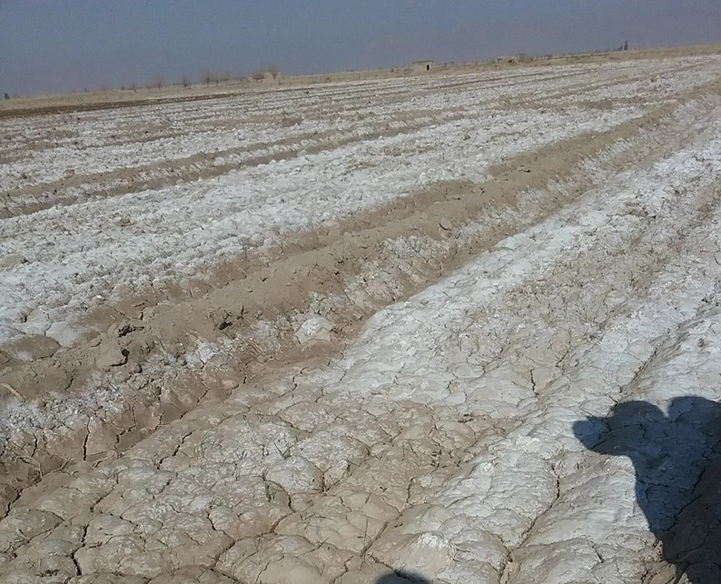

# SECTION THREE - INFORMATION SHARING AND RESOURCES MOBILIZATION{-}  

This section outlines the requirements and procedures for information sharing and resource mobilization for developing or monitoring salt-affected soils.

#	Product documentation and information sharing    
##	Product documentation   
Maps of salt-affected soils are useful spatial information depicting the status of salt problems in the mapped area. They are much more useful when shared with stakeholders with interest in management or alternative use of these soils. Map documentation adds value to the spatial information. Map documentation is done through: 1) cartographics of map elements during map development, 2) map metadata accompanying the maps, and 3) map publication in platforms such as the country soil information system, journals, etc.

###	Cartographics of map elements  
Elements in a map layout are objects that help users of the map to visually connect the spatial relationship in the map product. Unlike other documents that are separate from the map, map elements are integral with the map. Key elements of a map are data, legend, title, compass, scale, citation, longitude and latitude grid lines, inset, acknowledgments, and year of publication and data age. These elements should be included during map layout development.
Map data are derived from the GIS layers that produced the map. Levels of EC or ESP are examples of map data in the map of types of salt-affected soils. Map data are the central information carried by the map. Their clear representation is the first step towards conveying the intended spatial information of the maps. Buckley (2012) outlined the following five principles generally considered important when making a good map: good visual contrast, legibility, figure-ground orientation, hierarchical organization, and balance.
Good visual contrast enhances aesthetic appeal of the map and helps readers to identify the distinction between different levels of the map data. In mapping salt-affected soils, good visual contrast is achieved by using distinct colour symbology for different types and intensity of salt problems in the soil. Figure 6.1 is an example of colour symbology for different classes of salt problems in the soil.

Legibility concerns map presentation to allow easy reading and understanding of its message by the users. Legibility focuses on the map elements and labelling. The elements of the map need to be clearly visible and easily convey the intended map message. Labelling and texts in the map play a crucial role in map legibility. They are used to convey intellectual hierarchy, that is, ranking of the importance of what is labelled. An example of intellectual hierarchy is in the case of labelling boundaries where use of uppercase letters is preferred for international country names, bold lowercase letters for higher administrative units within a country, and so on. In general, the legibility principle emphasizes on using big and bold labelling styles for high hierarchy and decreasing text font and style with lower hierarchy. Legibility principle also emphasizes on the following when labelling:

*   To avoid (or minimize) text rotation (up-side down, except for left and right grid labels);
*   To avoid (or minimize) mixing font types in a labelling hierarchy;
*   To separate rank categories by changing the font size by 2;
*   Use colour deep blue for water bodies;
*   Separate map of salt-affected soils and uncertainty maps for clarity (Figure 6.2);
*   Always spell-check the labels;
*   A good visual balance in map legibility including:
+   The size, pattern and colour of the symbols;
+   Visual hierarchy of the symbols and elements;
+   Location of the map elements with respect to each other and visual centre of the map;
+   Including graticule and neat line.

Background orientation convey the landscape feel of the map. They pin the user's perspective to specific areas in the map. Examples of background orientation includes hillshade, whitewash, drop shadow, and feathering, among others. In mapping salt-affected soils, background orientation enhances areas with certain salt levels and convey visual relationships to the underlying landscape drivers of the salt levels (Figure 6.2).

###	Map metafile  
A metafile is the file containing map metadata. Metadata is the data about data or simply information about data. It gives a summary of the map content, data used and methods for creating the map, date of publication and other relevant information. It is normally a two-column textfile, which is convertible to xml file when necessary (Figure 6.3).

##	Information sharing  
Planning information sharing is important in order to deliver useful and impact-oriented information. The following three aspects need consideration when planning information share for salt-affected soils (Figure 6.4):

*   Identification of the key issues driving information sharing;
*   Technical specification to harmonize information from different areas/sources;
*   Identification of the platform for information sharing.

The types of target audience influence the type of information format, characteristics, and information content to be shared. For example, researcher and modellers at the regional level may require coarse resolution GIS files while extension officers at farmer-fields may require paper/digital images at high resolution. The design for information sharing to target these two examples are significantly different. The type of audience also influence the type of media to employ as the vehicle for information sharing (Figure 6.4). These are some of the key issues for consideration when designing information sharing system. The GSP-FAO has proposed geoTiff raster files at 1 km spatial resolution for maps of soil indicators (EC, pH, and ESP) and maps of salt-affected soils for information sharing between countries and users at the regional and global levels (Table 6.1). However, each country may use own recommendations for planning systems for sharing information of salt-affected soils.
Technical specification is concerned with the characteristics of the map products and information content to be shared. The characteristics define the features of the information products that users will look for when searching for the information. They include map data (EC, pH, ESP, salt-affected soils, etc.), the vertical and horizontal resolution of the maps, data age, information access/use rights, and file formats for access. Technical specifications are particularly important in guiding information development since the features that they define should be included during map development. Table 6.1 is an example of specifications of the three products proposed by the GSP-FAO for updating national and global information of salt-affected soils. These specifications are also contained in the country guidelines for developing national information of salt-affected soils (FAO, 2020).

*Table 6.1: Summary checklist for developing and sharing country-level maps of salt-affected soils*

Copyright issues are important when it comes to information sharing. Many countries hold primary information such as measured soil profile data on EC, pH, ESP, etc. under copyright but may be willing to share secondary information under general public license (GPL). The secondary information includes maps developed from primary data, technical reports, and scientific publications. Other countries have strict copyright on all soil information. There are also other countries with GPL on all soil information. Publicly shared information needs to be under GPL.

Platform for information dissemination is the ultimate consideration for information sharing. Its choice is influenced by many factors including target audience, advances in technology and software development, information security, and magnitude of available data. Alternatives for platform for information sharing are physical and digital libraries (portals), online sever (geoserver), social/news media, dedicated website (soil information system), accessible online storage (google driver), etc. Since many countries are now developing national soil information systems (http://www.fao.org/global-soil-partnership/pillars- action/4-information-data/glosis/inventory-countrysis/en/), they can use the soil information service platforms as suitable alternatives for sharing their soil information on salt-affected soils. GSP-FAO has dedicated file transfer protocol (FTP) for sharing national information and a geoserver for globally contributed information on salt-affected soils.

##	Resource mobilization  
###	Resource mobilization strategy  
####	Needs assessment  
Building and updating information on salt-affected soils require resources. Associated activities such as data generation and/or collection, data analysis, developing information sharing protocol, and information update and monitoring are some of the core components that are resource intensive. Proper planning for resources mobilization is necessary for successful development and maintenance of information on salt- affected soils.
As already outlined in Section 1, salt-affected soils are very important in the global resource management and utilization. They occupy more than 1 billion hectares globally and are predominant in arid and semi- arid climate zones. This significant areal proportion can positively contribute to the global economy if economically utilized in a sustainable way (Wicke et al., 2011). Salt-affected soils are also home to many forms of biodiversity (Wu et al., 2015). Their proportion of the global land area can be resourceful for implementing carbon sequestration activities. They also support global food production through biosaline agriculture activities (Abdelly et al., 2008; Dajic-Stevanovic et al., 2008; Nikalje et al., 2018; https://www.biosaline.org/). These positive aspects reinforce the need for proper information on the status and extent of salt-affected soils. Besides the positive aspects of salt-affected soils, they are not truly desirable in agriculture areas. They have overall negative impacts in crop productivity. A lot of efforts are in progress globally to manage, reduce or prevent, and reclaim salt-affected soils in agriculture areas.
Resource mobilization for developing and periodically updating soil information of salt problems is important for sustainable management of salt-affected soils. According to (FAO, 2012) an initial step towards planning resources mobilization is the needs assessment. Needs assessment considers the core areas where resources mobilization is critical. It is also a process for justifying investment in developing information on salt problems in the soil (Figure 7.1). The following resource-intensive areas can be used as guidelines for planning resources mobilization needs assessment:

*   Soil survey and laboratory analysis for estimation of soil indicators of salt problems;
*   Acquisition of equipment and high-resolution spatial predictors of salt-affected soils;
*   Technical capacity development for building spatial information products/
*   Developing infrastructure for spatial information sharing (system);
*   Establishment and implementation of periodic monitoring systems.

Assessment of resource mobilization needs should establish the significance for developing or updating soil information on salt-affected soils. Alignment with government development priorities, regional and global initiatives, and stakeholder synergies are some of the areas that should be targeted during evaluation of resource mobilization needs assessment. They help to identify opportunities for buy-in by these important stakeholders.
Resource mobilization needs assessment can be done through surveys such as interview, discussions, and literature review (FAO, 2012). Its output feeds into the development of strategy for resource mobilization (Figure 7.1).

####	Identification of sources
Identification of sources of resources is a priority focus in resource mobilization. It entails assessing the characteristics of different types and number of sources. It also incorporates mapping out the timing and duration of resource availability for the identified sources. This is especially important where multiple sources are targeted. A proper identification of sources of resources improves efficiency when selecting the appropriate resource mobilization vehicle(s) (tools).
Internal and external sources are the two major categories of sources for resource (FAO, 2012). Internal sources include available human and capital resources such as technical capacity, equipment, institutional (environment) framework, income generating activities, partnerships (public-private or communal-private partnerships), internal government budgetary allocations, and voluntary contributions from local foundations or individuals. Available soil database and network between technical experts on salt-affected soils and network between institution holding soil data are also important resources. Internal sources are critical during soil survey and when implementing sustainable long-term monitoring of salt problems in the soil. The institutional environment also affects data sharing, income generating activities to support monitoring framework, and potential engagement with/acquisition of resources from external sources of resources. External sources include international/regional development partners, potential collaboration (even research) activities with regional or international bodies/institutions on specific areas, among others. Some international/regional organization have rich technical cooperation programs (TCPs), which can provide substantial support in many of the key areas in soil and environmental information development.

####	Resource mobilization plan
Resource mobilization plan is the practical roadmap for mobilizing resources to implement the development and periodic update of spatial information on salt-affected soils. It entails the development of plans for communication, implementation of resource mobilization activities, and progress monitoring and evaluation. The resource mobilization plan outlines the vehicle (tools) to use for resource mobilizing and the timeline for their implementation. Examples of tools often used for sourcing funds are concept notes and proposals while memoranda are often used for mobilizing in-kind contributions, equipment, and network of expertise (FAO, 2012; Kipchumba et al., 2013). A suitable mobilization plan should have

multiple strategies using different tools (vehicles) to target many sources of resources. This is particularly appropriate for salt-affected soils where field survey, laboratory analysis, and online hosting of soil information service are heavy one-time initial investment. This kind of investment is mostly tackled with multiple sources of resources.
Different organization have different requirements and format for the tools for resource mobilization (also known as vehicle for resource mobilization). It is important that these requirements are clearly adhered to when preparing communication strategy. Since these tools presents the mobilization idea and needs to the donor, it's important that they are given adequate attention during their preparation. Important areas of focus when preparing the tools are:
a)	target resource-intensive area for the development/update of information on salt-affected soils
b)	Indicative/actual cost for implementing the identified target area in (a) above
c)	justification for resource mobilization
d)	schedule of activities

Table 7.1 gives a summary of the five steps for developing and implementing resource mobilization plan. The sequential steps begin with the identification of target area(s) requiring resource mobilizations and corresponding potential sources of resources. Subsequent steps are guided by the first step; implying that the first step determines the success/failure of the mobilization plan (FAO, 2012).

*Table 7.1: Steps for planning resource mobilization for updated information on salt-affected soils*

##	Technical capacity development program for spatial information development  
###	Program overview  
Capacity building program in digital mapping of salt-affected soils is designed to help countries or GSP partners to gain technical knowledge and skills for developing maps of salt-affected soils and be able to periodically monitor salt problems in their countries. In the spirit of country-driven approaches and global soil information system, the need for harmonized national capacities and products cannot be over- emphasized. It is envisaged that national capacity building and harmonized information on salt-affected soils will give uniform message for raising national, regional, and global awareness on the need for sustainable management and economic use of these soils.
There are many methods and approaches in the literature as well as indicators for assessing salt-affected soils. This capacity development program focuses on supporting harmonization of protocols, uniform reporting, and technical empowerment of national officers to provide reliable information on national status of salt-affected soils. It uses digital soil mapping concepts, statistical computing, and GIS tools to produce spatial information of soil salinity.
This program targets national focal persons tasked with mapping salt-affected soils in their countries. The program is also suited to practitioners who are keen on information generation and management of salt- affected soils. People interested in digital soil mapping and monitoring of salt problems may find the program suitable for enhancing their spatial modelling skills.

###	Duration and requirements  
This program is designed to take two weeks of data collection and 64 contact hours between participants and instructors for spatial information development. Participants are required to have own datasets during the training.
Successful implementation of the program requires the following:

1)    Expertise
+   Basic soil science and understanding of salt-affected soils.
+   GIS and computing knowledge.
+   Adequate understanding of soil salt problems in the country of focus
+   Basic understanding of indicators of soil salts and laboratory methods of analysis.
2)    Computer and software
+   Computer with minimum of core i3 processor, 8GB RAM, and enough storage capacity.
+   Installed latest versions of QGIS, ILWIS, R, and RStudio software.
+   The following installed plugins and packages:
    -       QGIS - Semi Automatic Classification, Profile Tool;
    -       R  Rstudio; raster,caret,rgdal,sp,soiltexture,soilassessment,randomforest,gstat, arm, automap, e1071,GSIF,Hmisc,corrplot,factoextra,spup,purr,ncf,aqp,car,plyr, kernlab
+   	Spreadsheet program (such as Excel and Access).
3)    Resources
+   Internet connectivity;
+   Technical manual on mapping salt-affected soils;
+   Country data for mapping soil salinity (Table 4.1).

###	Objectives and outcomes
Program goal: The overall goal of this program is to enhance technical capacities of countries to produce consistent, reliable, and comparable spatial information on salt-affected soils.
Program outcomes: At the end of the program, participants are expected to:

1.    Produce updated database for mapping salt-affected soils in their countries.
2.    Establish baseline for monitoring salt-affected soils in theory countries.
3.    Produce national maps of status of salt-affected soils in their countries.
4.    Contribute to global mapping of salt-affected soils.

Learning objectives: The program is designed to:

1.    Enable participant to assemble and organize relevant data for mapping salt-affected soils;
2.    Expose participants to cutting-edge digital soil mapping methodologies;
3.    Enhance technical capacities of participants in developing spatial information of salt-affected soils;
4.    Enable participants quantify accuracy and uncertainties of maps of salt-affected soils;
5.    Improve participants' skills and awareness in documentation and soil information sharing.

### Schedule
*Table 7.3: generic training outline*

###	Mode of delivery  
The program is designed for physical/online lectures, hands-on demonstrations, and reflection quizzes.

1)    Lectures
Items 1 and 2 are parts of introductory lecture designed to expose the participants to the basics of salt- affected soils, classification, and input data requirements for mapping. PowerPoint presentations, class- discussions, and consultation with resource materials should be adequate for knowledge transfer. The quizzes give feedback on the understanding of the lectures
2)    Demonstrations with worked examples
Part 2 of the program is focused on exposure of the participants to the mapping tools. Demonstrations using case-study dataset is emphasized to help the participants understand the procedural steps for mapping salt-affected soils and familiarity with the mapping tools.
3)    Hands-on practical exercise with own data
Part 3 of the program is dedicated to working with own datasets. The participants will apply the skills in Part 1 on their own datasets. They may work independently on their country dataset.  

###	Deliverables  
The following deliverables are anticipated at the end of the training program:

i.    Updated and harmonized national database of salt-affected soils;
ii.   Spatial national information (map with documentation) on salt-affected soils;
iii.    National maps of salt indicators (ECSE, pH, ESP) for 0-30 and 30-100 cm soil depths submitted to the GSP as contribution to global mapping of salt-affected soils;
iv.   National maps of uncertainties for mapping salt-affected soils.

