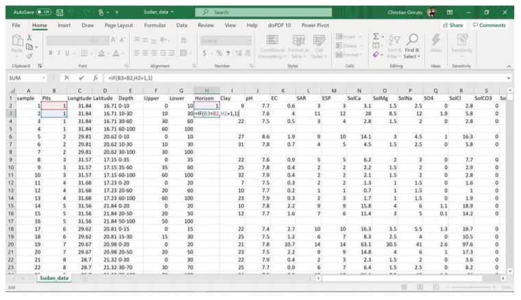

# Appendices{-}

## Appendix A: Example image download from USGS{-} 
This section outlines the procedure for downloading remote sensing images such as Landsat OLI, Sentinel, and MODIS images and elevation (DEM) from the site https://earthexplorer.usgs.gov/. It is important to note that the steps outlined here are different for data download from other online repositories and that the illustration given here is purely for demonstration purposes.

1.    Step 1: Launch the website by either pasting the link in a web browser or simultaneously press Ctrl
(on the keyboard) and click to the link.
2.    Step 2: Navigate to the area of interest (e.g. country boundary) by pressing and holding left-click of the mouse and moving the "hand pan" to the area (country) of interest. It may be necessary to zoom in or out (by using + or - navigation signs at the top-right part of the screen) for locating the area/country of interest. The download site has four buttons around the top-left corner: Search Criteria, Data sets, Additional Criteria, and Results. Search Criteria allows input spatial parameters for data search. This is done either by manually digitizing the corners of a polygon bounding the study area or uploading the file (shapefile or kml/kmz) (Figure A1).

3.    Step 3 (Dataset selection): Activate the Data Sets button to launch the window for viewing available datasets. This window lists available images by category such as Digital Elevation, Aerial Imagery, Sentinel, etc. (Figure A2). Each category has expandable (+) sign at the beginning of the list, which reveal available dataset in the group when expanded. Choosing the white square boxes next to the data selects data of interest. Furthermore, a click to the symbol opens a new window with  metadata details about the selected dataset. Expansive areas may use elevation data (GMTED2010) and images (MOD9A1 V6) while Landsat OLI/Sentinel and SRTM DEM (30/90 m) may be ideal for less- expansive smaller areas. It is important to select each data category at a time for easy tracking and data download.

4.    Step 4 (selection Results view): Choosing the results button opens a new window in the interactive map-view. Here, the data is chronologically listed. Choosing the footprint icon displays the image in the interactive map-view. Thereafter, a window for confirming the selection pups-up and the data download begins. It's important to ensure adequate internet connectivity at this point. GMTED2010 contains elevation data in three options: 1km (30 arc-second), 500 m (15 arc-second) and 250 m (7.5 arc-second). The appropriate option should be selected for download (Figure 4.8).

(1) Downloading land cover and climate data
Online repertory for land cover data are available at (USGS) https://earthexplorer.usgs.gov/, GLC200 at (JRC)https://forobs.jrc.ec.europa.eu/products/glc2000/products.php),	GLCS	database	at	(FAO) http://www.fao.org/geonetwork/srv/en/main.home?uuid=ba4526fd-cdbf-4028-a1bd-5a559c4bff38, Global LC maps at (ESA) https://www.esa-landcover-cci.org/?q=node/158. These datasets are available for direct download for the whole world. Further data sub-setting may be necessary. Landcover data at USGS can be downloaded using the steps outlined in Figure A1 and A2.
Climate data is downloadable at http://www.worldclim.org/ in GeoTiff files at 1km spatial resolution for the whole world.

## Appendix B: Frequently asked questions when implementing R{-}  

A.	Errors with file types

1.    Replacement has 0: I have got the following error when running line .
*Error in `[[<-.data.frame`(`*tmp*`, name, value = numeric(0)) : replacement has 0 rows, data has 536766*

This error occurs when processing multiple layers/variables to produce an output. It occurs when one of the input layers/variables is missing. Start by checking if all input layers/variables for that line are available by checking the global environment or running summary such as summary(predictors) or summary(soil1). Repeat the previous lines to ensure all previously created variables/layers were created.
2.    Object not found: I have an error in line 161 saying:
*Error in is.data.frame(x) : object 'predicters' not found*
This type of error occurs when a file or data was not created. Either the line for its creation was skipped or the line also had error and did not successfully create of the file. It's better to trace the line where file/layer or data was first created and implement the line again.

3.    Warning message: There is an error message in line 128
Warning message:
_In sqrt((nir * red - blue * green)/(nir * green + blue * green)) : NaNs produced_

This is not an error but a warning message. Checking the output may confirm if there is any peculiarity in the created layer/data

4.    Null summary: The summary result is NULL when I run line .
summary(predictors$ECtse)
Length	Class	Mode
0	NULL	NULL

This occurs when the layer/variable was either not created or the layer name is incorrectly spelt. Checking if the layer is available in the global environment or its correct spelling can help resolve the error

5.    Undefined columns selected: Error in line 292: undefined columns selected
*Error in `[.data.frame`(predictors@data, , c("SI1", "SI2", "SI3", "SI4",	: undefined columns selected*

This type of error arises if one or more the variable/layer names specified for selection is missing in the dataframe or R object. Running str function with the dataframe or R object (str(object)) will give a list of the variables contained in the dataframe/object. Confirm if the missing variables/layers are listed with the correct spelling of their names.
6.    NA detected: _Error in line 296 NA in the data
Error in regmodelSuit(soil, TSS, lon, lat, EC) :
Remove NA in columns:	clay, ph, TSS, TTS, ECTSS, ESP, ECTTS, X_

This function does not accept NA in the data and must be removed before executing it.
7.    Box-Cox transformation: Error in line 273 when running Box-Cox transformation
Error in bc1(out[, j], lambda[j]) :
First argument must be strictly positive.

This type of error occurs when the target variable has zero or negative entries. These entries need to be removed before implementing the transformation. If there are zeros, a very small value (like 0.0001) may be added to the target variable to eliminate discontinuities around zero and a return of the error message.
8.    Histogram: There is an error message when I run histogram function
Error in hist.default(soil1$TSS.1, main = "Frequency distribution (before transformati on)",	:
'x' must be numeric

9.    Graphical display: Error in plot
Error in plot.new() : figure margins too large In addition: Warning messages:

This error occurs when the plot window is too small. Manually enlarging the plot window by dragging its boundaries upwards and leftwards eliminates the error.

10.   Many plus signs in console: There are many plus (+) signs in the console
This phenomenon occurs when one of the lines was executed without a closing bracket or quotation marks. Typing two or more closing brackets (or quotation marks) in the console will stop the error (of course with a warning message).
11.   Cursor orientation: The cursor is horizontal and not vertical
This happens when Insert button on the keyboard was inadvertently struck. Striking the Insert key again restores the cursor orientation
12.   Depth harmonization: Error in site function
[1] "pedons (616) rows of site data (619)"
Error: invalid site data, non-unique values present in horizon data?

This type of error occurs when the library (aqp) has not been updated or when there are mismatches in the reported profile. The mismatch often occurs when there are differences in (1) lower and upper entries in sample depths/horizons. It is important to ensure that for all profiles, the upper depth entry for any row (sampled depth/horizon) should be equal to the lower entry of the preceding row (sampled depth/horizon) (refer to Figure 4.5), (2) Pit number or Latitude/Longitude entry for the same pit differs for any given sampled depth/horizon (Figure 4.5), (3) incorrect columns were selected when developing the profile database. Correcting these anomalies will solve the error.
13.   Depth harmonization: Error when running prof1 line
Error in data.frame(id, lon, lat) :
arguments imply differing number of rows: 407, 0

This error arises when one of the parameters for depth harmonization was not properly specified. Check the global environment is each of the parameters (lon, lat, id, horizon, etc.) have been created, not NULL, and are of numeric file types (except for horizon and id which may be factor).
14.   Unexpected symbol: Error of unexpected symbol
Error: unexpected symbol in "loncurv=readGDAL("loncurve.mpr")band"

This error occurs when a character is misplaced or missing in the script line. The character should be solved accordingly.
15.   Variable type: Not meaningful for factors
Sometimes some operations are not permitted for factor type of data and will return errors for factor or integer type of variables. This happens when (during spreadsheet data organization) the entries are converted to integer/factor because of no decimal places (or NA in the data). It is important to cross-check the decimal places in the spreadsheet software before importing the data into R

B.	Errors with libraries
1.	Missing functions: I have got an error indicating "cannot find function."

This type of error arises when the libraries where not loaded or not installed. Type a question mark followed by the missing function in R console and enter. A window will pop-up showing definition of the function. The name of the library containing that function is indicated at the top-left corner of the window. If the library is already installed, re-load it by typing library (missing library) in the console. If the library is not installed, install it and load it after installation. Some functions may be masked by other libraries. They can be accessed by appending the associated libraries before them using double colon (e.g. dplyr::count(predictors$saltaffected)). NB: It is important to run all the libraries as a first thing every time RStudio is restarted.

2.    Cannot install package: Install packages does not work
This happens if 1) there is no internet connectivity, 2) there is write-protection to the folders (my documents or C/Programs/R), 3) the cran mirror is not responding, 4) the package is not available for installation. Check for internet connectivity and try to install the package again. Check for administrative rights and try installation again. Change the cran mirror by typing chooseCRANmirror() in the console. A list will be displayed with selection option availed at the end of the list. Check for the numbers in the list and choose the number corresponding to the nearest working mirror. Insert it and enter. Then try installing the package again. Some packages which are not published in R CRAN may be available at GitHub. They can be installed using the specifications provided in the GitHub links.

C.    Errors with working directors
1.    No file in directory: Cannot find file
Error in file(file, "rt") : cannot open the connection In addition: Warning message:
In file(file, "rt") :
cannot open file 'soildataU2.csv': No such file or directory

This error occurs when 1) the working directory is not correctly specified, 2) the file name is not properly spelt, 3) the import script has syntax errors. Check for the correct path to the working directory, check for spaces or pathname for the directory, check for correct spelling for the filename. Check the script for correct parameters and spelling of the parameter names (e.g. soil=read.csv("soildata.csv", heade=T).. the header parameter is missing r at the end and will return import error).
E.    Errors with computing capacity
1.    I have got an error indicating " cannot allocate vector of size."
This error occurs when the computer memory is low. Sometimes adjusting the memory improves the performance (such as memory.limit(size=NA) or increasing the size by replacing NA with a higher value corresponding to or close to the computer RAM). The best option is to use a better computer with a higher memory
2.    My computer is taking too long or is frozen
This happens when the software is executing simulations with higher threshold or for large datasets. It is better to be patient and wait for the process to progress to completion.
3.    The computer keeps crushing and restarting
This happens when the computer has low RAM or when certain functions are returning infinite calculations.

## Appendix C: Checking for correct data organization in Excel{-}  

1.    Inserting sequential numbers for horizon/sampling depth
Horizon/depth codes are sequential numbers from 1 at the top sampled horizon/depth and increasing consecutively (i.e. increasing by 1) to the last sampled horizon/depth (Figure 4.5).

*   Step 1: Rank the Pit, Longitude, Latitude, and Pit columns in that order. This will order the Depth column accordingly.
*   Step 2: Create three new columns after the Depth column (because of three elements in the Depth items - first depth, minus (-)/underscore (_) symbol for range, and last depth, 0-15). Creating new columns is achieved by selecting the column after the Depth column, right-click the mouse, and choose insert.
*   Step 3: Copy and paste the Depth column into the nearby newly created column
*   Step 4: Select the pasted column in step 3. Go to Data panel among the top row of buttons, click it and select text-to-columns option. A new window comes with Delimited option selected. Click next, choose other and type the symbol for the range as used in the data (either - or _). Click next till completion (finish).
*   Step 5: Rename the columns as Upper and Lower for the first part and the second part respectively
*   Step 6: Name the next column as Horizon and enter 1 in the 1st cell (directly below the column name). Then calculate consecutive series for all entries in the same Pit. Enter the formula
=if(B3=B2,H2+1,1) in the 2nd cell in Horizon column. Copy the results to all cells in the entire column. This formula means that if the Pit code in the previous row is the same as the current row, then add 1 to the value of Horizon in the previous row or else return 1. 1 is added so that each Horizon begins from 1.

2.    Checking for correct/consistent entries in lower and upper depth entries

*   Step 1: Insert a new column after Horizon and call it Check. This column will check (and return TRUE) if the Upper in the current row is the same as Lower in the previous row.
*   Step 2: Type TRUE in the 1st cell immediately below Check. Enter the formula =if(B3=B2, F3=G2, "TRUE") in the second cell. Copy the formula in all cells.

*   Step 3: Filter the newly created Horizon and select and highlight entries with FALSE and investigate or correct them accordingly.

3.    Removing error in format
Sometimes some columns could show formatting errors with a green tag at the top left corner of the cells. This may be due to autocorrection of a formula or suspected differences in number sequencing or just general formatting errors. They can be removed by converting the cells (or the columns) into numbers.

*   Step 1: Type 1 in any empty cell in a new sheet. Then copy the cell and return to the original sheet
*   Step 2: Select the column to format beginning from the numerical entries which showed formatting
*   Step 3: Right -click and choose Paste special, then select Multiply and click Ok. The error will be cleared 

