--- 
title: ""

author: "MAPPING OF SALT-AFFECTED SOILS - Technical manual, Rome, 2020"
output:
  pdf_document: default
  html_document:
    df_print: paged
site: bookdown::bookdown_site
css: "justify.css"
#cover-image: images/cover.png
documentclass: book
papersize: b5
fontsize: 10pt
#bibliography: "GSOCseq_references_FAO.bib"
#csl: "food-and-agriculture-organization-of-the-united-nations.csl"
#nocite: '@*'
link-citations: yes
description: The GSSmap Technical Manual
always_allow_html: true
---
\mainmatter
\pagestyle{fancy}


```{r set-options, echo=FALSE, cache=FALSE}
options(width = 65)
library(kableExtra)
## redefine str for the width option
str <- function(...){
  utils::str(..., strict.width = "cut")}
# reproducible results
set.seed(123)
## Boolean object for running all the code #####
# if FALSE will use precalculated RK prediction and svm tuning
#RUN.ALL <- TRUE
# Cache results
knitr::opts_chunk$set(cache=T)
```

\frontmatter
\addtocontents{toc}{\protect\hypersetup{hidelinks}}   
\addtocontents{lot}{\protect\hypersetup{hidelinks}}
\addtocontents{lof}{\protect\hypersetup{hidelinks}}
\tableofcontents
\listoffigures
\listoftables
\printnomenclature

# Authors and contributos{-}

## Authors{-}


Christian Omuto   
Ronald Vargas   
El Mobarak A. Abdelmagid    
Nuha Muhammed   
Kostiantyn Viatkin     
Yusuf Yigini   


  
\vfill


## Contributors{-}

Christian Thine Omuto   (Global Soil Partnership, FAO)  
El Mobarak A. Abdelmagid    (Agriculture research centre (ARC), Sudan)  
Nuha Muhammed   (Agriculture research centre (ARC), Sudan)  
Ronald Vargas   (Global Soil Partnership, FAO)  
Kostiantyn Viatkin    (Global Soil Partnership, FAO)  
Yigini Yusuf    (Global Soil Partnership, FAO)  
Maria Konyuskova   (Intergovernmental Technical Panel on Soils (ITPS), FAO)  
Rosa Poch   (Intergovernmental Technical Panel on Soils (ITPS), FAO)  
Mohammad Jamal Khan   (Intergovernmental Technical Panel on Soils (ITPS), FAO)  
Megan Balks    (Intergovernmental Technical Panel on Soils (ITPS), FAO)    
Attia Rafla    (Intergovernmental Technical Panel on Soils (ITPS), FAO)  
Ashok Patra   (Intergovernmental Technical Panel on Soils (ITPS), FAO)  
Siosiua Halavatau   (Intergovernmental Technical Panel on Soils (ITPS),FAO)  
Lydia Chabala   (Intergovernmental Technical Panel on Soils (ITPS), FAO)  
Samuel Francke    (Intergovernmental Technical Panel on Soils (ITPS), FAO)  
Isabelle Verbeke (Global Soil Partnership, FAO)  
Matteo Sala (Global Soil Partnership, FAO)  


**Recommended citation:**

> Omuto CT, Vargas RR, El Mobarak, AM, Mohamed N, Viatkin K, Yigini Y. 2020. Mapping of salt-affected soils: Technical manual. Rome, FAO
https://doi.org/10.4060/ca9215en


# Preface{-}  
Salt-affected soils such as saline or sodic soils are distributed in all continents at various levels of problem intensity.
They are soils with high amounts of soluble salts and/or sodium ions. An updated information of their distribution
and drivers is a first step towards their sustainable management. This book provides technical guidelines and
approach for developing a harmonized multiscale soil information of salt-affected soils. The book is organized into
three sections covering seven chapters. The sections are sequentially arranged but independently designed to
benefit focused readership who may want to go straight to any section. Section 1 givesthe background information.
It has three chapters covering existing literature on the characteristics and mapping methods for salt problems in
the soil. It is intended to illustrate the basic concepts, linkage of the characteristics of salt-affected soils with input
data requirements for their mapping, existing classification methods, and global distribution of these soils. Section
2 covers the methodological procedures for developing multiscale spatial information of salt-affected soils. It has
two chapters describing requirements, input data preparation, and the procedural steps for developing spatial
information of salt-affected soils. It outlines how data from different sources and characteristics are harmonized
and integrated to produce information of salt-affected soils. Section 3 covers information sharing and resources
mobilization when developing information on salt-affected soils. It gives the guidelines for preparing spatial maps
and steps for value-addition to benefit end-users of the information. It also contains a generic training program for
building technical capacity for mapping salt-affected soils. This program also serves as one of the steps for
harmonizing product development in multiscale mapping activities.  

# Acknowledgements{-}  
The data used in this manual came from various sources. The Government of Sudan through the
Agriculture Research Centre (ARC) in Wad Madani, authorized the use of their soil data and some
covariates. Remote sensing images and elevation data were downloaded from the United States
Geological Survey website (https://earthexplorer.usgs.gov/). We received technical and financial support
from Food Agriculture Organization (FAO) through Global Soil Partnership (GSP).

# Executive Summary{-}
## Background{-}
Salt-affected soils are soils with high amounts of soluble salts and/or sodium ions. The first global
distribution of these soils was first estimated in the late 1970s at about 1 billion hectares. Since then,
there has been inconsistent updates of the global distribution. Recent literature at the globalscale mostly
use data that was collected in the late 1970s and still portray global distribution of affected areas at about
1 billion hectares. Evidently, a new update is necessary to improve knowledge of the status and actual
distribution of salt-affected soils. Part of the reason for the inconsistent global update is due to unclear
coordination for periodic data collection and harmonized data collection protocols to support it. The
Global Soil Partnership (GSP) of the Food and Agriculture Organization (FAO) is leading global
mobilization to kickstart information update from the country to global level. The GPS's bottom-up
approach is underpinned by the twin need to support countries to update their national information and
to contribute to the update of global information of salt-affected soils. One of the challenges with this
approach is the potential uncertainties due to differences in datasets and approaches by countries. The
focus of this book is to provide guidelines for harmonizing input data and approaches for mapping saltaffected soils at all levels of information update.
Developing spatial information of salt-affected soils
Many methods exist in the literature for mapping salt-affected soils. They include methods based on soiltype mapsintegrated with expert opinions, remote sensing applications and soil indicator-based method.
The requirements, limitations and example applications of these methods have been highlighted in this
book. Prominence has been given to the indicator-based approach for mapping salt-affected soils
because 1) the method is amenable to country-level harmonization of procedures, 2) it develops
information of both salt-affected soils and soil properties related to salt problems, 3) the method is able
to quantify mapping accuracy and uncertainty, 4) quantifies horizontal and vertical information. The
description of its methodological steps has been illustrated using case-study test data from Northern
Sudan and minimum requirement for input data, computer, and software. The intention is to present the
steps as clearly and repeatable as possible to enable implementation with own datasets.

## Resource mobilization{-}
Developing information and updating the status of salt-affected soils is resource-intensive and should be
properly planned. This book has dedicated the last two chapters for resources mobilization to build
national information on salt-affected soils. It outlines key areas of focus for resource mobilization and
steps for building technical resources to develop a harmonized database for assessing salt-affected soils.
It also discusses steps for enriching spatial maps through value addition to improve their information
resource.

# SECTION ONE - BACKGROUND INFORMATION{-}   
This section gives the background information related to the global mobilization to provide mapping of
salt-affected soils. It also covers a brief literature review on the characteristics, distribution, indicators and
drivers, and mapping and classification methods for these soils. The section is intended to illustrate the
relationship between the characteristics of these soils and input data requirement for their mapping and
classification.  


  


<!--chapter:end:index.rmd-->

# Introduction  
Salt-affected soils are soils with high amounts of soluble salts and/or sodium ions. The salts hold water in the soil at high osmotic potential, which limit easy exchange of water and nutrients with the plant roots. Consequently, they retard growth and development of many plants. Their global distribution was first estimated in the late 1970s at about 1 billion hectares (Szabolcs, 1979; Abrol et al., 1988). Since then, there has been inconsistent updates of their distribution. Recent literature at the global scale mostly use data that was collected in the late 1970s and portray global distribution of affected areas at about 1 billion hectares (FAO/IIASA/ISRIC/ISS-CAS/JRC, 2008; Wicke et al., 2011; Ivushkin et al., 2019). A new update is necessary to improve knowledge of the status and actual distribution of salt-affected soils.
Salt-affected soils have significant impacts on the environment, water, and agriculture. They negatively influence agriculture productivity and quality of soil and surface water but also have significant economic potential if they are properly managed (Wicke et al., 2011). An improved knowledge of their distribution, characteristics, and trend is necessary for sustainable management and economic exploitation. The current lack of consistent information update of salt-affected soils is hampering policy developments to support management and alternative uses of these soils. In 2018, the Global Soil Partnership (GSP) Plenary Assembly deliberated on the global information gap for salt-affected soils and requested for global mobilization to update the information (GSP-FAO, 2018). Following the request, GSP conducted a survey among member countries as a first step to gain understanding of the status of salt problems and identify areas to focus on when mobilizing for information update. The survey revealed that more than 70% of the countries have varied aspects of salt problems and data for mapping salt-affected soils (Figure 1.1). However, most of the datasets are old and need updating.  


In this manual, the GSP global mobilization approach is used to develop information update of salt-affected soils. The approach is a country-driven process where countries (partners) develop and contribute global soil information but retain the copyright of the contributed soil data (Figure 1.2). The process is globally coordinated by GSP in collaboration with International Network of Soil Information Institutions (INSII) and
focal persons (FP) in each country. The whole process is supported with technical documents developed by the technical bodies within GSP such as Pillar four Working Group (P4WG) and Intergovernmental Technical Panel on Soils (ITPS) (FAO and ITPS, 2018). This manual is part of the technical documents for supporting the global mapping of salt-affected soils (Figure 1.2).
One of the challenges in updating global information using the approach in Figure 1.2, is the potential uncertainties due to differences in datasets and approaches by countries. There are many methods and indicators in the literature which countries can use in mapping and classifying salt-affected soils. Unless the country data and methods are harmonized, the contributions can be disorganized and result into uncertain global map of salt-affected soils. The focus of the present manual is to provide guidelines for harmonizing input data and approaches for mapping salt-affected soils. The book puts emphasis on popularly used soil indicators for diagnosing salt problems in the soils (Figure 1.1) and a harmonization protocol for all contributing countries.


## Presentation
This book is organized into three sections covering seven chapters. The sections are sequentially arranged but independently designed to benefit focused readership who may want to go straight to any section. Section 1 gives the background information, Section 2 covers the methodological procedures for developing multiscale spatial maps of salt-affected soils, and section3 outlines the steps for information sharing and resources mobilization (Table 1.1). Section 1 has three chapters that gives brief literature review on the characteristics of salt-affected soils and methods for their mapping. The section is intended to provide readers with basic concepts linking the characteristics of salt-affected soils with data requirements for mapping and classifying these soils. It also discusses the mapping methods and existing information on the global distribution of salt-affected soils. Section 2 describes the procedural steps for developing maps of salt-affected soils (Table 1.1). Section 3 outlines the requirements and procedures for information sharing and resource mobilization for developing or monitoring salt-affected soils.

*Table 1.1: Book presentation*
```{r, echo = FALSE}
dt <- read.csv("figures/tables/Table_1.1.csv", sep = ";")
kable(dt, col.names = gsub("[.]", " ", names(dt))) %>%
kable_styling("striped", full_width = F)
```

# Characteristics of salt-affected soils  
## Genesis of salt-affected soils  
The minerals responsible for salt problems in the soil originate from diverse sources and gradually accumulate to contribute to the formation of salt-affected soils. Many models exist in the literature for describing the salt accumulation and evolution of these soils. They can be grouped into two broad categories (Figure 2.1): one involving climatic interactions with soil and water (Miller and Brierley, 2011) and the other describing direct deposit of the salt particles into the soil (Abou-Baker and El-Dardiry, 2015; Daliakopoulos et al., 2016).    

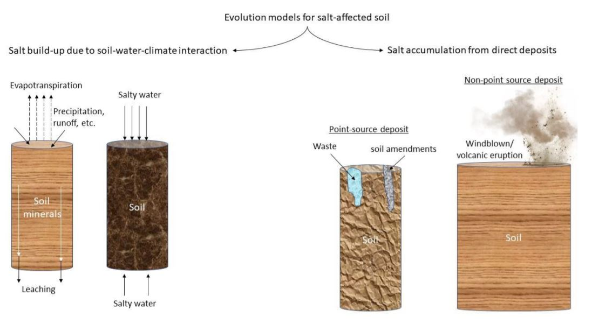  
### Soils-water-climate interaction mode  
This model was first proposed by Gedroiz (Kelly and Brown, 1934) and described the evolution of salt- affected soils along the trajectory of gradual changes of the characteristics of soluble salts. It postulated that salt-affected soils develop when dissolved minerals in water accumulate and change status as water is moved from the soil. Soluble salts are deposited in the soil when water evaporates and gradually accumulate with time to form saline soils. Sodic soils then develop when the soluble salts are leached and/or when divalent cations are precipitated out of the exchange complex followed by the corresponding increase in sodium ions. If leaching is insufficient, the salt-affected soils remain predominantly saline (FAO, 1984). Further types of sodic soils (e.g. solodized sodic soils) are formed when sodium ions move out of the exchange complex and are replaced by hydrogen ions (Miller and Pawluk, 1994). This genetic evolution is common in arid and semiarid areas where evaporative demand is high during certain times of the year.
Salt-affected soils also develop when salts accumulate due to repeated direct contact of soil with salty water. In this case, the type of salt-affected soils is particularly influenced by the dominant soluble salts in the salty water (Munn and Boehm, 1983). The model describing this genetic pathway is common in the coastal areas and in areas with salty and high groundwater table. The model also explains the development of certain types of salt-affected soils or ion-specific salinity in areas subjected to wastewater irrigation (Jalali et al., 2008).  

### Direct deposit model  
In this model, salt accumulation in the soil is facilitated by the repeated deposition of salt particles or solutions in the soil. There are two types of this model: point-source and non-point source deposits (Figure 2.1). Point-source depositions introduce localized salt accumulation, which gradually spread to other areas or down the soil profile by action of runoff, leaching, tillage, etc. Non-point deposits occur when windblown salt particles or volcanic eruptions settle on the soil. Alternate layers of the deposits may be buried and contribute to accumulation of salts in the soil profile. This model also explains the development of salt-affected soils due to geologic marine incursions (Schofield et al., 2001).

## Characteristics
The dominant cations in salt-affected soils are Sodium (Na+), Calcium (Ca2+), Magnesium (Mg2+), Potassium (K+) and dominant anions are Chloride (Cl-), Sulphate (S0 -2), Carbonate (C0 -2), Bicarbonate (HC0 -) and Nitrates (N0 -) (Richards, 1954). Salt-affected soils with high amounts of sodium ions are known as sodic soils. High content of sodium ions in these soils cause dispersion of clay and organic matter, which settle on the surfaces of soil particles to give them a brownish black appearance. This black appearance is the reason for the name "black alkali soils" in reference to sodic soils (Richards, 1954). When the dispersed clay settles in between soil particles, they plug the matric spaces and block water infiltration. Consequently, sodic soils tend to remain waterlogged for extended period after rainfall or irrigation. In some instances, dispersed humus and clay may be leached down the soil profile and portray clay accumulation and decrease in texture down the profile (Sparks, 2003; Krasilnikov et al., 2013).
High content of sodium ions has been used as an indicator for identifying sodic soils. According to Richards (1954), sodium occupies more than 15% of the soil's cation exchange capacity (CEC) in sodic soils. This observation has led to the use of Exchangeable Sodium Percent (ESP) ??? 15 as a diagnostic indicator for sodic soils. In addition, since sodic soils are low in total salt but high in exchangeable sodium, the ratio of sodium ions to the sum of major anions has been shown to be more than 1 in sodic soils (Chhabra, 2005). Figure 2.2 gives an illustration of the characteristics of sodic soils.


Salt-affected soils with high contents of soluble salts and low sodium ions in the exchange complex are often identified as saline soils. Due to their low content of exchangeable sodium ions, saline soils have low ESP and the ratio between sodium ions and sum of major anions is less than 1 (Figure 2.2). Preponderance of chloride and sulphate ions give saline soils a brownish white appearance. Hence, they are sometimes referred to as white alkali soils.  

Saline soils with significant proportions of calcium ions have good soil structure. Calcium ions have high flocculation power in the soil (Sumner and Naidu, 1998; Rangesamy and Marchuk, 2011). Therefore, their presence in soil tends to promote clay flocculation and particle aggregation. Some saline soils have gypsum (calcium sulphate) and lime (calcium and magnesium carbonate) (Skarie et al., 1987).  

Salt-affected soils with high content of soluble ions and appreciable amount of sodium ions are known as saline-sodic soils. When sodium salts in these soils hydrolyse, the pH of the soil increases and the soil changes to sodic soils. In this regard, saline-sodic soils are sometimes referred to as saline-soils capable of alkaline hydrolysis (Chhabra, 2005). When the soluble salts remain high in the saline-sodic soils, the characteristics of the soils are like those of the saline soils. When the concentration of the soluble salts is lowered and the sodium salts hydrolyse, then the characteristics of the soils change to those of sodic soils.  

Richard (1954) used measurable soil properties to further quantify characteristics of salt-affected soils (Table 2.1). These characteristics have been widely applied for general classification of salt-affected soils (Chhabra, 2005; Zaman et al., 2018).  

*Table 2.1: Characteristics of salt-affected soils*  

```{r, echo = FALSE}
dt <- read.csv("figures/tables/Table_2.1.csv", sep = ";")
kable(dt, col.names = gsub("[.]", " ", names(dt))) %>%
kable_styling("striped", full_width = F)
```

## Indicators for assessing salt-affected soils  
Indicators of salt-affected soils are features that identify the status or occurrence of the soils. In this book, they have been divided into three categories: quantitative soil properties, qualitative soil surface/profile properties, and vegetation characteristics.
Quantitative soil indicators are measurable soil properties related to salt problems in the soil such as concentration of soluble ions or exchangeable sodium ions, soil pH, etc. Integral soil indicators representing overall concentration of soil salts are also often used. These indicators include electrical conductivity (EC), total soluble salts (TSS), total dissolved solids (TDS), total soluble cations (TSC), resistivity etc. (Abrol et al., 1988; Zaman et al., 2018). Various levels of these indicators have been proposed in the literature for identification of the three types of salt-affected soils. A seminal work in this regard was proposed by Richard (1954) (Table 2.1). Other adjustments to the thresholds given in Table 2.1 have since been given, for example using different levels of soil pH and introduction of the ratio of soluble ions (Table 2.2). Soil spectral reflectance indices are also new indicators under development and are expected to provide diagnostic threshold for different types of salt-affected soils (Kalra and Joshi, 1994; Farifteh et al., 2008).

*Table 2.2: Summary of soil properties for diagnosing salt-affected soil*

```{r, echo = FALSE}
dt <- read.csv("figures/tables/Table_2.2.csv", sep = ";")
kable(dt, col.names = gsub("[.]", " ", names(dt))) %>%
kable_styling("striped", full_width = F)
```
*<sup>1</sup> Richards (1954);  <sup>1</sup> Abrol et al. (1988); <sup>2</sup>Choudhary and Kharche (2018); <sup>3</sup>Chhabra (2005); <sup>4</sup>Horneck et al. (2007)*

Qualitative soil properties are observable features associated with certain characteristics of salt-affected
soils. They include presence of crusts, qualitative diagnostic properties of natric/salic soil horizons, columnar/prismatic soil structure under dry conditions with peds covered by brownish black films (WRB,
2014; Pankova, 2015). These soil properties are mostly used to identify salt-affected soils in the field. 

Their aggregate evidence can be found in most soil maps with delineations of salt-affected soils (Abuelgasim and Ammad, 2019). Salt-tolerant vegetation are dominant in salt-affected areas. Their presence is sometimes used as indicator of salt-affected soil (Bouchhima et al., 2018). An advance application of this concept is found in remote sensing of the earth surface. Many tests have revealed correlation between remote sensing indices with salt-affected soils (Gorji et al., 2019).

## Drivers of salt problems in the soil  
Drivers of salt problems in the soils can be grouped into two: primary and secondary drivers. Primary drivers are the natural sources of mineral elements contributing to the salt problems or the natural conditions that favor development of salt-affected soils. Secondary drivers are factors that exacerbate salt problems in the soils. They are largely associated with human intervention on the natural environment. Table 2.3 gives a summary of these drivers of salt problems in the soil.  

*Table 2.3: Drivers of salt problems in soil*

```{r, echo = FALSE}
dt <- read.csv("figures/tables/Table_2.3.csv", sep = ";")
kable(dt, col.names = gsub("[.]", " ", names(dt))) %>%
kable_styling("striped", full_width = F)
```


### Primary drivers 
Salty parent material is a primary source of salt problems in the soil. They gradually release the mineral constituents of soil during chemical weathering, which react with air and water to produce soluble salts responsible for salt problems. These salts are laterally carried away by moving water to other sites or
vertically by capillarity up the soil profile (Fanning and Fanning, 1989). Further processes such as leaching can convert the salt conditions to produce other types of salt-affected soils.
Climate is another driver of formation of salt-affected soils. In arid and semi-arid climate, the evaporative demand dries up water on the soil which leave the salt crystals on the soil surface. In addition, low rainfall in these climatic zones does not fully facilitate leaching of salts down the soil profile. The combined effects of evaporative demand and insufficient leaching cause accumulation of salts in the soil and contribute to the development of salt-affected soils (Schaetzl and Anderson, 2005).
Groundwater is another driver influencing the development of salt-affected soils. Salty groundwater rising through the soil profile by capillarity contributes the salts, which remain in the soil when the water evaporates (Rengasamy, 2006). In certain areas where salty groundwater table meets the land surface, groundwater is discharged on to the soil surface as springs and geysers. The discharged salty water gradually builds salts in the soil and contribute to the development of salt problems in the soil. Groundwater also contributes to the salt problems when its salty water is used for irrigation.
Other primary causes of salt problems in the soils are sea/tidal water interaction, windblown salt deposits, and salty runoff water. Sea/tidal water contains salt that remain on the soil after interaction with soil at the seacoast. They can also influence soil salt problems when the water is used for irrigation or if used elsewhere (such as in wastewater or sewage) but later discharged onto the soil. Interaction of windblown salt particles also introduces salts into soils. Repeated deposits of windblown salt particles can accumulate the salts and lead to the development of salt-affected soils (Yang et al., 2018). Recurrent runoff or flood water from salt-affected areas can also bring in salt, which can accumulate with time and contribute to the development of salt-affected soils (Krasilnikov et al., 2013).  

### Secondary drivers  
Irrigation is the most cited secondary driver of salt problems in the soil. Irrigation water can either induce salt problems when salty water is used for irrigation or when irrigation water causes inadequate leaching of soil salts. Irrigation water can also recharge groundwater and cause it to rise and gradually introduce groundwater salts into the soil (Rietz and Haynes, 2003; Pulido-Bosch et al., 2018). Fertilized irrigation water can also introduce salts into the soil, which gradually build up with repeated application and contribute to the development of salt-affected soils.
Besides irrigation, waste and wastewater are also significant secondary drivers of salt problems in the soil. Improper management of wastewater and solid waste can contribute to the development of salt-affected soils (Piotr, 2008). Repeated disposal of waste material either directly mix with soil or contribute salty leachates into the soil, which gradually accumulate with time and lead to the formation of salt-affected soils. Use of wastewater in irrigation is also another way of inducing salt problem in the soil. Wastewaters contain mineral elements which can cause ion-specific toxicity and salinity in the soil (Muyen et al., 2011; Abd-Elwahed, 2018).
Land use/cover change is also an important secondary driver of salt-accumulation in the soil. Altering the vegetation type in certain ecosystems potentially change the plant water-use and evapotranspiration characteristics with consequences such as drying up of soil and salt build-up. Changing the vegetation types can also alter the equilibrium of groundwater table and eventually contribute to groundwater-induced salt-affected soils (Rengasamy, 2006). In the arid and semi-arid environments, declining vegetation cover has also been linked to increased exposure of soils to the risk of salinization (Perri et al., 2018).
Other secondary sources of salt problems in the soil include inappropriate fertilizer application, inadequate drainage, and misuse of soil amendments.

##	Classification of salt-affected soils
Salt-affected soils are classified according to the types of salt and intensity of the salt problems. Classification of the types of salt-affected soils was first proposed by Richard (1954) based on electrical conductivity (EC), pH and exchangeable sodium percent (ESP) or sodium adsorption ratio (SAR). According to this scheme, there are three types of salt-affected soils (Table 2.2):  

*   Saline: soils with excess soluble salts in which EC > 4 dS/m, pH < 8.5, and ESP < 15 (or SAR < 13)
*   Sodic: soils with excess exchangeable sodium ions in which EC<4 dS/m, pH>8.5, and ESP>15 (SAR>13)
*   Saline-sodic soils: soils with high content of soluble salts and appreciable quantity of sodium ions capable of alkaline hydrolysis. The soils have EC>4 dS/m, pH < 8.5 and ESP >15 (or SAR > 13)

Many proposals have been proposed in the literature on the limits given by Richards (1954). Abrol et al. (1988) proposed pH limit of 8.2 instead of 8.5 for the three classes of salt-affected soils. This pH value was also found satisfactory in Indian soils (Choudhary and Kharche, 2018). Szabolcs (1987) also gave a further classification of saline soils as: Gypsiferous soils, saline soils due to calcium chloride, saline soils due to soluble magnesium salts, acid sulphate soils with iron and aluminium sulphates, and potentially saline soils.
Classification of the intensity of salt problems in the soil is commonly expressed using levels of electrical conductivity and exchangeable sodium ions and on weight basis (Richard, 1954; Abrol et al., 1988; FAO, 2006; Chinese Academy of Sciences, 2001). Examples of these levels are given in Table 2.4

*Table 2.4: Identifying intensity of salt problems in soil*

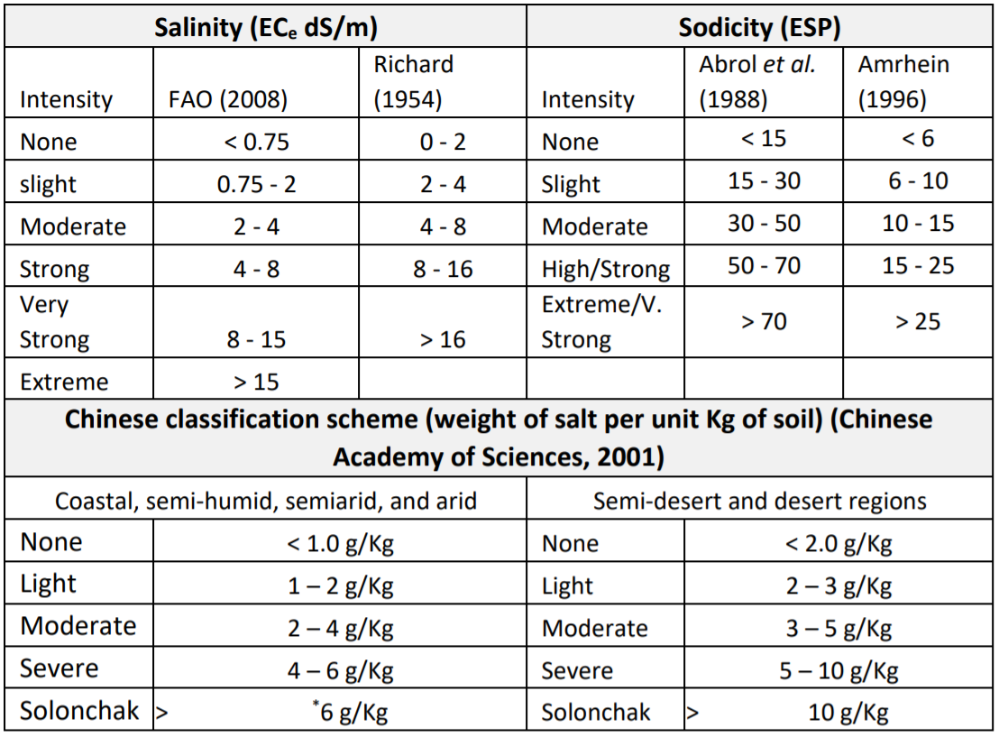

Besides the classification in Table 2.4, there are some other lumped parameters that are used to assess the salinity problems. The parameters include total dissolved solids (TDS in mg/L), total soluble cations (TSC) and total soluble anions (TSA) in mol(c)/L. There are approximations in the literature for converting these gravimetric measures into EC. For example, TDS may be approximated by multiplying EC (dS/m) by 800 for hypersaline soils and 640 for other saline soils. These are approximate guidelines since there are no exact relationships. Classification of salt intensity using gravimetric measurements has been given by Vargas et al. (2018) (Table 2.5).
The classification schemes in Table 2.4 and Table 2.5 show that there are many alternatives for identifying different levels of salt problems. They can be used at the national scale in the countries where they are popularly used.

*Table 2.5: Classification of salt intensity using gravimetric measurements*

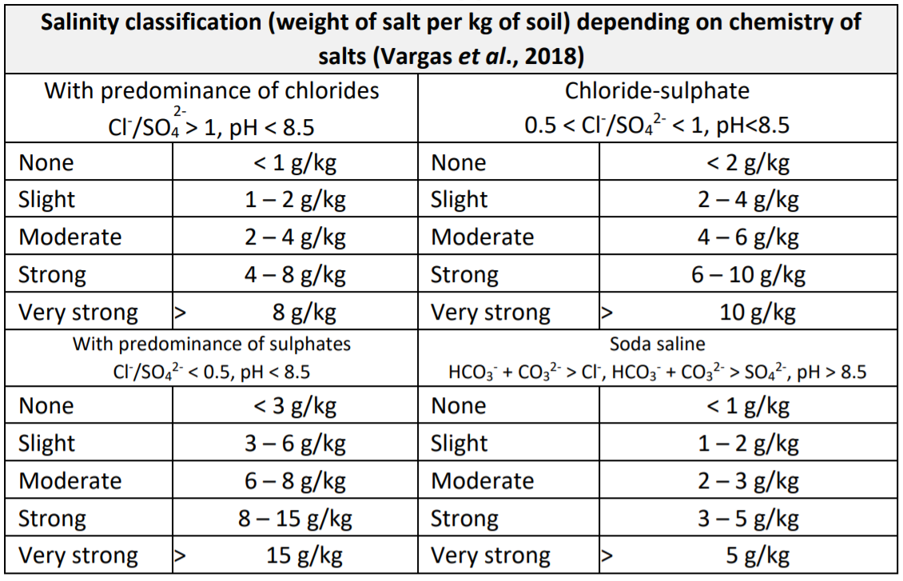  

##	Global distribution of salt-affected soil   
Salt-affected soils are found in all continents in varying spatial proportions. The literature is replete with attempts to quantify the global distribution of these soils. Massoud (1976) and Szabolcs (1979) developed the first world map of salt-affected soils using FAO/UNESCO Soil Map of the World. They estimated salt- affected areas at about 0.9 billion hectares (Table 2.6). In 2004, Squires and Glenn (2004) published new estimates of the global distribution and placed the coverage of affected areas at 1.029 billion hectares. This estimate portrayed 40% of the global affected areas as saline and 60% as sodic soils.  


*Table 2.6: Global estimates of salt-affected areas*

```{r, echo = FALSE}
dt <- read.csv("figures/tables/Table_2.6.csv", sep = ";")
kable(dt, col.names = gsub("[.]", " ", names(dt))) %>%
kable_styling("striped", full_width = F)
```

In 2011, Wicke et al. (2011) estimated the global distribution of types and intensity of salt-affected soils based on the Harmonized World Soil Database (FAO et al., 2008). Their estimate portrayed salt-affected areas as covering 1.1 billion hectares in which 60% of the areas were saline, 26% sodic, and 14% saline- sodic (Figure 2.3). It is important to note the proportions of affected areas by types as given by Wicke et al. (2011) was the opposite (flipped) proportions given by Squires and Glenn (2004). In 2018, Joint Research Centre (JRC) developed a global map of salinization, which showed the affected areas covering 1 billion hectares (Cherlet et al., 2018).
Recently, Ivushkin et al. (2019) published another global estimate of salt-affected soils. This study used a combination of remote sensing, soil data from World Soil Information System (WoSIS, https://www.isric.org/explore/wosis) and modelling. Their estimate also put the global distribution of salt- affected soils at about 1 billion hectares (Figure 2.3).

  

Interestingly, all these global estimates have remained nearly the same at around 1 billion hectares. Possible explanations are that: 1) the overall salt-affected soil areas have not changed over the years, or
2) the input data for estimating the areas has not changed, or 3) the estimation methods have been inconsistent. There is a need for new updates to improve the global information of the status of salt- affected soils.
Although all continents have salt-affected soils, arid and semi-arid Land (ASAL) areas seem to have a higher proportion. This is attributed to the prevalently low and irregular rainfall and high evaporative demand in ASAL areas, which all together combine to accumulate salts in/on the soil (Sheng et al., 2010; Pankova and Konyushkova, 2013).
Apart from ASALs, coastline salt problems are also of significant importance. Coastline salt problems are largely due to seawater intrusion. Li et al. (2014) gave a global picture of salt-affected coastlines of the world using secondary information from the literature (Figure 2.4). Other than this preliminary work, there is no clear data or representation of the extent and severity of salt-affected coastlines of the world.

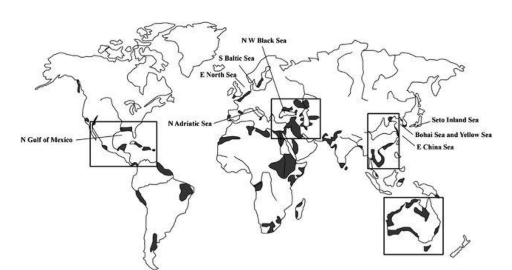 

# Methods for mapping salt-affected soils    
Maps of salt-affected soils contain spatial information of the distribution of types and intensity of salt problems in the soils. They are developed by considering the drivers, indicators, prevalence of salt-affected soils in the landscape and mapping tools and resources (Figure 3.1). Input data on the drivers and indicators provide the evidence of occurrence of salt problems in the soil. They influence the type of mapping tools for information mining and representation of the final maps. Some of the commonly used mapping tools include Geographic Information Systems (GIS), statistical modelling, stereoscopes, etc. Besides the input data and mapping tools, mapping methods are also influenced by resource requirements such as expertise, computing facility, and funding.

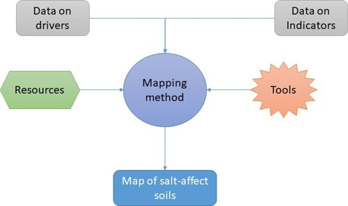  

The main categories of the methods for mapping salt-affected soils are:

i.    Methods based on soil maps and expert opinion;
ii.   Remote sensing applications;
iii.    Modelling of soil indicators of salt problems.

This chapter elaborates on the potential and limitations of these categories of mapping methods with regards to their: 1) contribution to building integral global information of salt-affected soils, 2) ability to quantify mapping accuracy and uncertainty, and 3) flexibility for periodic information update.

## Methods based on soil maps and expert opinion  
Soil maps have been traditionally used to identify salt-affected soils in many territories of the world. Their application relies on identification and verification of the areas in the soil maps with designations related to salt-affected soils. A seminal work in global assessment of salt-affected soils using this approach was published by Szabolcs (1979). The publication used FAO-UNESCO soil map of the world in which the polygons with salt-affected soils were classified saline soils (solonchak and saline phases), alkali soils (solonetz and alkaline phases), and potentially salt-affected soils. Potentially salt-affected soils were soils in areas that were not salt-affected at the time (or salt-affected to a very low degree) but could be easily become affected due to human activities. The approach given by Szabolcs (1979) also used expert opinion to identify the areas that were not very well represented in the FAO-UNESCO soil map of the world. Figure
3.2	is example output from this mapping approach.

  

Application of soil maps to quantify areas of salt-affected soils has since been applied in various parts of the world. Examples include mapping of saline and sodic soils in the European Union (Toth et al., 2008), salt-affected soils in the European part of Russia (Khitrov et al., 2009), digital assessment of salt-affected soils in India (Mandal et al., 2011), among others.
Most applications of soil maps use the sequence of identification, verification, and quantification processes to produce the spatial information of salt-affected soils. The identification process aims at locating the soil

typological/mapping units in the soil map with classified designations of salt-affected soils. The identified units are then verified with either through expert opinion or confirmatory field-sampling and testing. The confirmed areas are finally delineated and their aerial extent quantified. This sequence may be preceded with the development of a new soil map or digitalization of old maps where necessary (Khitrov et al., 2009; Mandal et al., 2011).
Although the application of soil maps to identify salt-affected soils is popular in some countries, it suffers from the lack of accuracy and uncertainty quantification of the final maps. The approach also produces maps of salt-affected soils with hard boundaries, which are arguably infrequent in most landscapes. Other soil information associated with salt-affected soils such as the distribution of electrical conductivity, pH, soluble ions, etc. may be imprecisely given or missing.

##	Using remote sensing application  
Remote sensing application has been used in agriculture and environment for many years. The technology provides spatial and temporal information about the land cover, soil cover characteristics, climate, and atmospheric conditions, which are of importance in soil and agriculture resources management. It relies on the interaction of the electromagnetic radiations with soil and vegetation to produce characteristic signatures in the reflected radiations. The reflected signatures are then modelled to extract soil and vegetation features. Two broad categories of radiations are discernible with this technology: radiations from the sun (also called passive radiations) or radiations from the sensor (active radiation). They are further classified according to the type of sensors detecting the radiations: 1) proximal sensors, which are put on the soil surface or a few meters from the soil surface; 2) sub-atmosphere cameras, which are carried by low lying aircrafts or aerial vehicles; and 3) satellites (Figure 3.3).


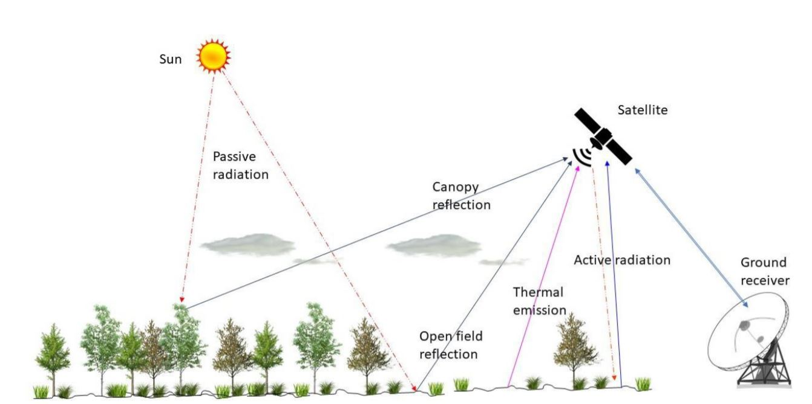 

Remote sensing applications in mapping salt-affected soils target land surface evidence of salt problems in the soil. Examples of proximal sensors often used are electromagnetic induction (EMI), geophysical sounding, and reflectometers. These sensors are mostly used to determine bulk soil electrical conductivity (Lesch et al., 1992). Low-altitude sensors such as Unmanned Arial Vehicles (UAV) are also gaining traction in mapping salt-affected soils (Hu et al., 2019; Ivusking et al., 2019). Hu et al. (2019) tested hyperspectral camera mounted on UAV and EMI in mapping salinity and found UAV as the most promising method for high-resolution identification of soil surface salinity characteristics.  

Satellite remote sensing are the most popularly used. They cover wide areas in a single scene, which is economical for large-area mapping. Moreover, most satellite images are increasingly becoming freely downloadable and gaining wide applications because of globally tested models and free processing algorithms. Their applications range from interpretation of composite images to modelling the relationships between indices of image reflectance and indicators of salt problems in the soil (Matternicht and Zinc, 2003; Gorji et al., 2019). Widely used remote sensing images for mapping soil resources are Landsat, sentinel and (Moderate Resolution Imaging Spectroradiometer (MODIS) (Table 3.1). These images are globally available for free download.  


*Table 3.1: Commonly used remote sensing image characteristics for mapping salt-affected soils*  

```{r, echo = FALSE}
dt <- read.csv("figures/tables/Table_3.1.csv", sep = ";")
kable(dt, col.names = gsub("[.]", " ", names(dt))) %>%
kable_styling("striped", full_width = F)
```

*B is notation for satellite image band  
Examples of popularly used image indices in mapping salt-affected soils are normalized salinity index (NSI), salinity index (SI), soil adjusted vegetation index (SAVI), vegetation soil salinity index (VSSI), normalized difference salinity index (NDSI), normalized difference vegetation index (NDVI), salinity ratio (SR), canopy response salinity index (CRSI), and brightness index (BI) (Gorji et al., 2019). They are summarized in Table
3.2. These indices have been variously used either alone or in combination to model soil surface salinity characteristics.

*Table 3.2: Examples of popular image band combinations for soil salinity mapping*
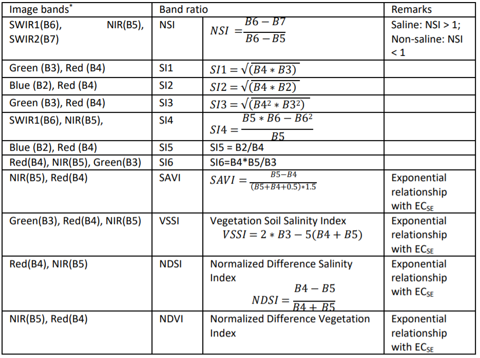

Remote sensing application for mapping salt-affected soils is expedited by the availability of images and processing software. Consequently, the approach is the fastest of all the methods for mapping salt- affected soils. Its application in large areas often produce consistent maps between boundaries of countries, which minimizes the need for harmonization. Furthermore, its time-series application is potentially useful in monitoring changes in status of salt-affected soils. A recent application at the global level was demonstrated by Ivushkin et al. (2019) (Figure 3.4).


Despite the potential of remote sensing application, the approach is limited in detecting salt problems down the soil profile. Most remote sensing images for large-area mapping do not penetrate more than a few inches of the topsoil and only rely on the calibration models to estimate salt problems down the soil profile. These calibration models can result into spurious relationships without significance in salt dynamics in the soil (Matternicht and Zinc, 2003; Gorji et al., 2019). Some attempts have been made to overcome these limitations. Combined modelling with other spatial datasets such as climate, soil maps and vegetation cover are examples focused on performance improvements of the approach (Scudiero et al., 2019).  

##	Methods based on soil indicators of salts  
Soil indicators provide evidence of the presence of salts in the soil and occurrence of salt-affected soils. They are traditionally used in most soil classification schemes to identify the soil profiles and soil types belonging to the group of salt-affected soil (Soil Survey Staff, 1999; IUSS Working Group WRB, 2015; Craig and Hempel, 2017). Soil indicators of salt-affected soils are also used to quantify the intensity of salt problems in the soil (Table 2.4). They are also used to calibrate other methods for mapping salt-affected soils. Hence, they play a central role in assessing salt-affected soils and should therefore be the foundation for developing soil information of salt-affected soils.
Three types of applications exist in the literature for mapping salt-affected soils using soil indicators: 1) mapping the soil attributes and classifying the output maps, 2) mapping classes derived from the soil attributes, and 3) classifying calibrated maps of electromagnetic induction outputs or remote sensing images (Figure 3.5) (Triantafilis et al., 2001; Taghizadeh-Mehrjardi et al., 2019).


Applications using calibrated models with EMI are popularly used in mapping soil salinity. In this case, EMI data are calibrated with measured EC on a select sample set and the results used to map soil salinity (Lesch et al., 1992). Farzamian et al. (2019) recently tested the efficacy of local and regional models of this approach to improve its wide adoption. Mapping approaches involving extrapolation of pre-classified classes of salt-affected soils are also available in the literature. These approaches resemble the soil-map based method except that the input data are georeferenced soil attributes. They are not very popular owing to the challenges with extrapolation of categorical attributes (Jafari et al., 2012). Classifying spatially interpolated soil attributes is also another way of mapping salt-affected soils. In this case, the georeferenced soil indicators are first interpolated then the resulting maps are classified into maps of salt- affected soils (Zurqani et al., 2018). This approach was tested by Wicke et al. (2011) to produce a global map of salt-affected soils (Figure 3.6).

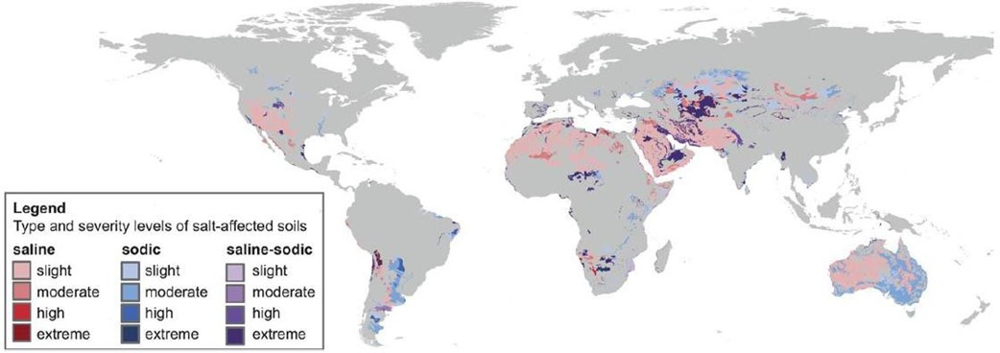

## Data requirements for mapping soil salinity    
Input data for mapping salt-affected soils depends on the mapping methods. A summary of data requirements by the main categories of mapping methods is given in Table 3.3. The soil indicator-based methods are the most data demanding. At least, they require soil data on electrical conductivity (EC), pH, and exchangeable sodium percent (ESP) or sodium adsorption ratio (SAR) as recommended by FAO or USDA classification schemes for salt-affected soils.  

*Table 3.3: Summary data requirements for mapping salt-affected soils*
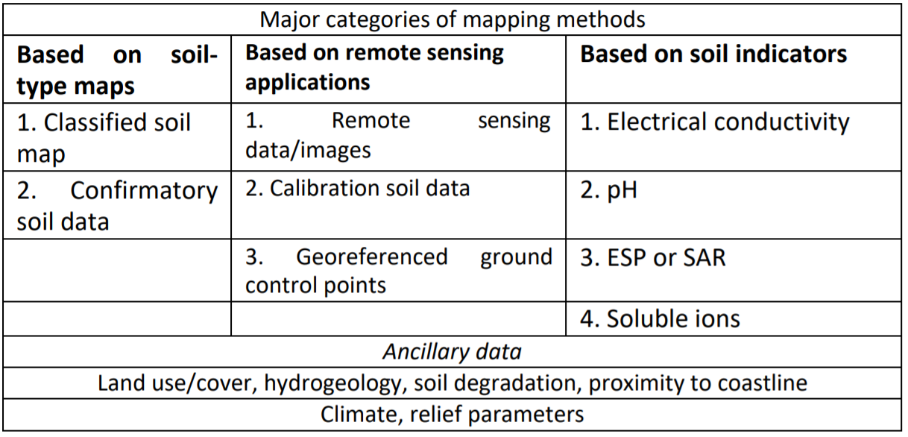

### Measured soil properties  
Measured soil properties for classifying salt problems in the soil are given in Table 3.4. Soluble ions in this category include Sodium (Na^+^), Calcium (Ca^2+^), Magnesium (Mg^2+^), Potassium (K+), Chloride (Cl^-^), Sulphate (SO^-2^), Carbonate (CO^-2^), Bicarbonate (HCO^-^) and Nitrates (NO^-^). They are useful in identification of the dominant salts and types of salt-affected soils. Electrical conductivity (EC), total soluble salts (TSS), total soluble cations (TSC), and total dissolved solids (TDS) are integral measures of salt concentration in the soil. This book recommends a minimum data set for classifying salt-affected soils as EC, pH and either ESP or SAR because of the recommendations given by the popular salt classification schemes (Table 2.1).
Table 3.4: Summary soil properties for mapping salinity  

*Table 3.4: Summary soil properties for mapping salinity*
```{r, echo = FALSE}
dt <- read.csv("figures/tables/Table_3.4.csv", sep = ";")
kable(dt, col.names = gsub("[.]", " ", names(dt))) %>%
kable_styling("striped", full_width = F)
```

###	Bulk-soil properties and soil maps
Bulk soil properties are properties measured in the field using proximal soil sensors. They are mostly used for estimation of pH and electrical conductivity. The sensors for measuring electrical conductivity are: 1) electrical resistivity, 2) electromagnetic induction, and 3) time domain/amplitude domain/frequency domain reflectometry (TDR, ADR, FDR). They measure electrical conductivity of the bulk soil, which is also known as apparent electrical conductivity (ECa) (Dalton and van Genuchten, 1986; Corwin and Lesch, 2005).

Field measurement of soil pH is often done using pH meters (and sometimes pH sensors). pH meters are used with samples prepared in the field. Hence, they are not really pH of the bulk soil. The sensors for bulk soil pH include field-efficient transistor (ion-selective field efficient transistor - ISFET) and conductimetric sensors, electrode sensors (Schirrmann et al., 2011).
Soil maps are ensemble of spatial information of groups (units) of soil with certain characteristics. Typical examples of soil maps are polygon maps showing dominant soil types in each polygon and thematic choropleth maps of indicators/classes of salt-affected soil types.

###	Information on soil forming factors
Soil forming factors are the parent material, land use/cover, climate, and relief. Information on the parent material is obtained from the geology map. The map should contain data on the age and type of lithology of the dominant rocks from which the soil was formed (Figure 3.7). Most geology maps are available as polygon GIS vector files.
Land cover/use information represent the biotic and anthropogenic activities influencing soil formation and secondary drivers of salt problems in the soil. Land cover/cover maps and remote sensing images are suitable sources of information of land cover/use. Examples of climate data are mean annual precipitation (rainfall, snowfall, etc.), annual minimum and maximum temperature, mean annual evapotranspiration rate, and wind speed. Freely downloadable climate data at low-resolution global scale are available at https://www.worldclim.org/ (Accessed on 31 January 2020). Digital elevation model (DEM) is the primary input data for deriving relief information. DEM can be downloadable at https://earthexplorer.usgs.gov/ accessed on 14 January 2020).


###	Other ancillary data
Other ancillary data for mapping salt-affected soils are administrative boundaries and spatial data of other drivers of salt problems in the soil (Figure 3.7). Spatial data of other drivers of salt problems are maps of hydrogeology (groundwater quality and depth to groundwater level), soil degradation, proximity to coastline, and flood-prone areas.

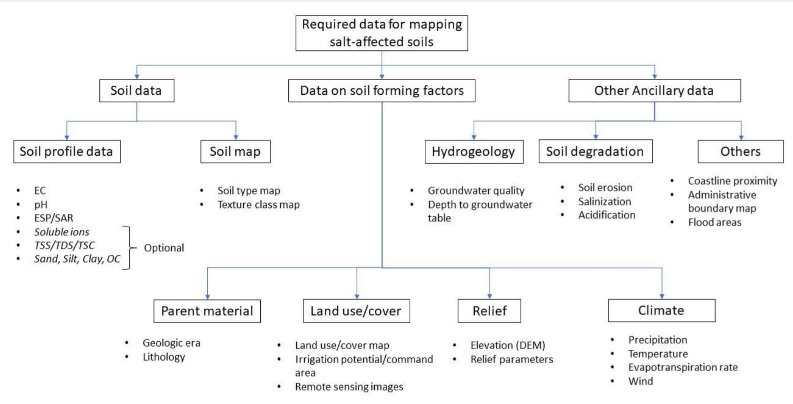  
###	Conversion models  
Electrical conductivity determined on saturated soil paste extract (ECSE in dS/m) is the preferred EC for classifying salt-affected soils. However, many soil laboratories don't analyse ECSE due to the cumbersome laboratory procedures involved with its determination and long turn-around time for analysing many samples. Instead they use other extracts, such as from 1:5 soil:water mix (1 part of soil in 5 parts of water), 1:2.5 solutions, etc (Landon, 1984). Proposals have been made in the literature to calibrate EC determined from other soil extracts to the ECSE equivalent (Hogg and Henry, 1984, Ozcan et al., 2006; Sonmez et al., 2008; Kargas et al., 2018). These proposals depend on the soil texture, organic matter content, temperature, and measured ECS. A generic framework in these proposals for converting EC to ECSE is as follows:

\begin{equation}
\tag{3.1}
EC_{SE} = f(EC_{s,texture,carbon,temperature}+ \varepsilon )
\end{equation}

*Table 3.5: Existing EC conversion models*  
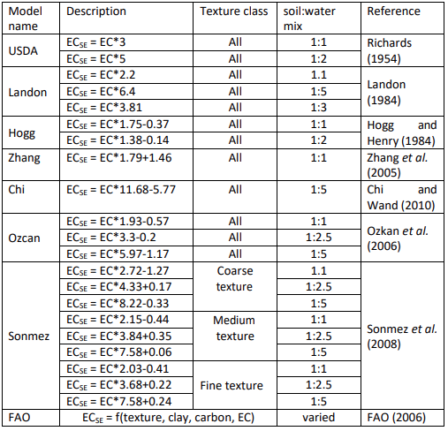  


<!--chapter:end:01.BACKGROUND_INFORMATION.rmd-->

# SECTION TWO - DEVELOPMENT OF INFORMATION ON SALT-AFFECTED SOILS{-}

This section describes the procedural steps for developing multiscale spatial information of salt-affected soils. It demonstrates how to integrate the resources (computer and software, data, and expertise) with methods to develop spatial information of salt-affected soils.

  

# Preparation for multiscale mapping of salt-affected soils  

## Requirements   
Multiscale mapping of salt-affected soils requires adequate coordination and mobilization of input data, computer and software for implementing the mapping methods, and a harmonized approach that allows comparison of information in space and time. Input data requirements have been elaborated in Section 1, which gives the relationship between input data and characteristics of salt-affected soils. Mobilization of capital resources and coordination of activities are outlined in Section 3. The interaction between different aspects on input requirements for mapping salt-affected soils are illustrated in Figure 4.1.

  


###	Input data  
Input data provide evidence of occurrence of salt-affected soils. Their characteristics influence and are also influenced by the specifications of the final outputs of the mapping exercise such as suitable soil depths, spatial resolution of the final maps, incorporation of uncertainty and accuracy assessment , and classification of the intensity of salt problems in the soil. Table 4.1 is an example summary of input data requirements for national, regional and global mapping of salt-affected soils.

*Table 4.1: Minimum input data requirements for large-area mapping of salt-affected soils*
  
[^1] [^2] [^3] [^4] [^5]  
[^1]: WOSIS: https://www.isric.org/explore/wosis
[^2]: HWSD:http://www.fao.org/soils-portal/soil-survey/soil-maps-and-databases/harmonized-world-soil-database-
v12/en/
[^3]: WorldClim: https://www.worldclim.org/
[^4]: ESA: https://www.esa-landcover-cci.org/
[^5]: USGS: https://earthexplorer.usgs.gov/


###	Computer and software
Computer and software are required to process the input data, implement the assessment methods, and to store and share the final spatial information. They include processing, storage, and networking facilities for developing the spatial information of salt-affected soils. Processing facility is the core component responsible for implementing the assessment methods and consist of the computer processor and software. Consideration for specification of the processing facility is important since processing complexities tend to increase with increase in spatial extent and resolution of the final outputs. Storage of the input and processed data is handled by the computer storage (hardware) facility. Like the processing facility, the demand for storage facility also increases with increase in spatial extent of the target areas. The sizes of the input images and processed maps may increase from the national to global level assessment. All these considerations influence the minimum computer and software requirements for implementing multiscale mapping of salt-affected soils. The following computer specifications are suggested for national mapping of salt-affected soils:  

*   Enough processing memory (at least 8GB RAM);  
*   Fast processing capacity (at least Core i5 or equivalent);   
*   Enough storage capacity (at least 100 GB).  

Internet connectivity is also an important aspect of the computer and software requirements. It enables access to online data repositories during data acquisition as well as during information sharing.   


### Example input data for demonstrating spatial mapping of salt-affected soils  
The case study for demonstration indicator-based spatial mapping of salt-affected soil was obtained is northern Sudan. The area stretches from the Latitude 22$^\circ$ 13' 30.3" to 16$^\circ$ 30' 28.59" North and from the Longitude 32$^\circ$ 41' 3.55" to 25$^\circ$ 0' 0" East (Figure 4.2). Input soil data from this area consist of 379 profile locations which were surveyed in 2018 at various soil depths between 0 and 200 cm. The data includes
ECSE (dS/m), pH, ESP, soluble ions (Soluble Na^+^, SO~4~^2-^, CO~3~^2-^, HCO~3~^-^, and Cl^-^) in cmol/kg and were determined using the saturated soil paste extract approach. This data is available at https://doi.org/10.1594/PANGAEA.920201

 
Data on soil forming factors include multispectral remote images, remote sensing image of digital elevation model (DEM), and maps of land cover types, geology, and mean annual rainfall amount (Table 4.2). The input data also include shapefiles of the case-study boundary and major towns and raster map of aquifer types.  

*Table 4.2: Case-study input data from northern Sudan (source: Government of Sudan, http://susis.sd/)*  

 

## Software requirements for multiscale mapping salt-affected soils    

###	GIS application requirements    
GIS applications are useful in spatial data preparation and presentation of the final products to enrich the information content. Commonly used GIS applications for data preparation are:  

a)    Reprojection: This application is needed to align the coordinate system of GIS data into one uniform projection. Projections that give spatial dimensions in meters are preferred while WGS84 geographic (decimal degrees) projection is preferred for data sharing.  
b)    Layer clipping: This application helps with reducing data bulk by trimming the extent within the boundary of the area of interest.  
c)    Format conversion: This application is used to enable data exchange between different software and for data sharing. Format conversion is done to change GIS vector to raster (and vice versa) or to change between raster file types (such as from geoTiff to ASCII).
d)    Resampling: Resampling application is needed to harmonize resolution of input layers for spatial modelling of indicators and classified map of salt-affected soils.  
e)    Image correction: Image correction is mainly applied to remote sensing images. There are two types of image correction: radiometric and geometric correction. Radiometric correction aims at converting image digital numbers (DN) to reflectance. The algorithms for radiometric corrections are usually given for each type of remote sensing mission. Geometric correction application reprojects the images to a preferred coordinate reference system (CRS) to the images.  
f)    GIS database development: This facility is required to put together a harmonized complete dataset to minimize spatial modelling errors and to ensure compatible storage for future reference or applications.  
g)    Map layout: This is the final value-addition to GIS layers to enhance communication with users of the final products of spatial information for salt-affected soils.  

Most GIS software can implement the above applications. The following guidelines can be used to select a suitable GIS software to use:

*   Software which accommodates a wide range of GIS file formats;  
*   Software with many alternatives for colour pellets and symbology for map layouts;  
*   Software with easily accessible layer view and graphical user interface functionalities;  
*   Software which is strict with on-screen overlay of truly pixel-harmonized and georeferenced layers;  
*   Software with versatile but easy-to-implement vector-to-raster conversion algorithms;  
*   Software with robust modules for remote sensing applications and direct image download;  
 
Mapping of salt-affected soils - Technical manual

*   Software with vibrant and freely accessible online support;  
*   Easily accessible software (preferably low cost or open source).  
Some of the GIS software meeting the above criteria are QGIS (https://download.qgis.org/), ILWIS (https://52north.org/software/software-projects/ilwis/), gvSIG (http://www.gvsig.com/en), and SAGA (http://www.saga-gis.org/en/index.html). Other commercial GIS software such as ArcGIS, ERDAS, IDRISI, ENVI, etc. are also suitable alternatives.


### 	Data harmonization requirements  
Data for multiscale mapping of salt-affected soils may have variations and standards because of their sources and methods of data generation, spatial and temporal resolution, file format, and measurement units. Input data harmonization is necessary to produce compatible dataset to reduce errors in data handling and spatial modelling uncertainties. Data harmonization applications include:  

a)    Standardizing measurement units;  
b)    Converting soil property values to the equivalent of a preferred measurement method;  
c)    Harmonizing soil property values at uniform soil depth intervals;  
d)    Transforming statistical distribution to a preferred probability distribution function;  
e)    Harmonizing spatial resolution, projection and extent of input GIS layers for spatial modelling.


In multiscale mapping of salt-affected soils, input data harmonization focuses on soil indicators and GIS spatial layers (Figure 4.3). Software requirement for data harmonization include requirements for implementing data conversion models, image correction and indices development, and harmonizing GIS layers. Statistical harmonization needs are implemented using statistical software while GIS harmonization needs are implemented using GIS software. A suitable software such as R and its contributed packages (R (https://cran.r-project.org/bin/windows/base/) may be suitable for combining statistical and GIS harmonization needs. R contributed packages include soilassessment (Omuto, 2020), raster (Hijmans, 2020), rgdal (Bivand et al., 2019), and GSIF (Hengl, 2019).


### Spatial modelling requirements  
Multiscale mapping of salt-affected soils requires spatial input data, which are combined through certain procedures to produce spatial information of the status of soil salt problems. Spatial modelling targets the development of spatial layers of input data (indicators) of salt problems and for developing classified map of salt-affected soils. The software requirements for spatial modelling are:

*   Functionality for spatial prediction of numerical and categorical variables;  
*   Functionality to estimate mapping accuracy and uncertainties;  
*   Functionality to classify salt-affected soils.   

Freely downloadable R computing software adequately meets these requirements. Some of its packages are especially useful in implementing some of the above requirements. For example, the soilassessment package has functions for classifying salt-affected soils and estimating mapping accuracy and uncertainties while the caret package has functions for spatial prediction of numerical and categorical variables (Kuhn, 2020; Omuto, 2020).  

## Input data preparation for mapping salt-affected soils  
Input data preparation is a necessary step in mapping salt-affected soils. It involves creation of a complete and fully harmonized database of soil profile data, GIS layers, and reference documentation.

i.    Soil profile database is the database containing spreadsheet of georeferenced soil profile. The database contains information on soil depth and measured soil properties for each sampled depth, measurement units, methods used in measurements, reference laboratory, date of data acquisition, reference publication (if any), contact person, and summary metafile (text-file).
ii.   GIS database is the database containing spatial GIS layers, which are layers of soil forming factors and ancillary drivers of salt problems in the soils.
iii.    Document database is the database containing literature of existing information about salt- affected areas, problems, legislation, and previous attempts on solving the problem, etc.  

It is important to consider standard GIS practices when preparing and GIS data handling. The practices include:


I.    Rule on file path: A short pathname is preferred
Pathname contains file locations separated by forward or backward slash "/". The number of items in a pathname, which are separated by the slash "/" should be as few as possible and containing no spaces. For example, "C:/Salinity/Input" has two slash symbols implying two folders in the pathname while "C:/Salinity/Sudan/Input" has three slash symbols for three folders in the pathname. The 3-folder pathname is longer than the 2-folder pathname.  


II.   Rule on file name    
DO NOT create filenames or folder-names with spaces (e.g. "salt affected.shp" is not recommended). Instead use underscore or without space (e.g. "salt_affected.shp" or "saltaffected.shp" are recommended). DO NOT start filenames with numbers, symbols, mathematical operators, full-stop and comma (e.g. ".ECtp.xls" or "+ESP.tif" or "0_30topESP.mpr" are not recommended). It is better not to use mathematical operators in filenames.
DO NOT create filenames with long names (e.g. "salt_affected_soluble_ions_sodium.csv" is not recommended).Use informative naming style incorporating file type or projection for GIS layers (e.g. "soildata_dg.shp" or "ECtop0_30cm.tif" or "DEM90_UTM37N").


III.    Rule on data archive  
Separate and protect input data by placing them in input folder and write-protecting it from inadvertent overwrite. The steps shown in Figure 4.4 are useful in creating working and archiving folders and protecting archive folders. Write-protect feature for input folder may need to be remove when a new original data is to be added to the archive and the protection reinstated afterwards.


###	Organizing spreadsheet data  
A three-step approach is described for organizing and documenting spreadsheet data.  

<ins>Step 1: Aligning spreadsheet data</ins> 

In this step, the spreadsheet data is orderly arranged so that the data rows represent samples and columns represent variables. The samples are distinguished by sequential serial numbers. A good practice is to use the first column as the variable indexing the serial order of the samples. The other variables in the database are consecutively aligned in the columns beginning with profile ID, location description (if any), Latitude and Longitude, and sampling depth-range (Figure 4.5). The depth-range is further split into two variables: Upper and Lower. Upper denotes the first part of the depth-range while Lower denotes the last part of the depth-range. The value for Upper in one sample should be the same as the value for Lower in the preceding sample for the same profile ID (Figure 4.5). Other variables such as Depth Code (or Horizon number), soil texture components, organic carbon, pH, EC, ESP, and additional soil properties (e.g. soluble ions, exchangeable sodium ions and CEC) are also included in that order (Figure 4.5). The Depth Code (or Horizon) should have consecutive numbers beginning with 1 for the first depth to the last sampled depth/horizon in each profile. This arrangement creates repeated numbers/codes for the profile ID and Longitude and Latitude values (Figure 4.5).  


It is important to ensure that:

*   Upper, Lower, and Horizon for each profile ID should be increasing down the soil profile;  
*   Latitude, Longitude and Profile ID should remain constant for each Profile ID;  
*   Upper is equivalent to the first part of the Depth range and Lower is the second part of Depth.  


<ins>Step 2: Saving and exporting spreadsheet data</ins>  

After data organization, the spreadsheet data should be saved (preferably as comma separated values, CSV) for further alignment with other datasets (Figure 4.6).


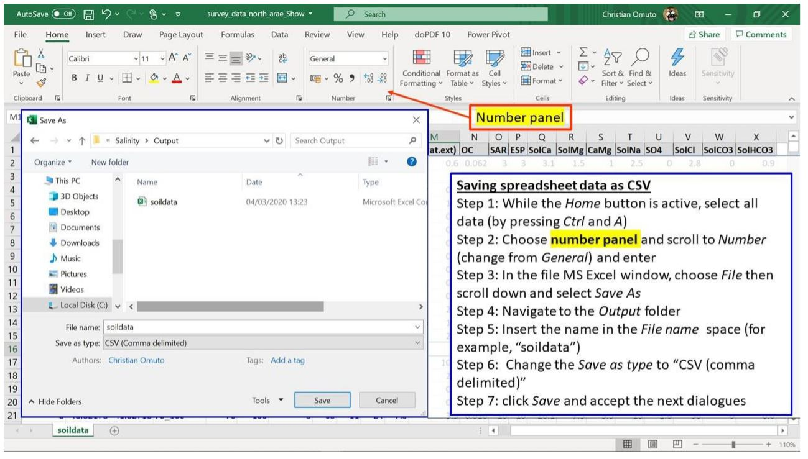


Sometimes, it may be necessary to ascertain that the computer system separator is comma or semi-colon since this will influence access to the saved CSV file. The following procedure may be useful to establish the type of system separator.  

1.    Click on the Start menu.
2.    Type control panel.
3.    Click on Control Panel (Desktop app).
4.    Select Clock, Language, and Region.
5.    Click Region.
6.    Select Additional settings in the pop-up window.
7.    Check the separator in front of List separator.


Where necessary, change the system separator to comma (by following the above steps and changing to comma at step 7 and saving the change). If the system separator is changed after completing the steps in Figure 4.6, then the steps should be repeated.


<ins>Step 3: Documenting spreadsheet data</ins>  


This last step is concerned with documenting the data. The items to document are:  

*   Title (short description data type - point or spatial GIS layer);
*   Data type, date of data generation, number of profiles/augers;
*   Salinity/sodicity indicator;
*   Type of measurement (field or laboratory) and units of measurement;
*   Type of soil-water solution (soil solution extract used);
*   GPS coordinate reference system (CRS);
*   Reference publication/contact address.


The following is an example of a two-column textfile/notepad for the documentation. It should be saved as data metafile alongside the CSV file in Figure 4.6.


### Organizing GIS layers  
Organizing GIS layers starts from layer acquisition. Online repositories are available for free download of some GIS datasets such as remote sensing images, elevation, land cover/use types, soil, and climate. The link to some of these datasets is given in Table 4.1. An example of steps for GIS data download is given in Appendix A1. Downloaded data is harmonized and archived in input GIS database


###	Harmonizing input GIS layers  

#### Harmonizing coordinate reference system  

Coordinate reference system (CRS) defines the projection of a GIS layer. CRS models the Earth's surface into a 2D representation. Since the earth is not a perfect sphere, its surfaces require unique conversion models to transform the 3D landscape into 2D representation. Consequently, there are different CRS models between sets of Latitudes and Longitudes. GIS data organization endeavours to identify layers' CRS and harmonize them into one uniform projection model. Harmonized CRS is a basic core of GIS database because it allows spatial layering of different datasets either for visualization (on the screen) or for subsequent spatial modelling of salt-affected soils. Reprojection is the terminology often used in GIS for transforming one CRS to another. The following steps are used for reprojecting GIS layers:  

*Step 1:*   Identifying the final CRS to use for all GIS layers (here known as harmonized CRS).
It is important to use WGS 84 (decimal degrees) as the harmonized CRS for all layers because it has uniform parameters throughout the world. During reprojection, this CRS is known as target CRS.  
*Step 2:*   Note the CRS for each GIS layer and the individual need for reprojection. This CRS is known as source CRS during reprojection.  
*Step 3:*   Reproject the layers as shown in Figure 4.7.  


#### Harmonizing layer format

Not all GIS layers are available in the preferred file format. Most soil forming factors such as soil map, geology, and land cover types are often available as polygon vector files. They need file format conversion to raster since spatial modelling is normally done on raster file formats. The process of harmonizing GIS layer formats attempts to convert vector files to raster formats. It also seeks to convert all file in the database to uniform filetypes. Vector-to-raster conversion is the GIS function for harmonizing vector polygons into raster data types.
Vector-to-raster conversion in QGIS can be implemented using modules in GRASS, SAGA, GDAL, or QGIS Raster tools. Except for SAGA, all the other modules require an attribute of unique integers designating the polygon items for vector-to-raster conversion. Nonetheless, they all produce comparable results for mapping salt-affected soils. Creating an attribute of unique integers may require additional steps that are accessible at https://docs.qgis.org/testing/en/docs/user_manual/index.html.
Some of the pre-requisite operations before vector-to-raster harmonization include projection harmonization, identification of the target polygon attribute to use in the conversion, decision on the target pixel resolution of the final raster map, and cleaning of missing entries, topology errors, and associated errors in the data entry. Figure 4.8 illustrates the steps for vector-to-raster conversion in QGIS.  


#### Harmonizing remote sensing images  

(1)   Image correction  

Input remote sensing images for spatial modelling of salt-affected soils come from diverse sources with different characteristics such as spatial extent, image digital numbers, CRS, and file format. They need harmonization before integration in the modelling process. Image correction is the harmonization process for aligning the characteristics of downloaded images to correspond with those of the established GIS database for mapping salt-affected soils.

Step 1:   Unzip the downloaded images.
Most downloaded images are wrapped in compressed files such as .zip, .rar or .gz. They should be unpacked into commonly used GIS file formats such as geoTIFF, ASCII, HDF, etc. Software such as WinZip or WinRar or 7-Zip unpacks the compressed files into a preferred destination folder (such as C:/Salinity/Output). Sometimes the unpacked file may still contain compressed files and another unpacking step should be used in this regard to extract the GIS files. Different zipped files should be unzipped into different folders to avoid over-writing metafiles and for processing each file independently.  

Step 2:   Image correction
Semi-Automatic Classification Plugin (SCP) in QGIS provides a quick way for simultaneous geometric and radiometric correction of remote sensing images. The plugin has many functions for handling different types of remote sensing images such as Landsat, Sentinel-2, Sentinel-3, ASTER, MODIS, etc. Figure 4.9 illustrates how these types of images are corrected using SAC plugin in QGIS.


Step 3:   Combine and size Images
Downloaded images sometimes cover regions that extend outside the study area. In such cases, the images need to be clipped using the boundary layer of the study area. Besides image clipping, there are also cases where two or more remote sensing image-scenes are needed to cover the study area completely. Image mosaicking is used to join adjacent images to produce a composite image that covers the whole study area. The harmonization process endeavours to merge overlapping data and/or trim data to fit the study area.  

(2)	Mosaicking images  

Although there are algorithms for mosaicking several bands in one-step, band-by-band mosaicking is preferred as it gives room to assess the quality of the output product. Starting with Band1, vertically overlapping images covering the country are selected and mosaicked (Figure 4.10). The process is repeated for all the bands of the selected image type. It is important to:
1)    note of the image CRS and harmonized pixel size for the resultant mosaicked image
2)    select a suitable choice of name for each mosaicked image band (say Mosaic1 for band 1)
3)    identify the need for further clipping of the final mosaicked bands to trim them to the study area.


  

(3)	Image trimming  

Image trimming/clipping/masking produces reduced data size and customizes products to the area of interest. The steps for image clipping are illustrated in Figure 4.11.  

  

####	Harmonizing relief data  
Relief data is processed to produce a set of terrain parameters influencing the distribution of salt-affected soils. The literature categorizes terrain parameters as either primary or secondary attributes (Wilson and Gallant, 2000). Primary attributes are derived from the altitude and directional location of the topographic surface. They include slope, aspect, curvature, flow accumulation and up-slope flow contributing area. Secondary attributes are obtained from the altitude and derivatives of the primary attributes. They depict surface characteristics regarding water distribution and light reflection and include indices such as topographic wetness index, compound topographic index, stream power index, etc. (Li et al., 2005).  
Elevation map is the primary input for extracting terrain parameters. Where necessary, depressionless elevation is first developed to improve the quality of the derived parameters (Weibel and Heller, 1991). SAGA software has a module for simultaneous derivation of 14 terrain parameters from DEM input. Its implementation steps are given in Figure 4.12.  


 

At least two primary and two secondary terrain parameters are adequate for modelling salt-affected soils. This book proposes slope, longitudinal curvature, LS-factor, Channel Network Base Level, and Valley Depth as the terrain parameters for mapping salt-affected soils. 


###	Input GIS database  
Properly established and complete GIS database has many advantages in data management, spatial modelling and as organized baseline for future monitoring activities. GIS database for multiscale mapping of salt-affected soils comprise harmonized input data, documentation (metadata) of the input data, and methods and software for data access and preparation (Figure 4.13). The database is the backbone for spatial information of salt-affected soils and should therefore be properly established and standardized to improve efficiency in information update, access, and data sharing.

 

Some of the desired GIS database characteristics for mapping salt-affected soils are:

*   The database should have representative data (raster layers) of soil forming factors, ancillary information on other drivers of salt problems in the soil (such as groundwater and irrigation command areas), and soil indicators of salt-affected soils
*   All methods for data transformation and metadata should be documented
*   All input (un-processed) data should be archived in secured input folder and protected from inadvertent data modification. The processed data should be saved in the Output folder, which should also be the working directory.
*   All GIS raster files should be harmonized to a common CRS and pixel resolution  


ILWIS map-list is a suitable facility for ensuring that all harmonized raster layers have uniform CRS and pixel resolution. Unlike other GIS software which can allow (force) on-screen overlay even for different layer characteristics, ILWIS never overlay non-harmonized layers. In addition, it can also facilitate multivariate statistics and harmonization of statistical distribution of the layers. Figure 4.14 gives the steps for creating a map-list of harmonized raster layers.


 

The final GIS database should have:  

1.    Spreadsheet soil data. It should contain at least the following variables: Sample, Pits, Longitude, Latitude, Depth, Upper, Lower, Horizon, EC, pH, ESP.
2.    GIS layers. This data should have the following minimum layers
*   Relief parameters: Elevation (denoted as dem), slope (slope), slope-length factor (ls), channel network to basin level (cnbl), longitudinal curvature (loncurve), and valley depth (valley);
*   Remote sensing image bands: Blue band (BBlue), Green band (BGreen), Red band (BRed), Infrared band (BIRed), shortwave band 1(swir1), and shortwave band 2 (swir2);
*   Land cover (lcover);
*   Climate: rainfall (rain), maximum temperature (maxtempr), and minimum temperature (mintempr);
*   Geology (geology);
*   Hydrogeology (pgeology);
*   Soil map (soilmap);
*   Erosion (erosion);

#	Country-driven global mapping approach  
##	Background  
The country-driven approach for mapping salt-affected soils is based on indicator mapping backed by drivers of salt-affected soils and models for classification of the salt problems. The approach integrates and borrows from the potential of other mapping methods. It also offers quantification of mapping accuracy and uncertainty, which are increasingly accepted by the soil science community as a standard practice. It also facilitates building of spatial information on indicators and drivers besides information on the status of salt-affected soils at multiple scales. However, these advantages come at the price of data demand. Some of the required input data such as soil indicators (ESP and Soluble ions) may not be readily available in many territories.
The country-driven global mapping is a three-step approach anchored on input data harmonization, spatial modelling of input soil indicators using spatial predictors, and classification of salt-affected soils (Figure 5.1).

 


The approach puts emphasis on measured soil data (EC, pH, and ESP) as the primary soil indicators for classifying salt-affected soils. These input soil data are spatially modelled to produce maps of soil indicators of salt-affected soils. Appropriate classification schemes are selected to classify the indicator maps into maps of salt-affected soils (Figure 5.1).
R software and its contributed packages are the principal software for implementing the country-driven global mapping protocol. A summary of the key packages for implementing various steps of the protocol is given in Table 5.1. RStudio software (https://rstudio.com/products/rstudio/download/) is used as an integrated development environment to support implementation of the packages in R. 

*Table 5.1: R packages and their application in multiscale mapping of salt-affected soils*

These packages and their dependencies are installed using the following commands in R

```{r,eval=FALSE}
install.packages(c("raster", "sp", "rgdal", "car", "carData", "dplyr", "spacetime", "gstat", "automap", "randomForest", "fitdistrplus", "e1071", "caret", "soilassessment", "soiltexture", "GSIF", "aqp", "plyr", "Hmisc", "corrplot", "factoextra", "spup", "purrr", "lattice", "ncf", "npsurv", "lsei", "qrnn", "nnet", "mda", "RColorBrewer", "vcd", "readxls","maptools","neuralnet","psych"))

library(sp); library(foreign); library(rgdal); library(car);library(carData); library(maptools) library(spacetime); library(gstat); library(automap);library(randomForest);library(fitdistrplus); library(e1071); library(caret); library(raster); library(soilassessment); library(soiltexture); library(GSIF); library(aqp); library(plyr); library(Hmisc); library(corrplot); library(factoextra) library(spup); library(purrr); library(lattice);library(ncf);library(npsurv); library(lsei); library(nnet); library(class); library(mda); library(RColorBrewer); library(vcd); library(grid); library(neuralnet);library(readxl); library(psych);library(qrnn); library(dplyr)

```

It is important to note the following points when implementing the mapping protocol in Figure 5.1 in R.

*   R is a case-sensitive scripting software. More than 90% of its commands are scripted in a text- editor and executed by running the line/script.
*   Hash (#) denotes the beginning of a comment and is not executed by the software. Consequently, it can be used to insert comments in a line. All comments after hash (#) are colored green (like green traffic light) implying "pass" without execution.
*   Errors and warnings are given in red, while functions and number are given in blue and commands and variables are given in black.
*   When using RStudio text-editor, four panes are available in which the top left pane is the text editing window, top right pane is for data environment, bottom right pane is for display and help, and the bottom left is the console for executing the scripts.
*   Implemented scripts and reports (warning or errors) are shown in the console pane.
*   Some commands may run for some time and patience is recommended to enable the software to progress to completion. During such time, a red icon will be shown at the top left corner of the console pane.  


## Step 1: Input data harmonization
Input data harmonization at this point is carried out to: 1) harmonize soil indicators to those of saturated soil paste extract, 2) harmonize statistical distribution to normal distribution, and 3) harmonize soil depths at the interval of 0-30 cm, 30-100 cm, and 100-200 cm (and more depending on soil depths). These harmonization steps compliment those that were done during input data preparation.  

###	Harmonizing GIS layers

Begin by setting the working directory. This is a recommendation building on the previous database development in which the input processed data were saved in the output folder (c:/salinity/output) in Section 4.3.4.
```{r,eval=FALSE}
# Step 1-1: Import the data
setwd("C:/Salinity/Output") # Setting the working directory
soil=readOGR(".","soildata") # Importing soildata.shp as shapefile
```


Spreadsheet data can also be imported directly as excel data or CSV using appropriate commands such as
```{r,eval=FALSE}
soil = read_xlsx("soildata.xlsx") 
```
 for importing MS Excel or 

```{r,eval=FALSE}
soil=read.csv("soildata.csv",header=T) 
```

for importing CSV filetype. GIS rater files are imported using either readGDAL or raster functions. Both functions accept many GIS raster file format such as geoTIF, ILWIS, ASCII, etc. When using the readGDAL function, the first instance is used to create a stack space for subsequent layers. Hence, it does not have "\$" sign at the end of predictors and does not have "\$band1" at the end of the import line. The function is unique since (1) it does not accept import and stack of layers of different dimensions in terms of spatial extent and pixel sizes and (2) it automatically creates a stack (here known as predictors) for input GIS layers. Subsequently, it is a preferred function for ensuring input data conformity. If the raster function is used, it may be necessary to resample the layers in case of possible differences in dimensions that may later introduce modelling errors. All imported input GIS layers should be named accordingly (dem, slope, ls, loncurve, cnbl, valley, rain, lcover, geology, pgeology, BBlue, BGreen, BRed, BIRed, swir1, swir2, etc.)


```{r,eval=FALSE}
predictors=readGDAL("dem.tif")
predictors$slope=readGDAL("SLOPE.mpr")$band1
predictors$ls=readGDAL("ls.asc")$band1
predictors$valley=readGDAL("valley.mpr")$band1
predictors$geology=readGDAL("geology.mpr")$band1


predictors$BBlue=readGDAL("BBlue.mpr")$band1
predictors$swir1=readGDAL("swir1.asc")$band1
predictors$swir2=readGDAL("swir2.tif")$band1


predictors$dem=predictors$band1 # for replacing the first layer
predictors$band1=NULL # for removing replaced layer
# Step 1-2: Check the data for unique values and remove where possible
summary(predictors)
# Object of class SpatialGridDataFrame # Coordinates:
#		min		max # x	-75674.99	417325
#	y 1883692.11 2443692
# Is projected: TRUE # proj4string :
# [+proj=utm +zone=36 +datum=WGS84 +units=m +no_defs +ellps=WGS84 +towgs84=0,0,0] # Grid attributes:
#	cellcentre.offset cellsize cells.dim # x		-75176 997.9757	494
# y	1884191 998.2175	561
# Data attributes:
#	dem	loncurve	ls	cnbl
# Min.	: 176.0		Min.	:-1.000e-07		Min.	:0.000002		Min.	:178.6 # 1st Qu.: 292.5	1st Qu.:-1.000e-07	1st Qu.:0.011727	1st Qu.:279.4
# Median : 342.9  Median :-1.000e-07   Median :0.033486   Median :326.9 # Mean  : 349.7   Mean   : 1.170e-06   Mean   :0.053562   Mean   :332.3 # 3rd Qu.: 399.1  3rd Qu.: 1.149e-06   3rd Qu.:0.062155   3rd Qu.:380.0 # Max.   :1064.6   Max.   : 3.295e-04   Max.   :7.043770   Max.  :571.0
# .....
#    swir1	swir2	BBlue	BGreen

# Min.	:0.008162	Min.	:0.002062	Min.	:0.009072	Min.	:0.01625
# 1st Qu.:0.554471	1st Qu.:0.533823	1st Qu.:0.426480	1st Qu.:0.11551
# Median :0.625109	Median :0.603396	Median :0.476060	Median :0.13294
# Mean	:0.604679	Mean	:0.582251	Mean	:0.462953	Mean	:0.13189
# 3rd Qu.:0.676205	3rd Qu.:0.650973	3rd Qu.:0.516825	3rd Qu.:0.15002
# Max.	:0.868268	Max.	:0.838160	Max.	:0.679898	Max.	:0.22036

# Remove NAs in case they occur due to data clipping
predictors$slope=ifelse(is.na(predictors$slope),mean(!is.na(predictors$slope)),predi ctors$slope)

```

Statistical distribution of the GIS layers may also need to be checked if it requires harmonization. The histogram function (hist) is used to facilitate visual assessment for skew and need for normalization. In the case-study sample dataset, slope and rainfall layers showed skewed distribution and are normalized with square root and log-transformation, respectively. Other transformation models can be tested for other datasets.

```{r,eval=FALSE}
# Check for frequency distribution of the GIS layers
hist(predictors@data[,c("dem","slope","loncurve","cnbl","valley","lcover","rain", "geology","pgeology")])


# Step 1-3: Derive the remote sensing indices
```


Remote sensing image indices in Table 3.1 related to surface features/evidence of salt problems are determine using imageIndices function in the soilassessment package. It uses seven bands of the input remote sensing data, which should now be in the predictors stack of layers. They are specified in the script using the "\$" symbol with the predictors. 

```{r,eval=FALSE}
predictors$SI1=imageIndices(predictors$BBlue,predictors$BGreen,predictors$BRed,predi ctors$BIRed,predictors$swir1,predictors$swir2,"SI1")

#	Min. 1st Qu.	Median	Mean 3rd Qu.	Max. # 0.03426 0.16152 0.18227 0.17972 0.20203 0.28645


predictors$SI2=imageIndices(predictors$BBlue,predictors$BGreen,predictors$BRed,predi ctors$BIRed,predictors$swir1,predictors$swir2,"SI2");summary(predictors$SI2)
#	Min. 1st Qu.	Median	Mean 3rd Qu.	Max. # 0.02974 0.31104 0.34469 0.33663 0.37158 0.50973


# Continue to complete all 13 image indices (see appendix A and Table 3.1)
predictors$BI=imageIndices(predictors$BBlue,predictors$BGreen,predictors$BRed,predic tors$BIRed,predictors$swir1,predictors$swir2,"BI");summary(predictors$BI)
#	Min. 1st Qu.	Median		Mean 3rd Qu.		Max. # 0.1113	0.5757	0.6454	0.6302	0.7039	0.9405
```

Any NAs produced during the calculation of the image indices can also be removed using the command in Step 1-2. Altogether, there are at least 13 layers of image indices produced. This number can be reduced using multivariate principal component analysis (PCA). The next step assesses statistical distribution of the image indices and harmonizes them to normal distribution, which is a prerequisite for PCA data reduction. 
```{r,eval=FALSE}
# Step 1-4: assess statistical distribution and harmonize where necessary
hist(predictors@data[,24:29]) # Figure 5.2
summary(predictors$SI6)
#	Min.	1st Qu.	Median	Mean	3rd Qu.	Max. # 0.003647 0.940943 1.129692 1.068303 1.232106 1.663694

predictors$BI=sqrt(predictors$BI)

hist(predictors$BI)
```


VSSI and BI image indices showed slight skew. Test with square-root transformation was found to adequately normalize the data. Although the transformation model is arbitrarily tested at this stage, it is better to use robust models such as the Box-Cox transformation (Box and Cox, 1964). 

```{r,eval=FALSE}
# Step 1-5: Perform PCA and select the first PCs accounting for over 95% of the image indices' variation

# Extract the image layers
predicters=predictors@data[,c("SI1","SI2","SI3","SI4","SI5","SI6","SAVI","VSSI","NDS I","NDVI","SR","CRSI", "BI")]
soil.cor=cor(predicters)
corrplot(soil.cor,method="number",number.cex = 0.8) # Figure 5.3a
pca<-prcomp(predicters[], scale=TRUE)
fviz_eig(pca) # Figure 5.3b

```

After normalizing the image indices, they are selected and converted into data-frame to enable determination of correlation and principal component analysis. Afterwards, the selected PCs are converted back to the raster stack.
The correlation plot (Figure 5.3b) shows the correlation between image indices. For example, SI1 and SI2 have a Pearson correlation index equal to 86%. PCA examines these correlations and determines the principal axes where data are highly correlated. These axes are also known as principal component (or dimensions in Figure 5.3b). Figure 5.3 is important in guiding the choice of PCs to represent the entire (13) layers of image indices.  

  

In Figure 5.3b, cumulative sum of the first 4 PCs (Dimensions) add up to more than 95% explained variation in the overall 13 layers of the image indices. Hence, the first 4 PCs can adequately represent the 13 image indices. This approach can be used on any set of image indices to select the appropriate number of PCs to reduce the data bulk.  

```{r,eval=FALSE}
# Return the selected PCs to the raster stack to complete the harmonization process
Pred.pcs<-predict(pca,predicters[])
predictors@data$PCA1=Pred.pcs[,1]
predictors@data$PCA2=Pred.pcs[,2]
predictors@data$PCA3=Pred.pcs[,3]
predictors@data$PCA4=Pred.pcs[,4]

```

### Harmonization of input soil data

Many methods can be used to determine EC. They include (1) use of saturated soil paste extract, (2) using other soil extracts, (3) using pedoTransfer models from other soil properties, or (4) electromagnetic induction. Harmonization seeks to standardize methods 2 to 4 to the equivalent values in method 1, since popular classification schemes use values obtained by method 1.
(1)	Example harmonization using known models in Table 3.5 (in Chapter3)


NB: This part is for the purposes of illustrating the steps for harmonizing EC. The case-study data indeed contains EC as obtained by the method of saturated soil paste extract and do not need harmonization. A quick look at the data structure is necessary to establish availability and format for target variables (EC, texture components, and organic carbon). The str function extracts the data structure.  

```{r,eval=FALSE}
# Step 1-6a: Harmonize input indicator measurements to those for saturated soil paste extract
#Step 1-6b: Load the library and import the soil data
str(soil)

# 'data.frame': 192 obs. of	14 variables:
# $ Sample	: int	1 2 3 4 5 6 7 8 9 10 ...
# $ Pits	: int	1 1 2 3 4 5 6 6 7 8 ...
# $ Longitude: num	62.2 62.2 62.2 62.2 62.2 ...
# $ Latitude : num	30.2 30.2 30.2 30.2 30.2 ...
# $ Upper	: int	0 20 0 0 0 0 0 40 0 0 ...
# $ Lower	: int	20 100 30 30 30 30 40 100 30 40 ...
# $ Horizon	: Factor w/ 2 levels "A","B": 1 2 1 1 1 1 1 2 1 1 ...
# $ EC	: num	1.16 1.63 0.499 0.295 0.161 0.8 1.85 0.938 0.167 0.141 ...
# $ PH	: num	8.3 8.71 8.64 8.72 9.14 8.6 8.86	8.95	8.83	9.45	...
# $ ESP	: num	3.61 7.16 2.76 2.26 1.56 ...				
# $ Sand	: num	51 45.2 45.2 55.2 67.2 43.2 45.2	49.2	49.2	85.2	...
# $ Silt	: num	38 44 39 32 20 44 39 36 31 2 ...				
# $ Clay	: num	11 10.8 15.8 12.8 12.8 12.8 15.8	14.8	19.8	12.8	...
# $ OC	: num	0.21 0.32 0.24 0.66 0.23 0.36 0.17 0.05 1.37 0.12 ...
```

The data seems to have the required variables for harmonizing EC values. The first step in the harmonization is to derive the soil textural classes. The functions for deriving the soil textural classes do not accept NAs in the data. Hence, they must be clearly checked and removed from the list of variables containing the textural components. This is done by first creating a dummy column to sum the texture components and using this dummy to choose only data-entries without missing entries (i.e. NA). In the case-study dataset, the texture components appear in variables number 11 (Sand), 12 (Silt) and 13 (Clay) (Note that there are 14 variables all together).


```{r,eval=FALSE}
#Step 1-6c: Check for missing data and select only complete dataset
variable.names(soil[11]); variable.names(soil[12]); variable.names(soil[13]);
soil$dummy= rowSums(soil[, 11:13])
soil1=subset(soil,!is.na(soil$dummy))
soil1$dummy=NULL # remove the dummy
soil0=data.frame(soil1)
#Step 1-6c: Create and code the texture classes
SSCP=soil0[,c("Clay","Silt","Sand")]
names(SSCP) = c('CLAY', 'SILT', 'SAND')
SSCP = round(SSCP, 2)
SSCP_norm = TT.normalise.sum(tri.data = SSCP[,1:3], residuals = T)
colnames(SSCP_norm)[1:3] = paste0(colnames(SSCP_norm)[1:3],"_nm")
SSCP = cbind(SSCP, round(SSCP_norm, 2))
SSCP$CLAY=SSCP$CLAY_nm;SSCP$SILT=SSCP$SILT_nm;SSCP$SAND=SSCP$SAND_nm
rm(SSCP_norm)
soil0=cbind(soil0,"TEXCLASS" =TT.points.in.classes(tri.data =SSCP[, c('CLAY', 'SILT', 'SAND')],class.sys = "USDA.TT",	PiC.type	= "t",collapse	= ', '))
soil0$TEXCLASS=as.factor(soil0$TEXCLASS)
soil0$TEXCLASS1=as.numeric(soil0$TEXCLASS)
summary(soil0$TEXCLASS)
rm(SSCP)
soil0$TEXCLASS=car::recode(soil0$TEXCLASS,"'Lo, SiLo'='SiLo'") # Here, the double classes are changed one at a time

summary(soil0$TEXCLASS)
#Cl	Lo Lo, SiLo	LoSa	SaClLo	SaLo	SiLo
#2	51	2	9	1	104	22

soil0$TEXCLASS1=dplyr::recode(soil0$TEXCLASS,Cl=1, ClLo =7, Lo=11, LoSa=10, Sa=12, SaCl=8, SaClLo=9,SaLo=5, SiCl=2,SiClLo=3,SiLo=4,Si=6,CS=13,MS=14,HCL=16,FS=15)

summary(soil0$TEXCLASS1)
#Min.	1st Qu.	Median	Mean	3rd Qu.	Max.  1.000	5.000	5.000		6.691	11.000		11.000

soil1=soil0
```

It is important to note again that the sample case-study variables were determined on saturated soil paste extract. Hence, the examples for harmonization given here are for the purpose of demonstrating script implementation. Suppose the EC was determined from 1:1 soil extract, then the following script is used to harmonize the EC values.

```{r,eval=FALSE}
#Step 1-6d: EC harmonization
soil1$ECse1=ECconversion1(soil1$EC,soil1$OC,soil1$Clay,soil1$texture1,"1:1","FAO")
summary(soil1$ECse1)

#Min.	1st Qu.	Median	Mean	3rd Qu.	Max.	NA's
#0.4912	2.0461	4.0769	10.5302	9.8501	108.8235	1
```

(2)	Example harmonization using pedo Transfer function


Pedo-transfer function (PTF) is a function for estimating soil property by utilizing functional relationship between this property (known as a target variable, such as ECSE) and other easy-to-measure soil variables such as texture, carbon, etc. Suppose a few samples have ECSE measurements, then a PTF is built between ECSE and the other soil properties. The PTF function is stored and later used to estimate ECSE for all (or future) samples in the study area. The soilassessment package has pedoTransfer function for building PTF. This function provides for alternative models such as linear, random forest, support vector machine, neural networks, etc. for modelling the relationship between the target soil variable and its predictors. The first term in the pedoTransfer function specifies the preferred model such as randomforest, svm, neuralnetwork, linear, etc. The second term specifies the dataframe containing the calibration dataset. This dataframe should not have NAs in any of the variables for developing the pedoTransfer model. The last terms are unlimited list of predictor variables, which are separated by comma. Their names should be like the variable names in the dataframe.

```{r,eval=FALSE}
#Step 1-6e: EC harmonization
soil2 =soil1[sample(nrow(soil1)), ][1:(floor((nrow(soil1)/4)*1)), ]
soil2=subset(soil2,!is.na(soil2$ECse))
EC.ptf= pedoTrasnfer("randomforest",soil2,ECse,Sand,OC,Clay)
soil1$ECpf=predict(EC.ptf, newdata=soil1) #to attach the harmonized ECSE equivalent
plot(soil1$ECse,soil1$ ECpf)
abline(a=0,b=1,lty=20, col="black")
```

(3)	Example harmonization of apparent electrical conductivity of bulk soil


Apparent electrical conductivity of bulk soil (ECa) is measured in the field using proximal sensors such as EMI. It's possible to obtain many sampled data points with this EC measurement approach owing to its rapid nature. However, the measured ECa values need calibration with measured ECSE to harmonize them. The harmonization is a two-step process in which the calibration model is first build between selected samples with ECa and ECSE and then the model applied to the remaining ECa to estimate the equivalent ECSE. In the soilassessment package, the function ECconversion3 facilitates this kind of harmonization. The following scripts demonstrate how to use ECconversion3 to harmonize ECa with ECSE. A scatterplot of ECa with ECSE is important in guiding the choice for the link model. In the given example, a power relationship is assumed as the link model between ECa and ECSE (Figure 5.4). Other link options such as linear, exponential, logarithmic, etc. are also provided in the ECconversion3 (Omuto, 2020).

```{r,eval=FALSE}
#Step 1-6f: EC Harmonization
plot(ECse~ECa,soil2) # To choose a suitable predictive model #(Figure 5.4)
EC3.ml=nls(EC~ECconversion3(ECa,A,B,"power"), start=c(A=0.1, B=0.8), data=soil2)
soil$ECse3=ECconversion3(soil$EC, coef(EC3.ml)[1], coef(EC3.ml)[2],"power")
```

 

Soil depth harmonization aims at developing soil information for uniform depth throughout the soil data. Uniform depth facilitates comparison of salt problems down the profile and horizontally across the landscape. This harmonization is achieved with the depth-integrating spline approach (Bishop et al., 1999). The tool for implementing the approach is contained in the GSIF package (Hengl, 2019).

```{r,eval=FALSE}
#Step 1-7: Harmonizing soil depths

lon=soil1$Longitude
lat=soil1$Latitude
id=soil1$Pits
top=soil1$Upper
bottom=soil1$Lower
horizon=soil1$Horizon
ECdp=soil1$EC
prof1=join(data.frame(id,top,bottom, ECdp, horizon),data.frame(id,lon,lat),type="inn er")


depths(prof1)=id~top+bottom Warning message:
converting IDs from factor to character
site(prof1)=~lon+lat
coordinates(prof1) = ~lon+lat
proj4string(prof1)=CRS("+proj=longlat +datum=WGS84 +no_defs")
depth.s = mpspline(prof1, var.name= "ECdp", lam=0.8,d = t(c(0,30,100,150))) 

plot(prof1, color= "ECdp", name="horizon",color.palette = rev(brewer.pal(8, 'Accent'
)),par=c(cex.lab=2.0)) #Figure 5.5


lon=soil1$Longitude
lat=soil1$Latitude
id=soil1$Pits
top=soil1$Upper
bottom=soil1$Lower
horizon=soil1$Horizon
ECdp=soil1$EC
prof1=join(data.frame(id,top,bottom, ECdp, horizon),data.frame(id,lon,lat),type="inn er")


depths(prof1)=id~top+bottom Warning message:
converting IDs from factor to character
site(prof1)=~lon+lat
coordinates(prof1) = ~lon+lat
proj4string(prof1)=CRS("+proj=longlat +datum=WGS84 +no_defs")
depth.s = mpspline(prof1, var.name= "ECdp", lam=0.8,d = t(c(0,30,100,150)))

plot(prof1, color= "ECdp", name="horizon",color.palette = rev(brewer.pal(8, 'Accent'
)),par=c(cex.lab=2.0)) #Figure 5.5


lon=soil1$Longitude
lat=soil1$Latitude
id=soil1$Pits
top=soil1$Upper
bottom=soil1$Lower
horizon=soil1$Horizon
ECdp=soil1$EC
prof1=join(data.frame(id,top,bottom, ECdp, horizon),data.frame(id,lon,lat),type="inn er")


depths(prof1)=id~top+bottom Warning message:
converting IDs from factor to character
site(prof1)=~lon+lat
coordinates(prof1) = ~lon+lat
proj4string(prof1)=CRS("+proj=longlat +datum=WGS84 +no_defs")
depth.s = mpspline(prof1, var.name= "ECdp", lam=0.8,d = t(c(0,30,100,150))) 

plot(prof1, color= "ECdp", name="horizon",color.palette = rev(brewer.pal(8, 'Accent'
)),par=c(cex.lab=2.0)) #Figure 5.5
```


```{r,eval=FALSE}
#Step 1-8: Extract the depth-harmonized soil data and re-project
soilhrmdepths=data.frame(depth.s$idcol, depth.s$var.std, check.names = TRUE)
soil2=merge(soil1,soilhrmdepths,by=intersect(names(soil1),names(soilhrmdepths)),by.x
="Pits",by.y="depth.s.idcol",all=TRUE)
coordinates(soil2)=~Longitude+Latitude
proj4string(soil2)=CRS("+proj=longlat +datum=WGS84")#Attach CRS to the data
#Harmonize CRS and ensure use of the correct +proj and +zone for the study area
soil1=spTransform(soil2,CRS("+proj=utm +zone=36 +ellps=WGS84 +units=m +no_defs"))
soil1=soil2
hist(soil1$EC)
soil1=subset(soil1,!is.na(soil1$EC))
bubble(soil1,"X0.30.cm", main="Harmonized EC (0-30 cm)") #Figure 5.6
```


This harmonization is done to transform the frequency distribution to normal distribution. Frequency transformation to normal distribution is optional for spatial modelling algorithms. If it's chosen, then the empirical distribution is first established through histogram analysis and transformation implemented if the distribution is found to be skewed. hist function is used to extract and plot the histogram. Box-Cox (1964) transformation is preferred. The following scripts illustrate the steps for transforming statistical distribution. Summary distribution is first obtained to establish if there are zeros, NAs, or negative values. It is desirable to remove them before implementing Box-Cox transformation.

```{r,eval=FALSE}
#Step 1-9: Harmonization of statistical distribution

summary(soil1$X0.30.cm)
Min.	1st Qu.	Median		Mean	3rd Qu.	Max. 0.0000		0.6291	1.8709	6.6812		5.3121 154.2463

soil1$dummy=(soil1$EC)+0.001 # add "+0.001" if minimum X0.30.cm is zero
hist(soil1$dummy, main="Frequency distribution (before transformation)", xlab="Harmo nized EC (dS/m)")
soil1$Tran=(soil1$dummy^(as.numeric(car::powerTransform(soil1$dummy, family ="bcPowe r")["lambda"]))-1)/(as.numeric(car::powerTransform(soil1$dummy, family ="bcPower")["la mbda"]))
hist(soil1$Tran, main="Frequency distribution (after transformation)",xlab="Harmoniz ed EC (dS/m)")
```

Histogram plot of the empirical distributions before and after transformation are given in Figure 5.7.

  


## Step 2: Spatial modelling of indicators
Spatial modelling of indicators of salt-affected soils is based on the digital soil mapping (DSM) concept. In this concept, a relationship is built between the soil indicators of salt problems and spatial predictors (GIS layers of drivers and indicators of salt problems and soil forming factors). This approach enables quantification of: 

1.    Spatial information of indicators of salt-affected soils (EC, pH, ESP) and different soil depths;
2.    Mapping uncertainties and accuracy;
3.    Spatial information of classes and intensity of salt problems.  

###	Choosing suitable model  
DSM approach proposes a mathematical relationship between the target soil variable and its predictors (or representation of soil forming factors). This relationship is popularly known as the SCORPAN model (McBratney et al., 2003):  


\begin{equation}
\tag{5.1}
Target\ soil\ variable = f(S,C,O,R,P,A,N) + error
\end{equation}

where S isthe soil component (such as soil map), C is climate, O is organism, R isrelief, P is parent material,
A is the Age(time), N is the spatial coordinates, error is the error term, and f is the link function of the
relationship between the predictors and the target soil variable. Popular models often used to represent f
are linear, random-forest, support-vector machine, mixed-effects, regression kriging, etc. The
soilassessment package provides regmodelSuit function for guiding the choice of the appropriate model
for mapping soil variables. It tests different models and returns the top nine models using RMSE, ME, NSE
and r^2^. Lowest root mean-square error (RMSE), highest r^2^, lowest mean error (ME), highest Nash-Sutcliff
coefficient of efficiency (NSE) are then used as the guiding criteria for choosing the suitable model (Holst
and Thyregod, 1999; Gupta and Kling, 2011). 


\begin{equation}
\tag{5.2}
RMSD =  \sqrt{\sum_{i=1}^N \frac{(x_i -\bar{x_i})^2}N}
\end{equation}


\begin{equation}
\tag{5.3}
ME = \frac{y_0 - y_m}n
\end{equation}

\begin{equation}
\tag{5.4}
NSE = 1 - \frac{(y_0-y_m)^2}{(y_0 -\bar{y})^2}
\end{equation}


where harmonized value is $y_o$, $y_m$ is the modelled value, and the mean value is $\bar{y}$.
An initial step for spatial modelling is to build the model in a calibration dataset and then testing the model using an independent dataset. This calls for the establishment of calibration and validation datasets. These datasets should have well aligned soil properties (indicators) and spatial predictors at each georeferenced sampling point. Pixel value extraction of GIS layers (predictors) using point data (soil1) is a suitable method for developing either the calibration or validation datasets.

```{r,eval=FALSE}
#Step 2-1: Extract pixel values of predictors and attach to the soil sampling points
# First check for similarity in coordinate reference system - crs and then extract the predictors
crs(predictors); crs(soil1) 
#+proj=utm +zone=36 +datum=WGS84 +units=m +no_defs +ellps=WGS84 +towgs84=0,0,0 CRS arguments:
#+proj=utm +zone=36 +datum=WGS84 +units=m +no_defs +ellps=WGS84 +towgs84=0,0,0
```

It's important to ensure that the CRS for predictors and soil database are the same before starting pixel extraction
```{r,eval=FALSE}
#Then extract the pixel values for all predictors into the soildata dataframe
{predictors.ov=over(soil1, predictors)
	soil1$dem=predictors.ov$dem
soil1$slope=predictors.ov$slope
	soil1$cnbl=predictors.ov$cnbl
	soil1$ls=predictors.ov$ls
	soil1$valley=predictors.ov$valley
soil1$loncurve=predictors.ov$loncurve
soil1$lcover=predictors.ov$lcover
soil1$rain=predictors.ov$rain
soil1$pgeology=predictors.ov$pgeology
soil1$geology=predictors.ov$geology
soil1$PCA1=predictors.ov$PCA1
soil1$PCA2=predictors.ov$PCA2
soil1$PCA3=predictors.ov$PCA3
soil1$PCA4=predictors.ov$PCA4
}

#Step 2-2: Establish suitable DSM model
summary(soil1)
# Object of class SpatialPointsDataFrame Coordinates:
# min		max Longitude -261790.8	497928
# Latitude	1841020.7 2430061
# Is projected: TRUE proj4string :
# [+proj=utm +zone=36 +datum=WGS84 +units=m +no_defs +ellps=WGS84
# +towgs84=0,0,0]
# Number of points: 1498 Data attributes:
# Pits		Sample	Upper	Lower	Horizon
# 292	:	8	1	:	1	Min.	:	0.00	Min.	:	2.00	Min.	:1.000
# 280	:	7	10	:	1	1st Qu.:	0.00	1st Qu.: 30.00	1st Qu.:1.000
# 293	:	7	100	:	1	Median : 30.00	Median : 64.00	Median :2.500
# 327	:	7	1000	:	1	Mean	: 42.56	Mean	: 75.37	Mean	:2.692
# 372	:	7	1001	:	1	3rd Qu.: 70.00	3rd Qu.:110.00	3rd Qu.:4.000
# 378	:	7	1002	:	1	Max.	:210.00	Max.	:300.00	Max.	:8.000
# ....
# ls	valley	loncurve	lcover
# Min.	:0.00051	Min.	:	0.7306	Min.	:0e+00	Min.	:	2.0
# 1st Qu.:0.00129	1st Qu.: 30.1037	1st Qu.:0e+00	1st Qu.:178.0
# Median :0.00219	Median : 43.0999	Median :0e+00	Median :178.0
# Mean	:0.02028	Mean	: 44.6613	Mean	:0e+00	Mean	:155.5
# 3rd Qu.:0.02821	3rd Qu.: 62.2221	3rd Qu.:0e+00	3rd Qu.:178.0
# Max.	:0.44952	Max.	:105.7522	Max.	:1e-05	Max.	:188.0
# NA's	4	NA's	4	NA's	4	NA's	4
```

The NAs appearing in the data need to be removed (or investigated).
```{r,eval=FALSE}

soil1=subset(soil1,!is.na(soil1$dem))
soil11a=soil1@data[,c("Tran","dem","slope","ls","cnbl","loncurve","valley","rain","l
cover","pgeology","geology","PCA1","PCA2","PCA3","PCA4")]
regmodelSuit(soil11a,Tran,dem,geology,pgeology,slope,rain,loncurve,cnbl,valley,lcove r,ls,PCA1,PCA2,PCA3, PCA4)
# |========================================================================| 100%
# 	ME	RMSE	R2	NSE
# Linear	1.37034834	1.8129133	0.1320264	-4.45424486
# RandomForest	0.24614749	0.4291176	0.9623631	0.99707891
# SVM	1.34745209	1.8212570	0.1357457	-4.44014767
# BayesianGLM	1.36669809	1.8051662	0.1399516	-4.55079779
# BaggedCART	0.88676091	1.1705841	0.7018074	0.44302759
# Cubist	0.07851255	0.2744213	0.9753726	1.00000000
# CART	1.40147986	1.8274332	0.1320797	-4.56273851
# Ranger	0.26852953	0.4205875	0.9655103	0.99702690
# QuantRandForest	0.04923343	0.2855093	0.9761419	1.00000000
# QuantNeuralNT	1.16162791	1.7075411	0.2582558	0.07778314


```


The above results depict quantum regression random forest and cubist models as suitable for modelling the 0-30cm ECse using the given spatial predictors in the case-study test data.

### Model building and testing  
Statistical model building and testing strategies recommend independent datasets for model building and for model testing. These datasets should ideally be sampled with focus for model building and testing. In the absence of independently sampled dataset for either model building (calibration) or testing (validation), data-splitting strategy is often used. Data-splitting strategy randomly (or stratified randomly) splits the data into two parts. One part is held as calibration and the other as validation. The validation dataset is used for accuracy assessment. The indices for reporting modelling accuracy include RMSE, ME, r2, NSE, and a graphical plot of the modelled versus harmonized values. Data-splitting may be arbitrarily chosen according to or depending on the data-size. 


```{r,eval=FALSE}
#Step 2-3: Model building and testing
{soil4=as.data.frame(soil1)
bound <- floor((nrow(soil4)/4)*3)
soil3 <- soil4[sample(nrow(soil4)), ]
df.traina <- soil3[1:bound, ]
df.testa <- soil3[(bound+1):nrow(soil3), ]}

rf.ec=train(Tran~(slope+rain+loncurve+ls+cnbl+valley+lcover+dem+PCA1+PCA2+PCA3+PCA4+ PCA5), data = df.traina, method = "qrf", trControl=trainControl( method = "cv",numbe r=5,returnResamp = "all",savePredictions = TRUE, search = "random",verboseIter = FALSE
))

# Show the prediction interval
df.testa$Strain=predict(rf.ec,newdata=df.testa)
hist(df.testa$Strain,xlab="Box-Cox Transformed ECse (0-30cm)", main=NULL)
abline(v = quantile(df.testa$Strain, probs = c(0.05, 0.95)),lty = 5, col = "red")

```


Prediction limits on the Box-Cox transformed values at 95% confidence interval are given in Figure 5.8. It shows the interval around the mean of 0.77 as [-2, 4.1].

```{r,eval=FALSE}
#Step 2-4: Accuracy assessment
cor(df.testa$Strain,df.testa$dummy)^2 [1] 0.9950319
{plot(df.testa$Strain~df.testa$dummy, xlab="Measured ECse",ylab="Modelled ECse", mai n="Accuracy assessment on hold-out samples")
+	abline(a=0,b=1,lty=20, col="blue")} # Figure 5.9

```


```{r,eval=FALSE}
Bias=mean(df.testa$Strain-df.testa$dummy,na.rm=TRUE)
RMSE=sqrt(sum(df.testa$Strain-df.testa$dummy,na.rm=TRUE)^2/length((df.testa$Strain-d f.testa$dummy)))
Rsquared=cor(df.testa$Strain,df.testa$dummy)^2
NSE=1-sum(df.testa$Strain-df.testa$dummy,na.rm=TRUE)^2/sum((df.testa$Strain-mean(df. testa$dummy,na.rm=TRUE))^2,na.rm=TRUE)
statia=data.frame(Bias,RMSE,Rsquared,NSE);View(statia)
write.csv(statia,file = "EC0_30_validmodel_stats.csv")

```
###	Spatial prediction and uncertainty assessment

The model can now be used to produce spatial prediction of the target variable (EC in this case) in the whole study area. A summary of the predicted and validation data can also be compared to give indication of the prediction ranges.

```{r,eval=FALSE}
#Step 2-3: Use the developed model to predict the map of EC
lmbda1=(as.numeric(powerTransform(soil1$dummy, family ="bcPower")["lambda"]))
predictors$ECte=predicta(rf.ec,predictors)
coordinates(df.testa)=~Longitude+Latitude
proj4string(df.testa)=CRS("+proj=utm +zone=36 +datum=WGS84 +units=m +no_defs +ellps= WGS84 +towgs84=0,0,0") # Make sure to use correct CRS
predicters.ov1=over(df.testa, predictors)
df.testa$Predre=predicters.ov1$ECse
cor(df.testa$dummy,df.testa$Predre)^2 [1] 0.9978655

#Compare the spatial prediction and validation dataset
featureRep(predictors["ECse"],df.testa) #Figure 5.10
summary(predictors$ECse);summary(df.testa$dummy)
# Min.	1st Qu.	Median	Mean	3rd Qu.	Max.
# 0.00007	0.48810	1.17487	1.51685	1.61781	112.74435
# Min.	1st Qu.	Median	Mean	3rd Qu.	Max.
# 0.00048	0.59755	1.71126	6.60388	5.05220	113.50941

```


The feature representation in Figure 5.10 shows how well the range of measured EC (validation EC) are contained in the prediction map. In the case-study sample, high EC (>40 dS/m) seem to have been poorly captured in the prediction map. The x-axis shows the frequency (probability density) of occurrence of data (EC) values in y-axis. Poor representation of the high (EC > 40) implies model uncertainty for high EC values. This will be further investigated when uncertainties are produced. 

```{r, eval = FALSE}

#Step 2-4: Export the output

writeGDAL(predictors["ECse"], drivername = "GTiff", "Top0_30ECse.tif")


```

*Uncertainty assessment*  
The general spatial model for digital soil mapping is generally given as 

\begin{equation}
\tag{5.5}
y = f(X) + \varepsilon
\end{equation}

where $y$ is the target soil variable to be mapped, $X$ is a vector of spatial predictors (controlling factors of causes or drives for salt problems), $\varepsilon$ is the error term, and $f$ is the link function between the target soil variable and its drivers/forming factors. The nature of $f$ is unknown and is approximated by mathematical models. These model approximations, denoted as $\bar{f}$, give estimates of $y$ which are also denoted as $\bar{y}$. The difference between $y$ and $\bar{y}$ is the uncertain quantity. 

\begin{equation}
\tag{5.6}
\bar{y} = \bar{f}(X)
\end{equation}

\begin{equation}
\tag{5.7}
y - \bar{y} = [f(X) + \varepsilon] - \bar{f}(X)\\
= [f(x) -\]+ \varepsilon
\end{equation}


In this Book, the uncertain quantity is estimated using prediction width at 95% confidence interval. predUncertain function in soilassessment package is used to extract the uncertainty by bootstrap approach (Efron, 1992). The inputs for the function are a list of predictors, input soil indicator, and the chosen link model (which is taken from the suitable model for map development in Section 5.3.1).

```{r, eval =FALSE}
#Step 2-6: Uncertainty assessment
soil6a=soil1[,c("Tran")]
predictors6a=predictors[c("dem","slope","cnbl","lcover","loncurve","rain","pgeology"
,"geology","ls","valley","PCA1","PCA2","PCA3","PCA4","PCA5")]

pred_uncerta=predUncertain(soil6a,predictors6a,3,95,"qrandomforest")


spplot(pred_uncerta, "pred_width", scales = list(draw = TRUE),col.regions=heat.color s(20,rev = TRUE)) + spplot(df.testa,"dummy",pch=3,cex=0.4) #Figure 6.11


#Step 2-7: Exporting the uncertainty maps
EC0_30_uncertain=(pred_uncerta$pred_width*lmbda1+1)^(1/lmbda1)
writeRaster(EC0_30_uncertain, filename="EC0_30_uncertain.tif",format="GTiff")

```


The steps for spatial modelling of EC should be repeated for pH, ESP and soluble ions for 30-100 cm soil depths. Altogether, the final products form the spatial information of indicators of salt-affected soils at 0- 30 cm and 30-100 cm soil depths.

## Part 3: Spatial modelling of salt-affected soils
###	Spatial modelling of salt-affected soils

This section describes the approach for spatial modelling of salt-affected soils based on input maps of soil indicators of salt problems. It is the final step of the multiscale approach in Figure 5.1. Spatial modelling approach for salt-affected soils is focused on:

1)    Classification of salt-affected areas;
2)    Identification of intensity of the salt problems;
3)    Assessment of uncertainty in developing maps of salt-affected soils. The mathematical model for classifying salt-affected soils is given here as


\begin{equation}
\tag{5.8}
salt = g(EC,pH,ESP) + error
\end{equation}

where *salt* is the class of type or intensity of the salt problems and error is the difference between the actual and modelled values classes. Proposed estimations for the model $g$ in the literature are given in Table 2.4 and Table 2.5. The soilassessment package contains the functions saltClass, saltSeverity and saltRating for implementing these models. The input data for saltClass and saltSeverity functions are the three soil indicators, EC, pH, and ESP. saltRating functions give the major classes of salt-affected soils using EC and pH only. It's an approximation for indicative classes which need improvement with data from sodium salts. The input data for classifying salt-affected soils can be point-data in a spreadsheet dataframe or raster maps.


```{r, eval = FALSE}
#Step 3-1: Classifying types of salt-affected soils
predictors$salty=saltClass(predictors$ECse,predictors$PH,predictors$ESP,"FAO")
summary(predictors$salty)

#Min. 1st Qu.	Median	Mean 3rd Qu.	Max.
#1.000	1.000	1.000	1.151	1.000	5.000

predictors$saltiness=classCode(predictors$salty,"saltclass")
spplot(predictors["salty"])
spplot(predictors["saltiness"]) # Figure 5.12a
predictors$Salt_affected=saltSeverity(predictors$ECse,predictors$PH,predictors$ESP," FAO")	predictors$saltaffectedness=classCode(predictors$Salt_affected,"saltseverity")
spplot(predictors["saltaffectedness"]) # Figure 5.12b

```


The final maps in Figure 5.12 are exported as a GIS file format for use with other GIS software (such as QGIS) or for data sharing. Since the export function does not work with factors /character values, the salt classes in the maps are first converted into numeric map-values and then exported. A look-up table (LUT) is necessary to help identify the classes and the unique numeric codes generated for each map-value. The LUT is exported as a text-file.

```{r, eval = FALSE}
#Step 3-2: Exporting the maps
predictors$Saltclass=as.numeric(predictors$saltaffectedness)
salinity_LUT30=classLUT(predictors["saltaffectedness"],"saltseverity")

writeGDAL(predictors["Saltclass"], drivername = "GTiff", "Top0_30saltaffected.tif")
write.table(salinity_LUT30,file = "saltaffected_LUT30.txt",row.names = FALSE)

```
###	Accuracy assessment
Accuracy of classified salt-affected map is assessed using confusion matrix. In this strategy holdout samples are independently classified in terms of types and severity of salt problems in the soil. Classification of the holdout samples should follow the same procedure of harmonization as other input data (that is, harmonization of input indicators and depths 0-30 and 30-100 cm). These classes are then compared to the pixel-extracted classes from the classified maps. The Kappa index is a suitable indicator for reporting the accuracy.

```{r, eval = FALSE}
#Step 3-2: Import and classify validation dataset
soilv=readOGR(".","validation_harmonized")
soilv=subset(soilv,soilv$Horizon==1)
soilv$salt_affected1=saltSeverity(soilv$EC,soilv$pH,soilv$ESP,"FAO")
summary(soilv$salt_affected1)
# Min. 1st Qu.	Median	Mean 3rd Qu.	Max. 3.0	6.0		8.0		8.5	#11.5	15.0

soilv$saltaffectedness1=classCode(soilv$salt_affected1,"saltseverity")
summary(soilv$saltaffectedness1)


```

After classifying the validation dataset, the dataset is used to extract pixel values of the classified map and compared with the classified validation.

```{r, eval=FALSE}

#Step 3-3: Extract the salt classes from the map using the validation samples
soilv=subset(soilv,!is.na(soilv$saltaffectedness1))
predictors.ovv=over(soilv, predictors)
soilv$salt_affected=predictors.ovv$Salt_affected
soilv$saltaffectedness=predictors.ovv$saltaffectedness
# Check the summary of extracted classified pixels
summary(soilv$salt_affected)

summary(soilv$saltaffectedness)


```

A visual comparison shows that the validation datasets had points classified as extremely saline soil, but the map reported only one pixel. Similarly, three points in the validation datasets had strong salinity class while the map had 10 pixels with strong salinity classes. A graphical plot of the comparison (confusion matrix) gives a clear picture of the accuracy (Figure 5.13).

```{r, eval =FALSE}
# Plot the confusion matrix and determine the Kappa index
agreementplot(confusion(soilv$salt_affected, soilv$salt_affected1),main = "Accuracy assessment",xlab = "Class codes in holdout samples", ylab = "Class codes in map")
Kappa(confusion(soilv$salt_affected, soilv$salt_affected1)) 
```


###	Uncertainty assessment
Uncertainty assessment in salt-affected modelling is conceived as estimating uncertainties contributed by input data modelling and uncertainties from the salt-classification model. The Monte Carlo uncertainty propagation approach is used to model both input data uncertainty and classification model uncertainty (Sawicka et al., 2018). This is a three-step approach involving input parameter specification, development of marginal and joint distributions, and simulations for uncertainty propagation (Figure 5.14). Input parameter specifications comprise definition of the salt-classification model (Equation 5.8) and spatial distribution of mean and variance of the input variables. Spatial distribution of mean and variance are used to train the MC simulations at a set number of simulations/realizations. Usually, MC simulations are more accurate with a higher number of realizations. However, this may cost the analysis computing time for large datasets. A trade-off is necessary to safeguard suitable accuracy while at the same time incurring moderate computing time. A value of 100 is suggested for modelling salt-affected soils.


Development of marginal density functions uses statistical distribution parameters and correlation models (crm). Examples of statistical distribution parameters, which depend on the type of distribution, are the mean(??????????)  and  standard  variation  (????????)  for  normal  distribution  or  the  scale  (???)  and  rate  (??)  for  gamma distribution.
The following steps describes the process for preparing the input indicator maps into raster file format, since the modules for uncertainty assessment were developed for the raster file format. The input maps are further converted into spatialPixelsDataFrame to facilitate mathematical operations on dataframes. It is important to check the probability distributions of the input data using the histogram function. Although MC simulations in Figure 5.14 are not strict on the type of the distribution, normal distribution is easy to sample. It's therefore recommended that normalized distributions be established from the input maps.  

```{r, eval = FALSE}
#Step 3-4: Convert the input layers into raster files
EC=raster(predictors["ECse"]);names(EC)=c("EC"); EC1=as(EC,"SpatialPixelsDataFrame")
PH=raster(predictors["PH"]); names(PH)=c("PH"); PH1=as(PH,"SpatialPixelsDataFrame")
ESP=raster(predictors["ESP"]);names(EC)=c("ESP");ESP1=as(ESP,"SpatialPixelsDataFrame ")

ECte=raster(predictors["ECte"]);ECsd=pred_uncerta$pred_sd; names(ECsd)=c("ECsd")
PHde=raster(predictors["PHt"]);PHsd=pred_uncertb$pred_sd; names(PHsd)=c("PHsd")
ESPt=raster(predictors["ESPt"]);ESPsd=pred_uncertc$pred_sd; names(ESPsd)=c("ESPsd")

# Obtain sample spatial autocorrelation (Figure 5.15)
b=nrow(EC1)
c=trunc(0.01*b)
jj=EC1[sample(b,c),]
vrm=autofitVariogram(EC~1,jj)

plot(vrm)#Note the spatial correlation model and the value of Range parameter
acf((EC1$EC)) ##Also not the acf0 (at lag 0)
EC_crm <- makeCRM(acf0 = 0.85, range = 20000, model = "Sph")
plot(EC_crm, main = "EC correlogram")

```

The above correlation functions are repeated for all input soil indicators for 0-30 cm and 30-100 cm.


```{r, eval = FALSE}

#Step 3-5: Develop input marginal and joint multivariate uncertainty models for defining MC models
EC_UM=defineUM(distribution="norm",distr_param = c(ECte,ECsd),crm =EC_crm,id = "EC")
PH_UM=defineUM(distribution ="norm",distr_param =c(PHde,PHsd),crm =PH_crm,id = "PH")
ESP_UM=defineUM(distribution="norm",distr_param=c(ESPt,ESPsd),crm=ESP_crm,id= "ESP")
class(EC_UM);class(PH_UM);class(ESP_UM)
# [1] "MarginalNumericSpatial"
# [1] "MarginalNumericSpatial"
# [1] "MarginalNumericSpatial"


#Get the correlation values and use them in defining the Monte Carlo Uncertainty Mode (MUM)
cor(values(ECte),values(PHde)); cor(values(ECte),values(ESPt)); cor(values(PHde),val ues(ESPt))
# [1] 0.5511048
# [1] 0.3204495
# [1] 0.2859129

		salinityMUM = defineMUM(UMlist = list(EC_UM, PH_UM, ESP_UM), cormatrix = matrix(c(1, cor(values(ECte),values(PHde)), cor(values(ECte),values(ESPt)), cor(values(ECte), values(PHde)), 1, cor(values(PHde), values(ESPt)), cor(values(ECte), values(ESPt)), cor(values(PHde), values(ESPt)),1), nrow = 3, ncol = 3))

	class(salinityMUM)
#[1] "JointNumericSpatial"

```


Possible realizations are now developed after setting the Monte Carlo Uncertainty models (MUM). 100 level is set for simulating the MC simulations.

```{r, eval = FALSE}
#Step 3-6: Create MC realizations from the distributions
	MC <- 100
	input_sample = genSample(UMobject = salinityMUM, n = MC, samplemethod = "ugs",	nmax
= 20, asList = FALSE)
Linear Model of Coregionalization found. Good. [using unconditional Gaussian cosimulation]

# Compute input sample statistics
EC_sample = input_sample[[1:MC]]
PH_sample = input_sample[[(MC+1):(2*MC)]]
ESP_sample = input_sample[[(2*MC+1):(3*MC)]]
EC_sample_mean <- mean(EC_sample)


PH_sample_mean <- mean(PH_sample)
ESP_sample_mean <- mean(ESP_sample)

EC_sample_sd <- calc(EC_sample, fun = sd)
PH_sample_sd <- calc(PH_sample, fun = sd)
ESP_sample_sd <- calc(ESP_sample, fun = sd)

#Plot the realizations
par(mfrow=c(2,2),mar = c(1, 1, 2, 2), mgp = c(1.7, 0.5, 0), oma = c(0, 0, 0, 1),
las = 1, cex.main = 1, tcl = -0.2, cex.axis = 0.8, cex.lab = 0.8)
plot(EC_sample_mean, main = "Mean of ECt realizations", xaxt = "n", yaxt = "n")
plot(PH_sample_mean, main = "Mean of PHt realizations", xaxt = "n", yaxt = "n")
plot(ESP_sample_mean, main = "Mean of ESPt realizations", xaxt = "n", yaxt = "n")

```

Note that the MC simulations were done on the normalized input soil indicators. It's possible to sample
from non-normalized data. However, a harmonized statistical distribution is use in this book.
The uncertainty propagation model is used to determine how uncertainties in input soil indicators
propagate through the classification model into the final classified map.
```{r, eval = FALSE}
#Step 3-7: Uncertainty propagation through the classification model
	Salinity_model_raster <- function (EC1,PH1,ESP1){
+	ww=EC1
+	ww=raster(ww)
+	ww$salt=saltSeverity(values(EC1),values(PH1),values(ESP1),"FAO")
+	ww=ww$salt; names(ww)=c("salt")
+	ww
+ }

	v <- list()
	v[[1]] = map(1:100, function(x){input_sample[[x]]})
	v[[2]] = map(101:200, function(x){input_sample[[x]]})
	v[[3]] = map(201:300, function(x){input_sample[[x]]})
	input_sample=v
	salinity_sample=propagate(realizations=input_sample,model=Salinity_model_raster,n=MC
)

#Determine the uncertainty in final classified map
	samplelist <- list()
	samplelist [[1]] = map(1:100, function(x){input_sample[[x]]})
	samplelist [[2]] = map(101:200, function(x){input_sample[[x]]})
	samplelist [[3]] = map(201:300, function(x){input_sample[[x]]})
	input_sample= samplelist
	salinity_sample = propagate(realizations = input_sample, model = Salinity_model_raster, n = MC)

	salinity_sample <- raster::stack(salinity_sample)
	names(salinity_sample) <- paste("salt.", c(1:nlayers(salinity_sample)), sep = "")
	salinity_freq = modal(salinity_sample, freq=TRUE)
	salinity_prop = salinity_fre/100
	salinity_SErr = sqrt(salinity_prop*(1-salinity_prop)/100)
	CL=0.95
	z_star=round(qnorm((1-CL)/2,lower.tail=F),digits = 2)
	salinity_MErr=z_star*salinity_SErr
	writeRaster(salinity_MErr,filename="Salinity_ME.tif",format="GTiff")
```

The final output is exported to a GIS file format for map layout development (Figure 5.17).

Overall classification accuracy of salt-affected topsoils (0-30 cm) was 65%. These soils covered more than 82% of the topsoils in the case-study area (Figure 5.17). Northwest of the area had slight to moderately saline topsoil with pockets of overlying saline-sodic and slightly sodic topsoils. Topsoil salinity seems to be predominant in the eastern side towards the Red Sea. Topsoil sodicity seems to be concentrated along the River Nile (Figure 5.17).
The above steps for developing maps of salt-affected soils and associated uncertainty maps should be repeated for 30-100 cm soil depths.


##	Map update  
###	Update needs assessment  
Salt problem in the soil is a dynamic phenomenon owing to the changing characteristics of its drivers. It is therefore expected that maps of salt-affected soils will also change with time. Furthermore, the spatial coverage of measured soil indicators is not always exhaustive owing to sampling limitations. Altogether, these factors emphasize the need for planning for updates. The following factors need consideration when planning update for salt-affected soil maps:

a)    Need to update the age of input data used in developing the current map;
b)    Need for additional data collection to cover areas with high uncertainties in the current map;
c)    Need for field surveys to monitor hot-spot areas in terms of salt problems;
d)    Budget to cover the update cost;
e)    Update focus (e.g. for prevention or control of salt problems, database management, etc.).


###	Sampling for monitoring and gap filling
One of the points to consider when planning information update is the number of locations to visit and the geographic areas to prioritize. The number of locations is determined using a simple expression such as


\begin{equation}
\tag{5.9}
samples = Area \times (\frac{1}{4\times w \times pixel})^2
\end{equation}

where pixel is the pixel size of the map, Area is the area of target site to be sampled in m^2^, and $w$ is the number of soil forming factors data for mapping, which is obtained from the Jenny's soil forming factors model (Cl,O,R,P). The maximum possible number of soil-forming factors (w) is 5 (Jenny's factors and Soil) irrespective of number of layers in each factor while the minimum number is 1. Equation (5.9) is based on the minimum legible distance (MLD) concept in soil mapping (USDA-NRCS, 1999).
The number of samples from Equation (5.9) can be allocated to the target area using available sampling protocols such as Latin hypercube sampling, random sampling, stratified random sampling (Sheikholeslami and Razavi, 2017). The function surveyPoints in the soilassessment package, which uses stratified random sampling is used to implement the sample allocation. The inputs for this function are:

*   the map to sample;
*   number of CLORP layers used in developing the map;
*   the class in the map to sample, and the proportion of all statistically possible sample-size to target.

```{r, eval = FALSE}


#Step 4-1: Identifying areas to target with update # Get the summary of classes to target
predictors$saltaffectedness=classCode(predictors$Salt_affected,"saltseverity")
hist(predictors$Salt_affected, main = "Topsoil salt-affected classes ", xlab="Codes for salt-affected classes")

#Convert the summary into a dataframe for determining the proportions of each class

	salts=predictors["saltaffectedness"]; salts=as(salts,"SpatialPixelsDataFrame")
	salts=predictors["saltaffectedness"]; salts=as(salts,"SpatialPixelsDataFrame")
	salty=as.data.frame(salts)
	salty1=data.frame(count(salty$saltaffectedness))
	colnames(salty1)=c("Saltclass","Cases")
	salty1$Props=round(salty1$Cases/sum(salty1$Cases)*100,1)
	barchart(Saltclass~Props, data=salty1, xlab="Proportion (%)")

```

The bar plot shows the proportions of study areas dominated by the salt intensity classes. After choosing the preferred class to update, then sample points are selected and distributed in the identified class.

```{r, eval = FALSE}

#Step 4-2: Create number of update locations and display in the map
	predictors$Saltclass=as.numeric(predictors$saltaffectedness)
	salinity_LUT30=classLUT(predictors["saltaffectedness"],"saltseverity")

	salt_affected_class=5
	clorp_factors=5
	survey=surveyPoints(soilsample,clorp_factors,salt_affected_class,10)
	length(survey$new)

[1] 33
	spplot(soilsample, scales=list(draw=TRUE),sp.layout=list("sp.points",survey,pch=8,co l="cyan")) # Figure 5.18
	writeOGR(survey,".","SurveyPointsClass5",driver = "ESRI Shapefile")


```


<!--chapter:end:02.DEVELOPMENT_OF_INFORMATION_ON_SALT-AFFECTED_SOILS.rmd-->

# SECTION THREE - INFORMATION SHARING AND RESOURCES MOBILIZATION{-}  

This section outlines the requirements and procedures for information sharing and resource mobilization for developing or monitoring salt-affected soils.


#	Product documentation and information sharing    
##	Product documentation   
Maps of salt-affected soils are useful spatial information depicting the status of salt problems in the mapped area. They are much more useful when shared with stakeholders with interest in management or alternative use of these soils. Map documentation adds value to the spatial information. Map documentation is done through: 1) cartographics of map elements during map development, 2) map metadata accompanying the maps, and 3) map publication in platforms such as the country soil information system, journals, etc.

###	Cartographics of map elements  
Elements in a map layout are objects that help users of the map to visually connect the spatial relationship in the map product. Unlike other documents that are separate from the map, map elements are integral with the map. Key elements of a map are data, legend, title, compass, scale, citation, longitude and latitude grid lines, inset, acknowledgments, and year of publication and data age. These elements should be included during map layout development.
Map data are derived from the GIS layers that produced the map. Levels of EC or ESP are examples of map data in the map of types of salt-affected soils. Map data are the central information carried by the map. Their clear representation is the first step towards conveying the intended spatial information of the maps. Buckley (2012) outlined the following five principles generally considered important when making a good map: good visual contrast, legibility, figure-ground orientation, hierarchical organization, and balance.
Good visual contrast enhances aesthetic appeal of the map and helps readers to identify the distinction between different levels of the map data. In mapping salt-affected soils, good visual contrast is achieved by using distinct colour symbology for different types and intensity of salt problems in the soil. Figure 6.1 is an example of colour symbology for different classes of salt problems in the soil.


Legibility concerns map presentation to allow easy reading and understanding of its message by the users. Legibility focuses on the map elements and labelling. The elements of the map need to be clearly visible and easily convey the intended map message. Labelling and texts in the map play a crucial role in map legibility. They are used to convey intellectual hierarchy, that is, ranking of the importance of what is labelled. An example of intellectual hierarchy is in the case of labelling boundaries where use of uppercase letters is preferred for international country names, bold lowercase letters for higher administrative units within a country, and so on. In general, the legibility principle emphasizes on using big and bold labelling styles for high hierarchy and decreasing text font and style with lower hierarchy. Legibility principle also emphasizes on the following when labelling:

*   To avoid (or minimize) text rotation (up-side down, except for left and right grid labels);
*   To avoid (or minimize) mixing font types in a labelling hierarchy;
*   To separate rank categories by changing the font size by 2;
*   Use colour deep blue for water bodies;
*   Separate map of salt-affected soils and uncertainty maps for clarity (Figure 6.2);
*   Always spell-check the labels;
*   A good visual balance in map legibility including:
+   The size, pattern and colour of the symbols;
+   Visual hierarchy of the symbols and elements;
+   Location of the map elements with respect to each other and visual centre of the map;
+   Including graticule and neat line.


Background orientation convey the landscape feel of the map. They pin the user's perspective to specific areas in the map. Examples of background orientation includes hillshade, whitewash, drop shadow, and feathering, among others. In mapping salt-affected soils, background orientation enhances areas with certain salt levels and convey visual relationships to the underlying landscape drivers of the salt levels (Figure 6.2).

###	Map metafile  
A metafile is the file containing map metadata. Metadata is the data about data or simply information about data. It gives a summary of the map content, data used and methods for creating the map, date of publication and other relevant information. It is normally a two-column textfile, which is convertible to xml file when necessary (Figure 6.3).

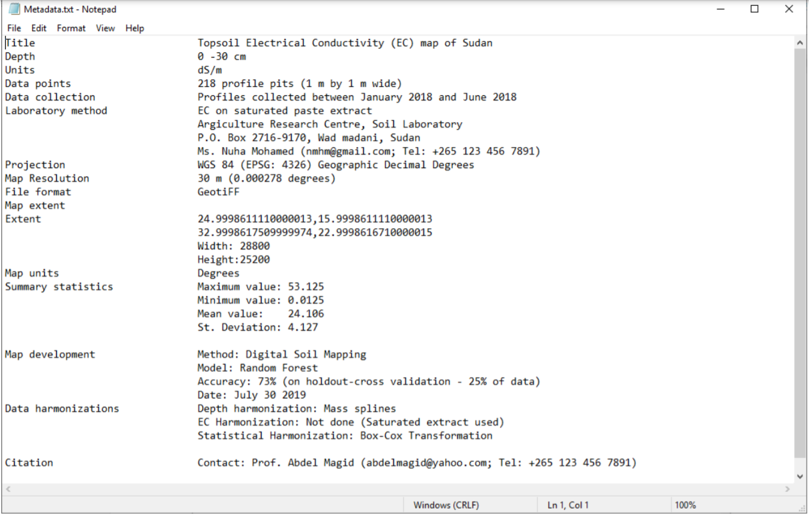


##	Information sharing  
Planning information sharing is important in order to deliver useful and impact-oriented information. The following three aspects need consideration when planning information share for salt-affected soils (Figure 6.4):

*   Identification of the key issues driving information sharing;
*   Technical specification to harmonize information from different areas/sources;
*   Identification of the platform for information sharing.


The types of target audience influence the type of information format, characteristics, and information content to be shared. For example, researcher and modellers at the regional level may require coarse resolution GIS files while extension officers at farmer-fields may require paper/digital images at high resolution. The design for information sharing to target these two examples are significantly different. The type of audience also influence the type of media to employ as the vehicle for information sharing (Figure 6.4). These are some of the key issues for consideration when designing information sharing system. The GSP-FAO has proposed geoTiff raster files at 1 km spatial resolution for maps of soil indicators (EC, pH, and ESP) and maps of salt-affected soils for information sharing between countries and users at the regional and global levels (Table 6.1). However, each country may use own recommendations for planning systems for sharing information of salt-affected soils.
Technical specification is concerned with the characteristics of the map products and information content to be shared. The characteristics define the features of the information products that users will look for when searching for the information. They include map data (EC, pH, ESP, salt-affected soils, etc.), the vertical and horizontal resolution of the maps, data age, information access/use rights, and file formats for access. Technical specifications are particularly important in guiding information development since the features that they define should be included during map development. Table 6.1 is an example of specifications of the three products proposed by the GSP-FAO for updating national and global information of salt-affected soils. These specifications are also contained in the country guidelines for developing national information of salt-affected soils (FAO, 2020).

*Table 6.1: Summary checklist for developing and sharing country-level maps of salt-affected soils*


Copyright issues are important when it comes to information sharing. Many countries hold primary information such as measured soil profile data on EC, pH, ESP, etc. under copyright but may be willing to share secondary information under general public license (GPL). The secondary information includes maps developed from primary data, technical reports, and scientific publications. Other countries have strict copyright on all soil information. There are also other countries with GPL on all soil information. Publicly shared information needs to be under GPL.

Platform for information dissemination is the ultimate consideration for information sharing. Its choice is influenced by many factors including target audience, advances in technology and software development, information security, and magnitude of available data. Alternatives for platform for information sharing are physical and digital libraries (portals), online sever (geoserver), social/news media, dedicated website (soil information system), accessible online storage (google driver), etc. Since many countries are now developing national soil information systems (http://www.fao.org/global-soil-partnership/pillars- action/4-information-data/glosis/inventory-countrysis/en/), they can use the soil information service platforms as suitable alternatives for sharing their soil information on salt-affected soils. GSP-FAO has dedicated file transfer protocol (FTP) for sharing national information and a geoserver for globally contributed information on salt-affected soils.

##	Resource mobilization  
###	Resource mobilization strategy  
####	Needs assessment  
Building and updating information on salt-affected soils require resources. Associated activities such as data generation and/or collection, data analysis, developing information sharing protocol, and information update and monitoring are some of the core components that are resource intensive. Proper planning for resources mobilization is necessary for successful development and maintenance of information on salt- affected soils.
As already outlined in Section 1, salt-affected soils are very important in the global resource management and utilization. They occupy more than 1 billion hectares globally and are predominant in arid and semi- arid climate zones. This significant areal proportion can positively contribute to the global economy if economically utilized in a sustainable way (Wicke et al., 2011). Salt-affected soils are also home to many forms of biodiversity (Wu et al., 2015). Their proportion of the global land area can be resourceful for implementing carbon sequestration activities. They also support global food production through biosaline agriculture activities (Abdelly et al., 2008; Dajic-Stevanovic et al., 2008; Nikalje et al., 2018; https://www.biosaline.org/). These positive aspects reinforce the need for proper information on the status and extent of salt-affected soils. Besides the positive aspects of salt-affected soils, they are not truly desirable in agriculture areas. They have overall negative impacts in crop productivity. A lot of efforts are in progress globally to manage, reduce or prevent, and reclaim salt-affected soils in agriculture areas.
Resource mobilization for developing and periodically updating soil information of salt problems is important for sustainable management of salt-affected soils. According to (FAO, 2012) an initial step towards planning resources mobilization is the needs assessment. Needs assessment considers the core areas where resources mobilization is critical. It is also a process for justifying investment in developing information on salt problems in the soil (Figure 7.1). The following resource-intensive areas can be used as guidelines for planning resources mobilization needs assessment:

*   Soil survey and laboratory analysis for estimation of soil indicators of salt problems;
*   Acquisition of equipment and high-resolution spatial predictors of salt-affected soils;
*   Technical capacity development for building spatial information products/
*   Developing infrastructure for spatial information sharing (system);
*   Establishment and implementation of periodic monitoring systems.

Assessment of resource mobilization needs should establish the significance for developing or updating soil information on salt-affected soils. Alignment with government development priorities, regional and global initiatives, and stakeholder synergies are some of the areas that should be targeted during evaluation of resource mobilization needs assessment. They help to identify opportunities for buy-in by these important stakeholders.
Resource mobilization needs assessment can be done through surveys such as interview, discussions, and literature review (FAO, 2012). Its output feeds into the development of strategy for resource mobilization (Figure 7.1).


####	Identification of sources
Identification of sources of resources is a priority focus in resource mobilization. It entails assessing the characteristics of different types and number of sources. It also incorporates mapping out the timing and duration of resource availability for the identified sources. This is especially important where multiple sources are targeted. A proper identification of sources of resources improves efficiency when selecting the appropriate resource mobilization vehicle(s) (tools).
Internal and external sources are the two major categories of sources for resource (FAO, 2012). Internal sources include available human and capital resources such as technical capacity, equipment, institutional (environment) framework, income generating activities, partnerships (public-private or communal-private partnerships), internal government budgetary allocations, and voluntary contributions from local foundations or individuals. Available soil database and network between technical experts on salt-affected soils and network between institution holding soil data are also important resources. Internal sources are critical during soil survey and when implementing sustainable long-term monitoring of salt problems in the soil. The institutional environment also affects data sharing, income generating activities to support monitoring framework, and potential engagement with/acquisition of resources from external sources of resources. External sources include international/regional development partners, potential collaboration (even research) activities with regional or international bodies/institutions on specific areas, among others. Some international/regional organization have rich technical cooperation programs (TCPs), which can provide substantial support in many of the key areas in soil and environmental information development.


####	Resource mobilization plan
Resource mobilization plan is the practical roadmap for mobilizing resources to implement the development and periodic update of spatial information on salt-affected soils. It entails the development of plans for communication, implementation of resource mobilization activities, and progress monitoring and evaluation. The resource mobilization plan outlines the vehicle (tools) to use for resource mobilizing and the timeline for their implementation. Examples of tools often used for sourcing funds are concept notes and proposals while memoranda are often used for mobilizing in-kind contributions, equipment, and network of expertise (FAO, 2012; Kipchumba et al., 2013). A suitable mobilization plan should have


multiple strategies using different tools (vehicles) to target many sources of resources. This is particularly appropriate for salt-affected soils where field survey, laboratory analysis, and online hosting of soil information service are heavy one-time initial investment. This kind of investment is mostly tackled with multiple sources of resources.
Different organization have different requirements and format for the tools for resource mobilization (also known as vehicle for resource mobilization). It is important that these requirements are clearly adhered to when preparing communication strategy. Since these tools presents the mobilization idea and needs to the donor, it's important that they are given adequate attention during their preparation. Important areas of focus when preparing the tools are:
a)	target resource-intensive area for the development/update of information on salt-affected soils
b)	Indicative/actual cost for implementing the identified target area in (a) above
c)	justification for resource mobilization
d)	schedule of activities

Table 7.1 gives a summary of the five steps for developing and implementing resource mobilization plan. The sequential steps begin with the identification of target area(s) requiring resource mobilizations and corresponding potential sources of resources. Subsequent steps are guided by the first step; implying that the first step determines the success/failure of the mobilization plan (FAO, 2012).

*Table 7.1: Steps for planning resource mobilization for updated information on salt-affected soils*


##	Technical capacity development program for spatial information development  
###	Program overview  
Capacity building program in digital mapping of salt-affected soils is designed to help countries or GSP partners to gain technical knowledge and skills for developing maps of salt-affected soils and be able to periodically monitor salt problems in their countries. In the spirit of country-driven approaches and global soil information system, the need for harmonized national capacities and products cannot be over- emphasized. It is envisaged that national capacity building and harmonized information on salt-affected soils will give uniform message for raising national, regional, and global awareness on the need for sustainable management and economic use of these soils.
There are many methods and approaches in the literature as well as indicators for assessing salt-affected soils. This capacity development program focuses on supporting harmonization of protocols, uniform reporting, and technical empowerment of national officers to provide reliable information on national status of salt-affected soils. It uses digital soil mapping concepts, statistical computing, and GIS tools to produce spatial information of soil salinity.
This program targets national focal persons tasked with mapping salt-affected soils in their countries. The program is also suited to practitioners who are keen on information generation and management of salt- affected soils. People interested in digital soil mapping and monitoring of salt problems may find the program suitable for enhancing their spatial modelling skills.


###	Duration and requirements  
This program is designed to take two weeks of data collection and 64 contact hours between participants and instructors for spatial information development. Participants are required to have own datasets during the training.
Successful implementation of the program requires the following:

1)    Expertise
+   Basic soil science and understanding of salt-affected soils.
+   GIS and computing knowledge.
+   Adequate understanding of soil salt problems in the country of focus
+   Basic understanding of indicators of soil salts and laboratory methods of analysis.
2)    Computer and software
+   Computer with minimum of core i3 processor, 8GB RAM, and enough storage capacity.
+   Installed latest versions of QGIS, ILWIS, R, and RStudio software.
+   The following installed plugins and packages:
    -       QGIS - Semi Automatic Classification, Profile Tool;
    -       R  Rstudio; raster,caret,rgdal,sp,soiltexture,soilassessment,randomforest,gstat, arm, automap, e1071,GSIF,Hmisc,corrplot,factoextra,spup,purr,ncf,aqp,car,plyr, kernlab
+   	Spreadsheet program (such as Excel and Access).
3)    Resources
+   Internet connectivity;
+   Technical manual on mapping salt-affected soils;
+   Country data for mapping soil salinity (Table 4.1).

###	Objectives and outcomes
Program goal: The overall goal of this program is to enhance technical capacities of countries to produce consistent, reliable, and comparable spatial information on salt-affected soils.
Program outcomes: At the end of the program, participants are expected to:

1.    Produce updated database for mapping salt-affected soils in their countries.
2.    Establish baseline for monitoring salt-affected soils in theory countries.
3.    Produce national maps of status of salt-affected soils in their countries.
4.    Contribute to global mapping of salt-affected soils.

Learning objectives: The program is designed to:

1.    Enable participant to assemble and organize relevant data for mapping salt-affected soils;
2.    Expose participants to cutting-edge digital soil mapping methodologies;
3.    Enhance technical capacities of participants in developing spatial information of salt-affected soils;
4.    Enable participants quantify accuracy and uncertainties of maps of salt-affected soils;
5.    Improve participants' skills and awareness in documentation and soil information sharing.

### Schedule
*Table 7.3: generic training outline*


###	Mode of delivery  
The program is designed for physical/online lectures, hands-on demonstrations, and reflection quizzes.

1)    Lectures
Items 1 and 2 are parts of introductory lecture designed to expose the participants to the basics of salt- affected soils, classification, and input data requirements for mapping. PowerPoint presentations, class- discussions, and consultation with resource materials should be adequate for knowledge transfer. The quizzes give feedback on the understanding of the lectures
2)    Demonstrations with worked examples
Part 2 of the program is focused on exposure of the participants to the mapping tools. Demonstrations using case-study dataset is emphasized to help the participants understand the procedural steps for mapping salt-affected soils and familiarity with the mapping tools.
3)    Hands-on practical exercise with own data
Part 3 of the program is dedicated to working with own datasets. The participants will apply the skills in Part 1 on their own datasets. They may work independently on their country dataset.  

###	Deliverables  
The following deliverables are anticipated at the end of the training program:

i.    Updated and harmonized national database of salt-affected soils;
ii.   Spatial national information (map with documentation) on salt-affected soils;
iii.    National maps of salt indicators (ECSE, pH, ESP) for 0-30 and 30-100 cm soil depths submitted to the GSP as contribution to global mapping of salt-affected soils;
iv.   National maps of uncertainties for mapping salt-affected soils.


<!--chapter:end:03.INFORMATION_SHARING_AND_RESOURCES_MOBILIZATION.rmd-->

# References{-}

**Abdelly C., Ozturk M., Ashraf M., Grignon C.** 2008. *Biosaline agriculture and high salinity tolerance.* Verlag AG. Berlin

**Abd-Elwahid M.**, 2018. *Influence of long-term wastewater irrigation on soil quality and its spatial distribution*. Annals of Agricultural Sciences, 63:191-199.

**Abou-Baker N., El-Dardiry E**. 2015. *Integrated management of salt-affected soils in agriculture: Incorporation of soil salinity control methods*. Elsevier Academic Press, Amsterdam.

**Abrol I.P., Yadav J.S.P, Massoud F.I.** 1988. *Salt-affected soils and their management*. FAO Soils Bulletin 39. FAO, Rome.

**Abuelgasim A, Ammad R**. 2019. *Mapping soil salinity in arid and semi-arid regions using Landsat 8 OLI satellite data*. Remote Sensing Applications: Society and Environment, 13: 415-425.

**Amrhein C**. 1996. *Australian sodic soils: Distribution, properties, and management*. Soil Science 161. pp412.

**Bivand R., Keitt T, Rowlingson B., Pebesma E**. 2019. rgdal: *Bindings for the 'Geospatial' Data Abstraction Library*. https://cran.r-project.org/web/packages/rgdal/index.html

**Bivand R., Keitt T., Rowlingson B., Pebesma E.** 2019. rgdal: *Bindings for the 'Geospatial' Data Abstraction Library*. https://cran.r-project.org/web/packages/rgdal/index.html

**Bouchhima R.A., Sarti M., Ciolfi M., Lauteri M., Ksibi M**., 2008. *Decision tree for mapping of halophyte cover around Ghannouch, Tunisia*. Environmental Monitoring and Assessment, 190: 742.

**Box, G. E. P. and Cox, D. R.** (1964). *An analysis of transformations, Journal of the Royal Statistical Society*, Series B, 26, 211-252.

**Buckley A**. 2012. *Make maps people want to look at: Five primary design principles for cartography*. Winter 2012. https://www.esri.com/news/arcuser/0112/files/design-principles.pdf

**Cherlet M., Hutchinson C., Reynolds J., Hill J., Sommer S., von Maltitz G.** 2018. *World Atlas of Desertification*. Publication Office of the European Union, Luxembourg. (https://www.esri.com/news/arcuser/0112/files/design-principles.pdf)*doi:10.2760/9205.

**Chi C.M., Wang Z.C**. 2010. *Characterizing salt-affected soils of Songnen plain using saturated paste and 1:5 soil-to-water extraction methods*. Arid Land Res. Mgmt. 24:1-11. doi:10.1080/15324980903439362

**Chinese Academy of Sciences**. 2001. Chinese soil taxonomy. Coordinated by Institute of Soil Science, Chinese Academy of Sciences, p 203.

**Choudhary O.P., Kharche V.K.** 1993. *Soil salinity and sodicity. In Soil Science*: An Introduction. Eds. Leeper GW and Uren NC. Chapter 10. pp 354-385. Melbourne University Publishing.

**Corwin DL, Lesch SM.** 2005. *Apparent soil electrical conductivity measurements in agriculture. Computers and Electronics in Agriculture*, 46(1-3 Spec Iss.): 11-43.

**Craig D.A., Hempel J. 2017**. *Soil taxonomy and soil classification*. International Encyclopedia Of Geography: People,	the	Earth,	Environment	and	Technology,	1-15, https://doi.org/10.1002/9781118786352.wbieg0347

**Dajic-Stevanovic Z., Pecinar I., Kresovic M., Vrbnicanin S., Tomovic L**. 2008. *Biodiversity, utilization and management of grasslands of salt affected soils in Serbia*. Community Ecology, 9: 107-114

**Daliakopoulus I.N., Tsanis I.T., Koutroulis A., Kourgialas N.N., Varouchakis A.E., Karatzas G.P.,** 

**Ritsema C.J**. 2016. *Threat of salinity: A European scale review*. Science of the Total Environment,573(15): 727-739.

**Dalton F.N., Van Genuchten M T.** 1986. *The time-domain reflectometry method for measuring soil water content and salinity*. Geoderma, 38(1-4): 237-250.

**Efron, B.** 1992. *Jackknife-after-bootstrap standard errors and influence functions*. Journal of the Royal Statistical Society. Series B (Methodological), 83-127.

**Fanning D.S., Fanning M.C.B.,** 1989. *Soil, Morphology, Genesis, and Classification*. John Wiley & Sons, New York.

**FAO and ITPS**. 2018. *Global Soil Organic Carbon Map (GSOCmap) Technical Report*. Rome. 162 pp.

**FAO, IIASA, ISRIC, ISS-CSA and JRC**. 2008. *Harmonized World Soil Database (version 1.0),* FAO, Rome, Italy and IIASA, Laxenburg, Austria.

**FAO.** 1984. *Prognosis of salinity and alkalinity*. FAO, Rome.

**FAO**. 2006. *Guidelines for soil description*. FAO, Rome

**FAO**. 2012. *A Guide to resource mobilization: promoting partnership with FAO*. FAO. Rome

**FAO**. 2020. *Country guidelines and specifications for mapping salt-affected soils*. Rome

**FAO-ITPS-GSP**. 2015. *Status of the world's soil resources*. FAO-ITPS-GSP Main Report, FAO, Rome, Italy, pp 125-127.

**Farifteh J., van de Meer F., van der Maijde M., Atzberger C.,** 2008. *Spectral characteristics of salt-affected soils: A laboratory experiment*. Geoderma, 145: 196-206.

**Farzamian M., Paz M.A., Paz A.M., Castanheira N.L., Goncalves M.C., Santos F.A.M., Triantafilis J**. 2019. *Mapping soil salinity using electromagnetic conductivity imaging-A comparison of regional and location- specific calibrations*. Land Degradation and Development, 30(12): 1393-1406.

**Fox J., Wesberg S., Price B**. 2020. car: Companion to Applied Regression. https://cran.r- project.org/web/packages/car/index.html

**Gorji T, Yildirim A., Sertel E, Tanik A**.(https://cran.r-project.org/web/packages/car/index.html) 2019. *Remote sensing approaches and mapping methods for monitoring soil salinity under different climate regimes*. International Journal of Environment and Geoinformatics 6(1): 33-49 (2019).

**GSP-FAO.** 2018. *Report of the Sixth Meeting of the Plenary Assembly of the Global Soil Partnership*. GSPPA- VI/18/Report. http://www.fao.org/3/CA0389EN/ca0389en.pdf

**Gupta H.V., Kling H.** 2011. *On typical range, sensitivity, and normalization of mean squared error and Nash Sutcliffe efficiency type metrics*. Water Resources Research, 47: W10601


**Hengl	T.**	2019.	GSIF:	*Global	Soil	Information	Facilities*.	https://cran.r- project.org/web/packages/GSIF/index.html

**Hijman R.J.** 2020. *raster: Geographic Data Analysis and Modeling.* https://cran.r- project.org/web/packages/raster/index.html

**Hogg T.T.J., Henry J.L**. 1984. *Comparison of 1:1 and 1:2 suspensions and extracts with the saturation extracts in estimating salinity in Saskatchewan*(https://cran.r-project.org/web/packages/raster/index.html)*. Can. J. Soil Sci. 1984, 64, 699-704.

**Holst E, Thyregod P.** 1999. *A statistical test for the mean squared error*. Journal of Statistical Computation and Simulation, 63(4): 321-347

**Horneck, D.S., Ellsworth, J.W., Hopkins, B.G., Sullivan, D.M., Stevens, R.G.** 2007. *Managing Salt-Affected Soils for Crop Production*. PNW 601-E. Oregon State University, University of Idaho, Washington State University.

**IUSS Working Group WRB**. 2015. *World Reference Base for Soil Resources 2014, update 2015 International soil classification system for naming soils and creating legends for soil maps*. World Soil Resources Reports No. 106. FAO, Rome.

**Ivuskin K., Bartholomeus H., Bregt A.K., Pulatov A., Kempen B., de Sousa L.** 2019. *Global mapping of soil salinity change*. Remote Sensing of Environment, 231: 111260

**Jafari A., Finke P.A., Wauw J.V., Ayoubi S., Khademi H.** 2012. *Spatial prediction of USDA - great soil groups in the arid Zarand region, Iran: comparing logistic regression approaches to predict diagnostic horizons and soil types*. European Journal of Soil Science, 63(2): 284-298. https:// doi.org/10.1111/j.1365-2389.2012.01425.x

**Jalali M., Merikhpour Kaledhonkar M.J., van der Zee SEATM**. Agriculture Water Management, 95(2): 143-153.

**Kargas G., Chatzigiakoumis I., Kollias A., Spiliotis D., Massas I., Kerkides P**. 2018. *Soil salinity assessment using saturated paste and mass soil:water 1:1 and 1:5 ratios extracts*. Water, 10:1589, doi:10.3390/w10111589

**Karla N.K., Joshi D.C.,** 1994. *Spectral reflectance characteristics of salt-affected arid soils of Rajasthan*. Journal of the Indian Society of Remote Sensing, 22(3): 183-193.

**Kelly W.P., Brown (https://doi.org/10.1111/j.1365-2389.2012.01425.x)**S.M,**. 1934. *Principles governing the reclamation of alkali soils*. Hilgardia, 8(5): 149-177.

**Khitrov B.N., Rukhovivh D.I., Kalinina N.V., Novikova A.F., Pankova EI, Chernousenko G.I**. 2009. *Estimation of the Areas of Salt-Affected Soils in the European Part of Russia on the Basis of a Digital Map of Soil Salinization on a Scale of 1: 2.5 M.* Eurasian Soil Science, 42(6): 581-590.


**Kipchumba S.K, Zhimin L., Chelagat R.** 2015. *A study on the sources of resources and capacity building in resource mobilization: case of private chartered universities in Nakuru Town*, Kenya. Journal of International Education and Leadership, 3(2): 1-18

**Krasilnikov P., Gutierrez-Castorena M.C., Ahrens RJ, Cruz-Gaistardo C.O., Sedov S., Solleiro-Robelledo E**., 2013. *The soils of Mexico*. Springer, London.

**Kuhn M**. 2020. caret: *Classification and Regression Training*. https://cran.r- project.org/web/packages/caret/index.html

**Landon J.R. 1984**. *Booker Tropical Manual. Longman Inc*., New York, pp. 157-163.

**Lesch S.M., Rhoades J.D., Lund L.J., Corwin D.L.** 1992. *Mapping soil salinity using calibrated electromagnetic measurements*. Soil Science Society of America Journal, 56: 540-548.

**Li J., Pu L., Zhu M., Zhang J., Li P., Dai X., Xu Y., Liu L.** 2014. *Evolution of soil properties following reclamation in coastal areas: A review*. Geoderma, 226-227: 130-139.

**Li Z., Zhu Q., Gold C.** 2005. *Digital Terrain Modeling: Principles and methodology*, CRC Press: Boca Raton, FL, 323pp

**Mandal A.K., Reddy G.P. O, Ravisankar T**. 2011. *Digital database of salt affected soils in India using Geographic Information System*. Journal of Soil Salinity and Water Quality, 3, 16-29

**Massoud, F.I**. 1976. *Basic principles for prognosis and monitoring of salinity and sodicity. In: Proc. International Conference on Managing Saline Water for Irrigation*. Texas Tech. University, Lubbock, Texas. 16-20 August 1976. pp. 432-454.

**Matternicht G.I., Zinc J.A..** 2003. *Remote sensing of soil salinity: potentials and constraints.* Remote Sensing of Environment, 85:1-20

**McBratney A.B., Mendon\c{c}a-Santos M.L**, Minasny B. 2003. *On digital soil mapping*. *Geoderma* 117: 3-52

**Miller J.J., Brierley J.A.** 2011. *Solonetzic soils of Canada: genesis, distribution, and classification*. Canadian Journal of Soil Science, 91:889-902.

**Miller J.J., Pawluk S**. 1994. *Genesis of solonetzic soils as a function of topography and seasonal dynamics*. Canadian Journal of Soil Science, 74: 207-217.

**Munn L.C., Boehm M.M.** 1983. *Soil genesis in a Natrargrid-Haplargid complex in Northern Montana*. Soil Science Society of America Journal, 47(6): 1186-1192.

**Muyen Z., Moore G.A., Wrigley R.J.** 2011. *Soil salinity and sodicity effects of wastewater irrigation in southeast Australia*. Agriculture Water Management, 99:33-41.

**Nikalje C.G., Srivastava A.K., Pandey K.D., Suprasanna P.** 2018. *Halophytes in biosaline agriculture: mechanism, utilization, and value addition*. Land Degradation and Development, 29(4): 1081-1095

**Omuto, C.T**. 2020. S*oil assessment: Assessment Models for Agriculture Soil Conditions and Crop Suitability*. https://cran.r-project.org/web/packages/soilassessment/index.html


**Ozcan H., Ekinci H., Yigini Y., Yuksel O**., 2006. *Comparison of four soil salinity extraction methods. Proceedings of 18th International Soil Meeting on "Soil Sustaining Life on Earth, Managing Soil and Technology*", May 22-26, 2006, Sanliurfa, Turkey, p. 697-703.

**Pankova EI, Konyushkova M.V.** 2013. *Climate and soil salinity in the deserts of Central Asia*. Eurasian Soil Science, 46(7): 721-727.

**Pankova EI.** 2015. *Salt-affected soils of Russia: Solved and unsolved problems*. Eurasian Soil Science, 48:115-127.

**Pebesma E., Bivand R.** 2020. sp: *Classes and Methods for Spatial Data*. https://cran.r- project.org/web/packages/sp/index.html

**Perri S., Suweis S., Entekhabi B., Molini A.** 2018. *Vegetation controls on dryland salinity*. Geophysical Research Letters, 45(21): 11,669-11,682.

**Piotr H.** 2008. *Quantitative and qualitative differentiation of soil salinity in Poland*. Berichte der Deutschen Bodenkundlichen Gesellschaft. 1-4.

**Pulido-Bosch A., Rigol-Sanchez J.P., Vallejos (https://doi.org/10.1007/s12665-018-7386-6) **A., Andreu J.M., Ceron J.C., Molina-Sanchez L., Sola F.** 2018. *Impacts of agricultural irrigation on groundwater salinity*. Environmental Earth Sciences volume, 77, 197. https://doi.org/10.1007/s12665-018-7386-6

**Rangesamy P., Marchuk A.** 2011. *Cation ratio of soil structural stability (CROSS)*. Soil Research, 49: 280-285.

**Richards L.A.** 1954. *Diagnosis and improvements of saline and alkali soils*. Agriculture Handbook No. 60. USDA, Washington.

**Rietz D.N., Haynes R.J.** 2003. *Effects of irrigation-induced salinity and sodicity on soil microbial activity*. Soil Biology and Biochemistry, 35: 845-854.

**RStudio Team**. 2015. RStudio: *Integrated Development for R. RStudio*, Inc., Boston, MA  http://www.rstudio.com/

**Sawicka K., Heuvelink G.B.M., Walvoort D.J.J.** 2018. *Spatial uncertainty propagation analysis with the spup R package*. The R Journal 10(2): 180-199

**Schaetzl, R.J., Anderson, S.,** 2005. *Soils, Genesis and Geomorphology*. Cambridge University Press, Cambridge.

**Schirrman M., Gebbers B., Kramer E., Seidel J. 2011.** *Soil mapping with an on-the-go sensor. Sensors*, 1(1): 573-598. https://doi.org/10.3390/s110100573

**Schofield R., Thomas D.S.G, Kirkby M.J.** 2001. *Causal processes of soil salinization Tunisia Spain and Hungary*. Land Degradation and Development, 12(2): 163-181.

**Scudiero E., Corwin L.D., Ray A., Yemoto .K, Clary W., Wang Z., Skaggs T.** 2017. *Remote sensing is a viable tool for mapping soil salinity in agricultural lands.* California Agriculture. 71. 10.3733/ca.2017a0009

**Sheikholeslami R., Razavi S**. 2017. *Progressive Latin hypercube sampling: An efficient approach for robust sampling-based analysis of environmental models*. Environmental Modelling and Software, 93: 109-126


**Sheng J., Ma L., Jiang P., Li B., Huang F., Wu H.** 2010. *Digital soil mapping to enable classification of the salt-affected soils in desert agro-ecological zones. Agriculture Water Management*, 97(12): 1944-1951.

**Skarie R.L., Arndt JL, Richardson JL.** 1987. *Sulfate and gypsum determination in saline soils*. European Soil Science Society of America Journal, 51:901-905.

**Soil Survey Staff**. 1999. *Soil Taxonomy: A basic system of soil classification for making and interpreting soil surveys*. USDA Agriculture Handbook 436. Natural Resource Conservation Service. Washington DC.

**Sonmez S., Buyuktas D., Asri F.O..** 2008. *Assessment of different soil to water ratios (1:1, 1:2.5, 1:5) in soil salinity studies*. Geoderma, 144: 361-369

**Sparks D.L.** 2003. *Environmental Soil Chemistry*. Academic Press.

**Squires, V.R., Glenn E.P.** 2004. *Salination, desertification, and soil erosion. In: Squires, V.R. (Ed.),* The Role of Food, Agriculture, Forestry and Fisheries in Human Nutrition. UNESCO, EOLSS Publishers, Oxford, UK.

**Sumner M.E., Naidu R**. 1998. *Sodic Soils Distribution, Properties, Management, and Environmental Consequences*. Oxford University Press, New York.

**Szabolcs I.** 1979. *Review of research on salt-affected soils*. UNESCO, France.

**Szabolcs I.** 1987. The global problems of salt-affected soils. Acta Agronomica Hungarica, 36:159-172.

**Taghizadeh-Mehrjardi R., Minasny B., Toomanian N., Zeraatpisheh M., Amirian-Chakan A., Triantafilis J.** 2019. *Digital mapping of soil classes using ensemble of models in Isfahan Region,* Iran. Soil Systems, 3, 37. doi:10.3390/soilsystems3020037

**Toth G., Adhikari K., Varallyay G., Toth T., Bodis K., Stolbovoy V**. 2008. *Updated map of salt affected soils in the European Union. In.* Toth *et al.* (Eds). Threats to soil quality in Europe. EUR 23438. Scientific and Technical Research series Luxembourg: Office for Official Publications of the European Communities p.61-74. JRC

**Triantafilis J., Odeh I.O.A., McBratney A.B..** 2001. *Five geostatistical models to predict soil salinity from electromagnetic induction data across irrigated cotton*. Soil Society of America Journal, 65:869-878.

**USDA-NRCS**, 1999. *The mechanics of soil survey*. Lincoln Nebraska.

**Weibel R., Heller M**. 1991. *Digital terrain modelling. In: Maguire, D. J.; Goodchild, M. F.; Rhind, D. W., ed. Geographic Information Systems - Vol. 1: Principles*. Harlow Longman

**Wicke B., Smeets E., Dornburg V., Vashev B., Gaiser T., Turkenburg W., Faaij A**. 2011. *The global technical and economic potential of bioenergy from salt-affected soils*. Energy and Environmental Science 4, 2669-2681.

**Wilson J.P., Gallant J.C.** 2000. *Digital terrain analysis. In: Wilson JP, Gallant JC, editors. Terrain Analysis: Principles and Applications. John Wiley & Sons*, Inc.; 2000. pp. 1-28

**Yang X, Frey MK, Ghodes R.H., Norris S.J., Brooks I.M., Anderson S.P., Nishimura K., Jones A.E.,** 

**Wolff W.E.** 2019. *Sea salt aerosol production via sublimating wind-blown saline snow particles over sea-ice: parameterizations and relevant micro-physical mechanisms*. Atmospheric Chemistry and Physics, 19: 8407- 8424.

**Yu-Peng W., Zhang Y., Ye-Meng B., Zhen-Jun S.**. 2015. *Biodiversity in saline and non-saline soils along the Bohai Sea Coast, China*. Pedoshere, 25(2): 307-315.

**Zaman M, Shahid SA, Heng L.** 2018. *Guidelines for Soil Salinity Assessment, Mitigation and Adaptation Using Nuclear and Related Techniques*. International Atomic Energy Agency-Springer, Vienna.

**Zhang H., Schroder J.L., Pittman J.J., Wang J.J., Payton M.E.** 2005. *Soil salinity using saturated paste and 1:1 soil to water extract*. Soil Sci. Soc. Am. J. 69:1146-1151.

**Zurqani H., Mikhailova E., Post C., Schlautman M., Sharp J**. 2018. *Predicting the classes and distribution of salt-affected soils in Northwest Libya*. Communications in Soil Science and Plant Analysis, 49(6): 689- 700, DOI: 10.1080/00103624.2018.1432637


<!--chapter:end:04.References.rmd-->

# Glossary{-}

**Absorption**: Uptake of matter or energy by a substance Acid soil: Soil with a pH value less than 7.0.

**Acidification**: Process whereby soil becomes acid (pH < 7) because acid parent material is present or in regions with high rainfall, where soil leaching occurs. Acidification can be accelerated by human activities (use of fertilizers, deposition of industrial and vehicular pollutants).

**Adsorption**: Process by which atoms, molecules or ions are retained on the surfaces of solids by chemical or physical bonding.

**Alkali (sodic) soil**: A soil having so high a degree of alkalinity (pH 8.5 or higher) or so high a percentage of exchangeable sodium (15 percent or more of the total exchangeable bases), or both, that plant growth is restricted

**Anion**: Particle with a negative charge. Her anion exchange capacity is sum of exchangeable anions that a soil can adsorb. Usually expressed as centimoles, or millimoles, of charge per kilogram of soil (or of other adsorbing material such as clay).

**Base saturation**: The degree to which material having cation-exchange properties is saturated with exchangeable bases (sum of Ca, Mg, Na, and K), expressed as a percentage of the total cation-exchange capacity.

**Calcareous soil**: A soil containing enough calcium carbonate (commonly combined with magnesium carbonate) to effervesce visibly when treated with cold, dilute hydrochloric acid.

**Calcification**: Process whereby the soil is kept sufficiently supplied with calcium to saturate the soil cation exchange sites.

**Cation exchange capacity**: The total amount of exchangeable cations that can be held by the soil, expressed in terms of mill equivalents per 100 grams of soil at neutrality (pH 7.0) or at some other stated pH value. The term, as applied to soils, is synonymous with base-exchange capacity but is more precise in meaning.

**Decalcification**: Removal of calcium carbonate or calcium ions from the soil by leaching.

**Electrical conductivity (EC)**: Conduction of electricity through water or a solution of soil commonly used to estimate the soluble salt content in solution, e.g. soil solution

**Hydromorphic soils**: Formed under conditions of poor drainage in marshes, swamps, seepage areas or flats.

**Ion**: Electrically charged atom or group of atoms.

**Irrigation**: Application of water to soils to assist in production of crops. Methods of irrigation are:

*   Basin: Water is applied rapidly to nearly level plains surrounded by levees or dikes.
*   Border: Water is applied at the upper end of a strip in which the lateral flow of water is controlled by small earth ridges called border dikes, or borders.
*   Controlled flooding: Water is released at intervals from closely spaced field ditches and distributed uniformly over the field.
*   Corrugation: Water is applied to small, closely spaced furrows or ditches in fields of close-growing crops or in orchards so that it flows in only one direction.
*   Drip (or trickle): Water is applied slowly and under low pressure to the surface of the soil or into the soil through such applicators as emitters, porous tubing, or perforated pipe.
*   Furrow: Water is applied in small ditches made by cultivation implements. Furrows are used for tree and row crops.
*   Sprinkler: Water is sprayed over the soil surface through pipes or nozzles from a pressure system.
*   Subirrigation: Water is applied in open ditches or tile lines until the water table is raised enough to wet the soil.
*   Wild flooding: Water, released at high points, is allowed to flow onto an area without controlled distribution.

**Natric horizon**: A special kind of argillic horizon that contains enough exchangeable sodium to have an adverse effect on the physical condition of the subsoil. Neutral soil A soil having a pH value of 6.6 to 7.3. (See Reaction, soil.)

**pH value**: A numerical designation of acidity and alkalinity in soil. (See Reaction, soil).

**Profile soil**: A vertical section of the soil extending through all its horizons and into the parent material.

**Reaction soil**: A measure of acidity or alkalinity of a soil, expressed as pH values. A soil that tests to pH 7.0 is described as precisely neutral in reaction because it is neither acid nor alkaline. The degrees of acidity or alkalinity, expressed as pH values, are:

*   Ultra acid: Less than 3.5.
*   Extremely acid: 3.5 to 4.4.
*   Very strongly acid: 4.5 to 5.0.
*   Strongly acid: 5.1 to 5.5.
*   Moderately acid: 5.6 to 6.0.
*   Slightly acid: 6.1 to 6.5.
*   Neutral: 6.6 to 7.3
*   Slightly alkaline: 7.4 to 7.8.
*   Moderately alkaline: 7.9 to 8.4.
*   Strongly alkaline: 8.5 to 9.0.
*   Very strongly alkaline: 9.1 and high.

**Saline soil**: A non-sodic soil (see sodic soil) containing sufficient soluble salt to adversely affect the growth of most crop plants. The lower limit of electrical conductivity in the saturation extract of such soils is conventionally set at 4 dS m-1(at 25$^\circ$C), though sensitive plants are affected at about half this salinity and highly tolerant ones at about twice this salinity. Salt-affected soils with a high exchangeable sodium percentage (ESP) greater than 15%, pH usually less than 8.5; in general, these soils are not suitable for agriculture.

It's a soil that containing soluble salts in an amount that impairs growth of plants. A saline soil does not contain excess exchangeable sodium.

**Salt-affected soil**: Soil that has been adversely affected by the presence of soluble salts, with or without high amounts of exchangeable sodium. See also saline soil, saline-sodic soil, and sodic soil.
 


**Sodic soil**: Soil with excess of sodium, pH is higher than 7, usually in the range 8-10, exchangeable sodium percentage, ESP> 15 and very poor soil structure. These soils need special management and are not used for agriculture; non-sodic soils are without excess of sodium.

**Sodic (alkali) soil**: A soil having so high a degree of alkalinity (pH 8.5 or higher) or so high a percentage of exchangeable sodium (15 percent or more of the total exchangeable bases), or both, that plant growth is restricted.

**Sodicity**: The degree to which a soil is affected by exchangeable sodium. Sodicity is expressed as a sodium adsorption ratio (SAR) of a saturation extract, or the ratio of Na+ to Ca++ + Mg++. The degrees of sodicity and their respective ratios are:

*   Slight: Less than 13:1.
*   Moderate: 13-30:1.
*   Strong: More than 30:1.

**Sodium adsorption ratio (SAR)**: A measure of the amount of sodium (Na) relative to calcium (Ca) and magnesium (Mg) in the water extract from saturated soil paste. It is the ratio of the Na concentration divided by the square root of one-half of the Ca + Mg concentration.

**Soil**: A natural, three-dimensional body at the earth's surface. It is capable of supporting plants and has properties resulting from the integrated effect of climate and living matter acting on earthy parent material, as conditioned by relief and by the passage of time.

**Soil monitoring**: Repeated observation and measurement of selected soil properties and functions, mainly for studying changes in soil conditions.

**Soil morphology**: Form and arrangement of pedological features. Subsoil technically, the B horizon; roughly, the part of the solum below plow depth. Surface soil, the A, E, AB, and EB horizons, is considered collectively. It includes all subdivisions of these horizons.

<!--chapter:end:05.Glossary.rmd-->

# Appendices{-}

## Appendix A: Example image download from USGS{-} 
This section outlines the procedure for downloading remote sensing images such as Landsat OLI, Sentinel, and MODIS images and elevation (DEM) from the site https://earthexplorer.usgs.gov/. It is important to note that the steps outlined here are different for data download from other online repositories and that the illustration given here is purely for demonstration purposes.

1.    Step 1: Launch the website by either pasting the link in a web browser or simultaneously press Ctrl
(on the keyboard) and click to the link.
2.    Step 2: Navigate to the area of interest (e.g. country boundary) by pressing and holding left-click of the mouse and moving the "hand pan" to the area (country) of interest. It may be necessary to zoom in or out (by using + or - navigation signs at the top-right part of the screen) for locating the area/country of interest. The download site has four buttons around the top-left corner: Search Criteria, Data sets, Additional Criteria, and Results. Search Criteria allows input spatial parameters for data search. This is done either by manually digitizing the corners of a polygon bounding the study area or uploading the file (shapefile or kml/kmz) (Figure A1).


3.    Step 3 (Dataset selection): Activate the Data Sets button to launch the window for viewing available datasets. This window lists available images by category such as Digital Elevation, Aerial Imagery, Sentinel, etc. (Figure A2). Each category has expandable (+) sign at the beginning of the list, which reveal available dataset in the group when expanded. Choosing the white square boxes next to the data selects data of interest. Furthermore, a click to the symbol opens a new window with  metadata details about the selected dataset. Expansive areas may use elevation data (GMTED2010) and images (MOD9A1 V6) while Landsat OLI/Sentinel and SRTM DEM (30/90 m) may be ideal for less- expansive smaller areas. It is important to select each data category at a time for easy tracking and data download.

4.    Step 4 (selection Results view): Choosing the results button opens a new window in the interactive map-view. Here, the data is chronologically listed. Choosing the footprint icon displays the image in the interactive map-view. Thereafter, a window for confirming the selection pups-up and the data download begins. It's important to ensure adequate internet connectivity at this point. GMTED2010 contains elevation data in three options: 1km (30 arc-second), 500 m (15 arc-second) and 250 m (7.5 arc-second). The appropriate option should be selected for download (Figure 4.8).


(1) Downloading land cover and climate data
Online repertory for land cover data are available at (USGS) https://earthexplorer.usgs.gov/, GLC200 at (JRC)https://forobs.jrc.ec.europa.eu/products/glc2000/products.php),	GLCS	database	at	(FAO) http://www.fao.org/geonetwork/srv/en/main.home?uuid=ba4526fd-cdbf-4028-a1bd-5a559c4bff38, Global LC maps at (ESA) https://www.esa-landcover-cci.org/?q=node/158. These datasets are available for direct download for the whole world. Further data sub-setting may be necessary. Landcover data at USGS can be downloaded using the steps outlined in Figure A1 and A2.
Climate data is downloadable at http://www.worldclim.org/ in GeoTiff files at 1km spatial resolution for the whole world.

## Appendix B: Frequently asked questions when implementing R{-}  

A.	Errors with file types

1.    Replacement has 0: I have got the following error when running line .
*Error in `[[<-.data.frame`(`*tmp*`, name, value = numeric(0)) : replacement has 0 rows, data has 536766*

This error occurs when processing multiple layers/variables to produce an output. It occurs when one of the input layers/variables is missing. Start by checking if all input layers/variables for that line are available by checking the global environment or running summary such as summary(predictors) or summary(soil1). Repeat the previous lines to ensure all previously created variables/layers were created.
2.    Object not found: I have an error in line 161 saying:
*Error in is.data.frame(x) : object 'predicters' not found*
This type of error occurs when a file or data was not created. Either the line for its creation was skipped or the line also had error and did not successfully create of the file. It's better to trace the line where file/layer or data was first created and implement the line again.

3.    Warning message: There is an error message in line 128
Warning message:
_In sqrt((nir * red - blue * green)/(nir * green + blue * green)) : NaNs produced_


This is not an error but a warning message. Checking the output may confirm if there is any peculiarity in the created layer/data

4.    Null summary: The summary result is NULL when I run line .
summary(predictors$ECtse)
Length	Class	Mode
0	NULL	NULL


This occurs when the layer/variable was either not created or the layer name is incorrectly spelt. Checking if the layer is available in the global environment or its correct spelling can help resolve the error

5.    Undefined columns selected: Error in line 292: undefined columns selected
*Error in `[.data.frame`(predictors@data, , c("SI1", "SI2", "SI3", "SI4",	: undefined columns selected*


This type of error arises if one or more the variable/layer names specified for selection is missing in the dataframe or R object. Running str function with the dataframe or R object (str(object)) will give a list of the variables contained in the dataframe/object. Confirm if the missing variables/layers are listed with the correct spelling of their names.
6.    NA detected: _Error in line 296 NA in the data
Error in regmodelSuit(soil, TSS, lon, lat, EC) :
Remove NA in columns:	clay, ph, TSS, TTS, ECTSS, ESP, ECTTS, X_


This function does not accept NA in the data and must be removed before executing it.
7.    Box-Cox transformation: Error in line 273 when running Box-Cox transformation
Error in bc1(out[, j], lambda[j]) :
First argument must be strictly positive.


This type of error occurs when the target variable has zero or negative entries. These entries need to be removed before implementing the transformation. If there are zeros, a very small value (like 0.0001) may be added to the target variable to eliminate discontinuities around zero and a return of the error message.
8.    Histogram: There is an error message when I run histogram function
Error in hist.default(soil1$TSS.1, main = "Frequency distribution (before transformati on)",	:
'x' must be numeric


9.    Graphical display: Error in plot
Error in plot.new() : figure margins too large In addition: Warning messages:


This error occurs when the plot window is too small. Manually enlarging the plot window by dragging its boundaries upwards and leftwards eliminates the error.

10.   Many plus signs in console: There are many plus (+) signs in the console
This phenomenon occurs when one of the lines was executed without a closing bracket or quotation marks. Typing two or more closing brackets (or quotation marks) in the console will stop the error (of course with a warning message).
11.   Cursor orientation: The cursor is horizontal and not vertical
This happens when Insert button on the keyboard was inadvertently struck. Striking the Insert key again restores the cursor orientation
12.   Depth harmonization: Error in site function
[1] "pedons (616) rows of site data (619)"
Error: invalid site data, non-unique values present in horizon data?


This type of error occurs when the library (aqp) has not been updated or when there are mismatches in the reported profile. The mismatch often occurs when there are differences in (1) lower and upper entries in sample depths/horizons. It is important to ensure that for all profiles, the upper depth entry for any row (sampled depth/horizon) should be equal to the lower entry of the preceding row (sampled depth/horizon) (refer to Figure 4.5), (2) Pit number or Latitude/Longitude entry for the same pit differs for any given sampled depth/horizon (Figure 4.5), (3) incorrect columns were selected when developing the profile database. Correcting these anomalies will solve the error.
13.   Depth harmonization: Error when running prof1 line
Error in data.frame(id, lon, lat) :
arguments imply differing number of rows: 407, 0


This error arises when one of the parameters for depth harmonization was not properly specified. Check the global environment is each of the parameters (lon, lat, id, horizon, etc.) have been created, not NULL, and are of numeric file types (except for horizon and id which may be factor).
14.   Unexpected symbol: Error of unexpected symbol
Error: unexpected symbol in "loncurv=readGDAL("loncurve.mpr")band"


This error occurs when a character is misplaced or missing in the script line. The character should be solved accordingly.
15.   Variable type: Not meaningful for factors
Sometimes some operations are not permitted for factor type of data and will return errors for factor or integer type of variables. This happens when (during spreadsheet data organization) the entries are converted to integer/factor because of no decimal places (or NA in the data). It is important to cross-check the decimal places in the spreadsheet software before importing the data into R

B.	Errors with libraries
1.	Missing functions: I have got an error indicating "cannot find function."

This type of error arises when the libraries where not loaded or not installed. Type a question mark followed by the missing function in R console and enter. A window will pop-up showing definition of the function. The name of the library containing that function is indicated at the top-left corner of the window. If the library is already installed, re-load it by typing library (missing library) in the console. If the library is not installed, install it and load it after installation. Some functions may be masked by other libraries. They can be accessed by appending the associated libraries before them using double colon (e.g. dplyr::count(predictors$saltaffected)). NB: It is important to run all the libraries as a first thing every time RStudio is restarted.

2.    Cannot install package: Install packages does not work
This happens if 1) there is no internet connectivity, 2) there is write-protection to the folders (my documents or C/Programs/R), 3) the cran mirror is not responding, 4) the package is not available for installation. Check for internet connectivity and try to install the package again. Check for administrative rights and try installation again. Change the cran mirror by typing chooseCRANmirror() in the console. A list will be displayed with selection option availed at the end of the list. Check for the numbers in the list and choose the number corresponding to the nearest working mirror. Insert it and enter. Then try installing the package again. Some packages which are not published in R CRAN may be available at GitHub. They can be installed using the specifications provided in the GitHub links.


C.    Errors with working directors
1.    No file in directory: Cannot find file
Error in file(file, "rt") : cannot open the connection In addition: Warning message:
In file(file, "rt") :
cannot open file 'soildataU2.csv': No such file or directory


This error occurs when 1) the working directory is not correctly specified, 2) the file name is not properly spelt, 3) the import script has syntax errors. Check for the correct path to the working directory, check for spaces or pathname for the directory, check for correct spelling for the filename. Check the script for correct parameters and spelling of the parameter names (e.g. soil=read.csv("soildata.csv", heade=T).. the header parameter is missing r at the end and will return import error).
E.    Errors with computing capacity
1.    I have got an error indicating " cannot allocate vector of size."
This error occurs when the computer memory is low. Sometimes adjusting the memory improves the performance (such as memory.limit(size=NA) or increasing the size by replacing NA with a higher value corresponding to or close to the computer RAM). The best option is to use a better computer with a higher memory
2.    My computer is taking too long or is frozen
This happens when the software is executing simulations with higher threshold or for large datasets. It is better to be patient and wait for the process to progress to completion.
3.    The computer keeps crushing and restarting
This happens when the computer has low RAM or when certain functions are returning infinite calculations.

## Appendix C: Checking for correct data organization in Excel{-}  

1.    Inserting sequential numbers for horizon/sampling depth
Horizon/depth codes are sequential numbers from 1 at the top sampled horizon/depth and increasing consecutively (i.e. increasing by 1) to the last sampled horizon/depth (Figure 4.5).

*   Step 1: Rank the Pit, Longitude, Latitude, and Pit columns in that order. This will order the Depth column accordingly.
*   Step 2: Create three new columns after the Depth column (because of three elements in the Depth items - first depth, minus (-)/underscore (_) symbol for range, and last depth, 0-15). Creating new columns is achieved by selecting the column after the Depth column, right-click the mouse, and choose insert.
*   Step 3: Copy and paste the Depth column into the nearby newly created column
*   Step 4: Select the pasted column in step 3. Go to Data panel among the top row of buttons, click it and select text-to-columns option. A new window comes with Delimited option selected. Click next, choose other and type the symbol for the range as used in the data (either - or _). Click next till completion (finish).
*   Step 5: Rename the columns as Upper and Lower for the first part and the second part respectively
*   Step 6: Name the next column as Horizon and enter 1 in the 1st cell (directly below the column name). Then calculate consecutive series for all entries in the same Pit. Enter the formula
=if(B3=B2,H2+1,1) in the 2nd cell in Horizon column. Copy the results to all cells in the entire column. This formula means that if the Pit code in the previous row is the same as the current row, then add 1 to the value of Horizon in the previous row or else return 1. 1 is added so that each Horizon begins from 1.


2.    Checking for correct/consistent entries in lower and upper depth entries

*   Step 1: Insert a new column after Horizon and call it Check. This column will check (and return TRUE) if the Upper in the current row is the same as Lower in the previous row.
*   Step 2: Type TRUE in the 1st cell immediately below Check. Enter the formula =if(B3=B2, F3=G2, "TRUE") in the second cell. Copy the formula in all cells.


*   Step 3: Filter the newly created Horizon and select and highlight entries with FALSE and investigate or correct them accordingly.


3.    Removing error in format
Sometimes some columns could show formatting errors with a green tag at the top left corner of the cells. This may be due to autocorrection of a formula or suspected differences in number sequencing or just general formatting errors. They can be removed by converting the cells (or the columns) into numbers.

*   Step 1: Type 1 in any empty cell in a new sheet. Then copy the cell and return to the original sheet
*   Step 2: Select the column to format beginning from the numerical entries which showed formatting
*   Step 3: Right -click and choose Paste special, then select Multiply and click Ok. The error will be cleared 


<!--chapter:end:06.Appendices.rmd-->

